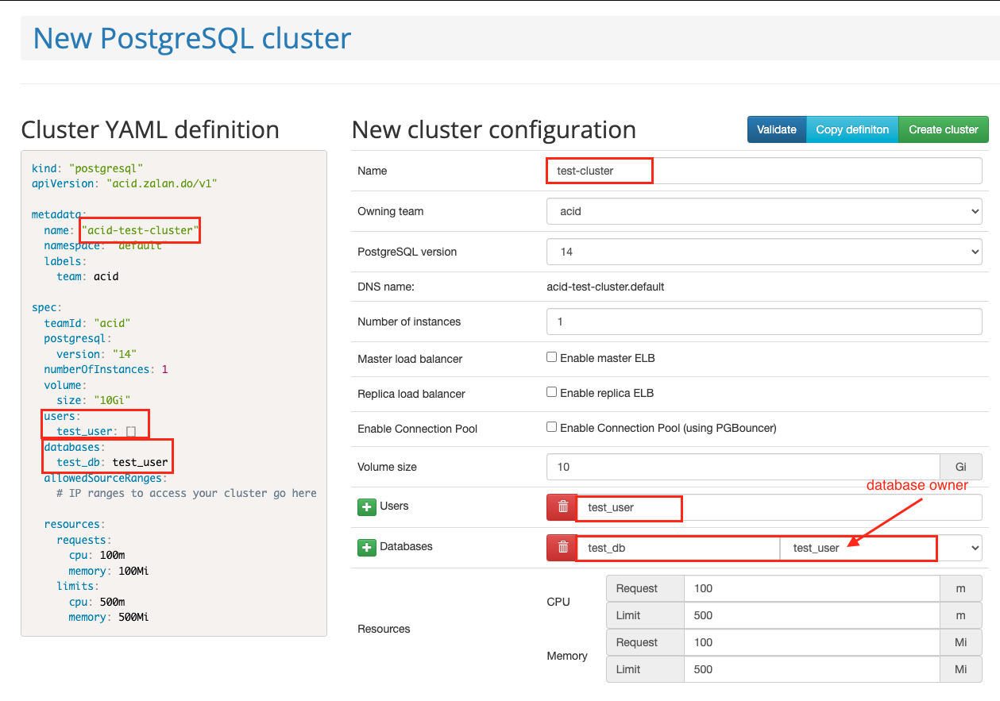
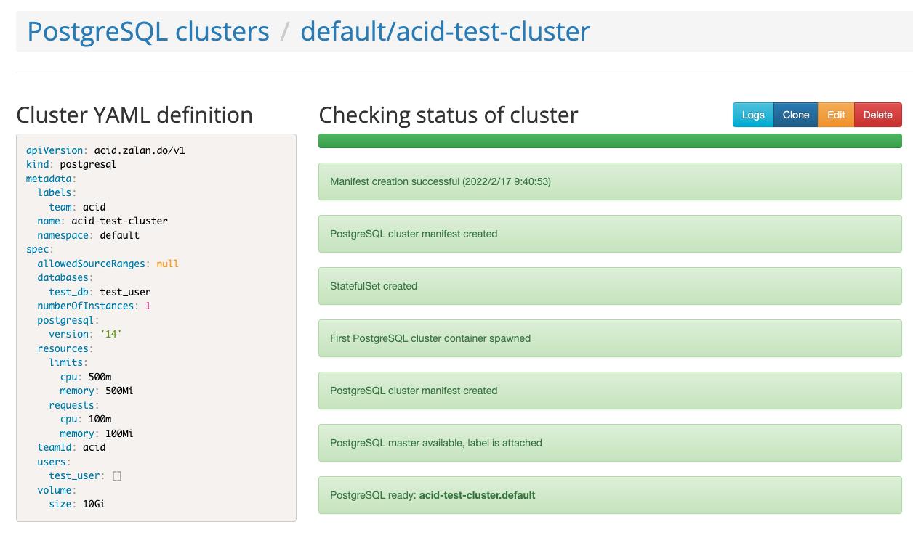
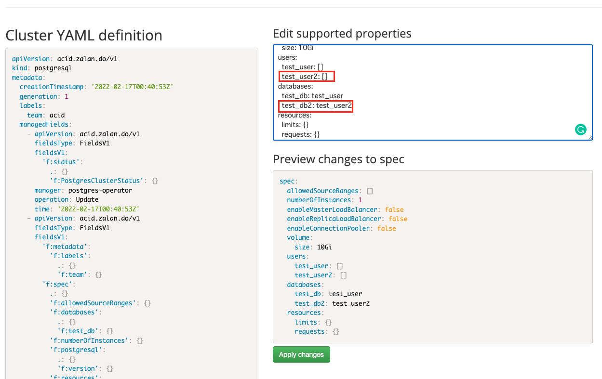

# Run Operator - Example: postgres-operator

## Overview

We'll run **PostgreSQL** with and without [postgres-operator](https://github.com/zalando/postgres-operator) and
see how easy it is to create a new user with operator.

## 1. Run PostgreSQL With operator.


1. Install Postgres Operator

    There are two options:

    1. **ConfigMaps-based** (legacy):

        ```
        kubectl apply -k github.com/zalando/postgres-operator/manifests
        ```
    1. **CRD-based** (`github.com/zalando/postgres-operator/manifests` + patch for `POSTGRES_OPERATOR_CONFIGURATION_OBJECT`):
        ```
        kubectl apply -k .
        ```

    For more details:
    1. [Quickstart](https://github.com/zalando/postgres-operator/blob/master/docs/quickstart.md#deployment-options)
    1. [Configuration Parameters](https://github.com/zalando/postgres-operator/blob/master/docs/reference/operator_parameters.md)

1. Check API resource.

    ```
    kubectl api-resources | grep zalan
    postgresqls                       pg           acid.zalan.do/v1                       true         postgresql
    ```

1. Check `CRD`:
    1. list
        ```
        kubectl get customresourcedefinition postgresqls.acid.zalan.do
        NAME                        CREATED AT
        postgresqls.acid.zalan.do   2022-04-12T22:24:18Z
        ```
    1. Get yaml:
        ```
        curl -O https://raw.githubusercontent.com/zalando/postgres-operator/master/manifests/postgresql.crd.yaml
        ```
    1. Check contents.

1. Deploy the Operator UI

    ```
    kubectl apply -k github.com/zalando/postgres-operator/ui/manifests
    ```

    Check:

    ```
    kubectl port-forward svc/postgres-operator-ui 8081:80
    ```

    Open http://localhost:8081/

1. Create a Postgres cluster on UI.

    Create:

    

    Creation completed:

    

    <details><summary>you can also create postgres cluster with yaml</summary>

    ```
    kubectl create -f https://raw.githubusercontent.com/zalando/postgres-operator/master/manifests/minimal-postgres-manifest.yaml
    ```

    **Roles and Databases initially created:**

    yaml:

    ```yaml
      users:
        zalando:  # database owner
        - superuser
        - createdb
        foo_user: []  # role for application foo
      databases:
        foo: zalando  # dbname: owner
      preparedDatabases:
        bar: {}
    ```

    roles:

    ```
    \du
                                                         List of roles
        Role name    |                         Attributes                         |               Member of
    -----------------+------------------------------------------------------------+----------------------------------------
     admin           | Create DB, Cannot login                                    | {foo_user,zalando,bar_owner}
     bar_data_owner  | Cannot login                                               | {bar_data_writer,bar_data_reader}
     bar_data_reader | Cannot login                                               | {}
     bar_data_writer | Cannot login                                               | {bar_data_reader}
     bar_owner       | Cannot login                                               | {bar_writer,bar_data_owner,bar_reader}
     bar_reader      | Cannot login                                               | {}
     bar_writer      | Cannot login                                               | {bar_reader}
     foo_user        |                                                            | {}
     postgres        | Superuser, Create role, Create DB, Replication, Bypass RLS | {}
     robot_zmon      | Cannot login                                               | {}
     standby         | Replication                                                | {}
     zalando         | Superuser, Create DB                                       | {}
     zalandos        | Cannot login                                               | {}
    ```

    databases:

    ```
    \l
                                      List of databases
       Name    |   Owner   | Encoding |   Collate   |    Ctype    |   Access privileges
    -----------+-----------+----------+-------------+-------------+-----------------------
     bar       | bar_owner | UTF8     | en_US.utf-8 | en_US.utf-8 |
     foo       | zalando   | UTF8     | en_US.utf-8 | en_US.utf-8 |
     postgres  | postgres  | UTF8     | en_US.utf-8 | en_US.utf-8 |
     template0 | postgres  | UTF8     | en_US.utf-8 | en_US.utf-8 | =c/postgres          +
               |           |          |             |             | postgres=CTc/postgres
     template1 | postgres  | UTF8     | en_US.utf-8 | en_US.utf-8 | =c/postgres          +
               |           |          |             |             | postgres=CTc/postgres
    (5 rows)
    ```

    </details>

1. Check

    ```
    # check the deployed cluster
    kubectl get postgresql

    # check created database pods
    kubectl get pods -l application=spilo -L spilo-role

    # check created service resources
    kubectl get svc -l application=spilo -L spilo-role
    ```

1. Connect to PostgreSQL cluster.

    ```
    kubectl exec -it acid-test-cluster-0 -- psql -Upostgres
    psql (14.0 (Ubuntu 14.0-1.pgdg18.04+1))
    Type "help" for help.

    postgres=#
    ```

1. Check `Secret` is automatically created for PostgreSQL users.

    ```
    kubectl get secret | grep postgresql
    postgres.acid-test-cluster.credentials.postgresql.acid.zalan.do    Opaque                                2      60s
    standby.acid-test-cluster.credentials.postgresql.acid.zalan.do     Opaque                                2      60s
    test-user.acid-test-cluster.credentials.postgresql.acid.zalan.do   Opaque                                2      60s
    ```

1. Create a new user `test_user2` on UI.

    

1. Check on PostgreSQL.

    ```
    kubectl exec -it acid-test-cluster-0 -- psql -Upostgres
    psql (14.0 (Ubuntu 14.0-1.pgdg18.04+1))
    Type "help" for help.

    postgres=# \du
                                              List of roles
     Role name  |                         Attributes                         |       Member of
    ------------+------------------------------------------------------------+------------------------
     admin      | Create DB, Cannot login                                    | {test_user,test_user2}
     postgres   | Superuser, Create role, Create DB, Replication, Bypass RLS | {}
     robot_zmon | Cannot login                                               | {}
     standby    | Replication                                                | {}
     test_user  |                                                            | {}
     test_user2 |                                                            | {}
     zalandos   | Create DB, Cannot login                                    | {}
    ```

1. Check `Secret` again.

    ```
    kubectl get secret | grep postgresql
    postgres.acid-test-cluster.credentials.postgresql.acid.zalan.do     Opaque                                2      2m18s
    standby.acid-test-cluster.credentials.postgresql.acid.zalan.do      Opaque                                2      2m18s
    test-user.acid-test-cluster.credentials.postgresql.acid.zalan.do    Opaque                                2      2m18s
    test-user2.acid-test-cluster.credentials.postgresql.acid.zalan.do   Opaque                                2      6s
    ```

1. Clean up.

    ```
    kubectl delete -f https://raw.githubusercontent.com/zalando/postgres-operator/master/manifests/minimal-postgres-manifest.yaml
    kubectl delete -k github.com/zalando/postgres-operator/ui/manifests
    kubectl delete -k github.com/zalando/postgres-operator/manifests
    ```

## 2. Run PostgreSQL without operator.

1. Create postgres with simple `StatefulSet`.

    For simplicity, we just set replica is 1. (Just increasing replica cannot form a postgres cluster.)

    ```
    kubectl apply -f postgres-sts.yaml
    ```

1. Check deployed `Pod`.

    ```
    kubectl get po postgres-0
    NAME         READY   STATUS    RESTARTS   AGE
    postgres-0   1/1     Running   0          17s
    ```

1. Create a new user.

    ```
    kubectl exec -it postgres-0 -- psql postgres postgres
    psql (14.2 (Debian 14.2-1.pgdg110+1))
    Type "help" for help.

    postgres=#
    ```

    ```
    postgres=# create user test_user with encrypted password 'password';
    CREATE ROLE
    postgres=# create database test_db owner test_user;
    CREATE DATABASE
    postgres=# \du
                                       List of roles
     Role name |                         Attributes                         | Member of
    -----------+------------------------------------------------------------+-----------
     postgres  | Superuser, Create role, Create DB, Replication, Bypass RLS | {}
     test_user |                                                            | {}
    postgres=# \list
                                     List of databases
       Name    |   Owner   | Encoding |  Collate   |   Ctype    |   Access privileges
    -----------+-----------+----------+------------+------------+-----------------------
     postgres  | postgres  | UTF8     | en_US.utf8 | en_US.utf8 |
     template0 | postgres  | UTF8     | en_US.utf8 | en_US.utf8 | =c/postgres          +
               |           |          |            |            | postgres=CTc/postgres
     template1 | postgres  | UTF8     | en_US.utf8 | en_US.utf8 | =c/postgres          +
               |           |          |            |            | postgres=CTc/postgres
     test_db   | test_user | UTF8     | en_US.utf8 | en_US.utf8 |
    (4 rows)
    ```

1. Clean up.

    ```
    kubectl delete -f postgres-sts.yaml
    ```

## Other Postgres Operator
- https://www.kubegres.io/
