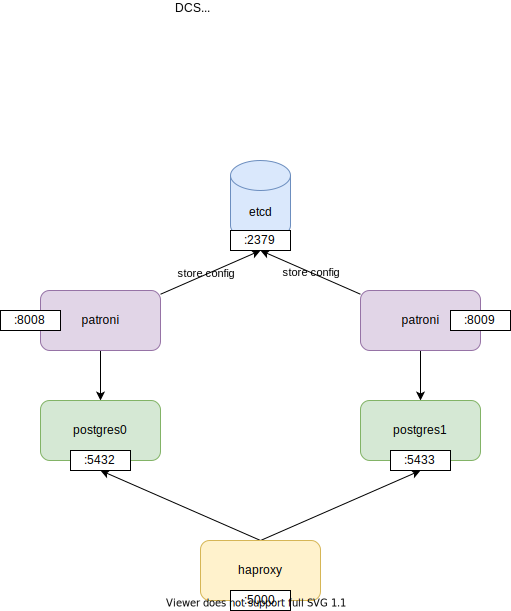
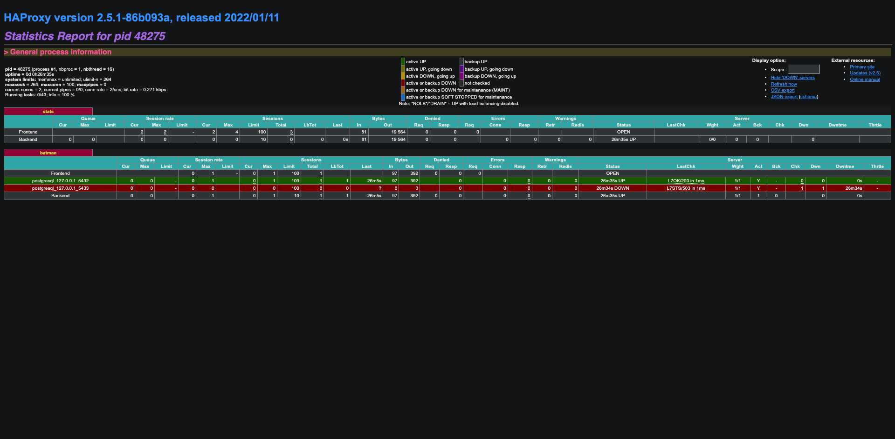

# Run postgres on MacOS



## 1. Preparation

1. Install dependencies.

    ```
    brew install postgresql etcd haproxy libyaml python
    ```
1. Set up python virtual environment.
    ```
    python3 -m venv venv
    . venv/bin/activate
    pip install -r requirements.txt
    ```

## 2. Start etcd.

```
etcd --data-dir=data/etcd --enable-v2=true
```

## 3. Start postgres with Patroni

1. Start postgres0. (leader)

    ```
    ./run.py postgres0.yml
    ```

    <details><summary>postgres0</summary>

    ```
    ./run.py postgres0.yml
    2022-02-16 07:59:03,768 INFO: Selected new etcd server http://localhost:2379
    2022-02-16 07:59:03,771 INFO: No PostgreSQL configuration items changed, nothing to reload.
    2022-02-16 07:59:03,777 INFO: Lock owner: None; I am postgresql0
    2022-02-16 07:59:03,816 INFO: trying to bootstrap a new cluster
    The files belonging to this database system will be owned by user "masato-naka".
    This user must also own the server process.

    The database cluster will be initialized with locale "ja_JP.UTF-8".
    initdb: could not find suitable text search configuration for locale "ja_JP.UTF-8"
    The default text search configuration will be set to "simple".

    Data page checksums are enabled.

    creating directory data/postgresql0 ... ok
    creating subdirectories ... ok
    selecting dynamic shared memory implementation ... posix
    selecting default max_connections ... 100
    selecting default shared_buffers ... 128MB
    selecting default time zone ... Asia/Tokyo
    creating configuration files ... ok
    running bootstrap script ... ok
    performing post-bootstrap initialization ... ok
    syncing data to disk ... ok

    initdb: warning: enabling "trust" authentication for local connections
    You can change this by editing pg_hba.conf or using the option -A, or
    --auth-local and --auth-host, the next time you run initdb.

    Success. You can now start the database server using:

        /usr/local/Cellar/postgresql/14.2/bin/pg_ctl -D data/postgresql0 -l logfile start

    2022-02-16 07:59:06,188 INFO: postmaster pid=41627
    2022-02-16 07:59:06.201 JST [41627] LOG:  starting PostgreSQL 14.2 on x86_64-apple-darwin20.6.0, compiled by Apple clang version     13.0.0 (clang-1300.0.29.30), 64-bit
    2022-02-16 07:59:06.201 JST [41627] LOG:  listening on IPv4 address "127.0.0.1", port 5432
    2022-02-16 07:59:06.202 JST [41627] LOG:  listening on Unix socket "./.s.PGSQL.5432"
    2022-02-16 07:59:06.208 JST [41630] LOG:  database system was shut down at 2022-02-16 07:59:05 JST
    2022-02-16 07:59:06.213 JST [41627] LOG:  database system is ready to accept connections
    2022-02-16 07:59:06.226 JST [41631] FATAL:  the database system is starting up
    localhost:5432 - rejecting connections
    localhost:5432 - accepting connections
    2022-02-16 07:59:06,269 INFO: establishing a new patroni connection to the postgres cluster
    2022-02-16 07:59:06,290 INFO: running post_bootstrap
    2022-02-16 07:59:06,421 INFO: initialized a new cluster
    2022-02-16 07:59:16,395 INFO: no action. I am (postgresql0), the leader with the lock
    2022-02-16 07:59:26,392 INFO: no action. I am (postgresql0), the leader with the lock
    2022-02-16 07:59:36,374 INFO: no action. I am (postgresql0), the leader with the lock
    ```

    </details>

1. Start postgres1. (a secondary)
    ```
    ./run.py postgres1.yml
    ```

    <details><summary>postgres1</summary>

    ```
    ./run.py postgres1.yml
    2022-02-16 07:59:42,608 INFO: Selected new etcd server http://localhost:2379
    2022-02-16 07:59:42,611 INFO: No PostgreSQL configuration items changed, nothing to reload.
    2022-02-16 07:59:42,616 INFO: Lock owner: postgresql0; I am postgresql1
    2022-02-16 07:59:42,636 INFO: trying to bootstrap from leader 'postgresql0'
    pg_basebackup: initiating base backup, waiting for checkpoint to complete
    WARNING:  skipping special file "./.s.PGSQL.5432"
    pg_basebackup: checkpoint completed
    pg_basebackup: write-ahead log start point: 0/2000060 on timeline 1
    pg_basebackup: starting background WAL receiver
    pg_basebackup: created temporary replication slot "pg_basebackup_41693"
    WARNING:  skipping special file "./.s.PGSQL.5432"
    pg_basebackup: write-ahead log end point: 0/2000138
    pg_basebackup: waiting for background process to finish streaming ...
    pg_basebackup: syncing data to disk ...
    pg_basebackup: renaming backup_manifest.tmp to backup_manifest
    pg_basebackup: base backup completed
    2022-02-16 07:59:44,814 INFO: replica has been created using basebackup
    2022-02-16 07:59:44,815 INFO: bootstrapped from leader 'postgresql0'
    2022-02-16 07:59:45,247 INFO: postmaster pid=41714
    2022-02-16 07:59:45.261 JST [41714] LOG:  starting PostgreSQL 14.2 on x86_64-apple-darwin20.6.0, compiled by Apple clang version     13.0.0 (clang-1300.0.29.30), 64-bit
    2022-02-16 07:59:45.262 JST [41714] LOG:  listening on IPv4 address "127.0.0.1", port 5433
    2022-02-16 07:59:45.263 JST [41714] LOG:  listening on Unix socket "./.s.PGSQL.5433"
    2022-02-16 07:59:45.269 JST [41716] LOG:  database system was interrupted; last known up at 2022-02-16 07:59:43 JST
    2022-02-16 07:59:45.269 JST [41717] FATAL:  the database system is starting up
    localhost:5433 - rejecting connections
    2022-02-16 07:59:45.291 JST [41719] FATAL:  the database system is starting up
    localhost:5433 - rejecting connections
    2022-02-16 07:59:45.602 JST [41716] LOG:  entering standby mode
    2022-02-16 07:59:45.609 JST [41716] LOG:  redo starts at 0/2000060
    2022-02-16 07:59:45.609 JST [41716] LOG:  consistent recovery state reached at 0/2000138
    2022-02-16 07:59:45.610 JST [41714] LOG:  database system is ready to accept read-only connections
    2022-02-16 07:59:45.622 JST [41743] FATAL:  could not start WAL streaming: ERROR:  replication slot "postgresql1" does not exist
    2022-02-16 07:59:45.628 JST [41745] FATAL:  could not start WAL streaming: ERROR:  replication slot "postgresql1" does not exist
    localhost:5433 - accepting connections
    2022-02-16 07:59:46,337 INFO: Lock owner: postgresql0; I am postgresql1
    2022-02-16 07:59:46,338 INFO: establishing a new patroni connection to the postgres cluster
    2022-02-16 07:59:46,410 INFO: no action. I am (postgresql1), a secondary, and following a leader (postgresql0)
    2022-02-16 07:59:46,475 INFO: no action. I am (postgresql1), a secondary, and following a leader (postgresql0)
    ```

    </details>

## 4. Start haproxy

```
haproxy -f haproxy.cfg
```

Check on http://localhost:7000/



## 5. Connect to postgres via haproxy

```
psql --host 127.0.0.1 --port 5000 postgres postgres
psql (14.1, server 14.2)
Type "help" for help.

postgres=#
```
