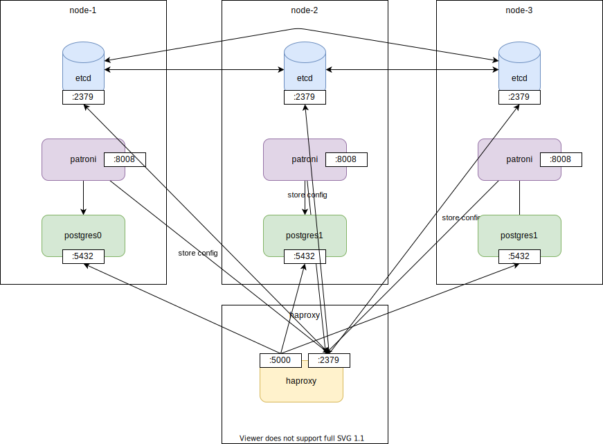
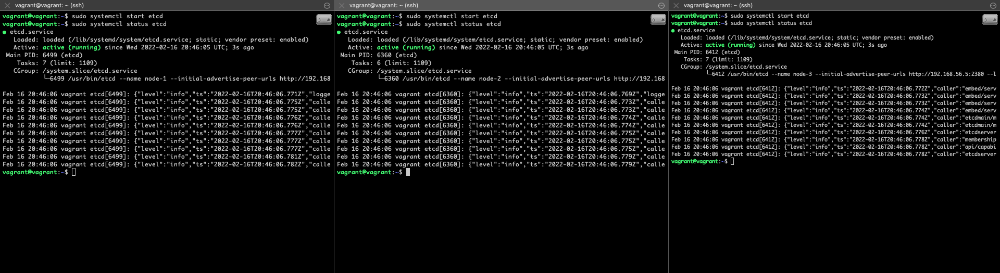
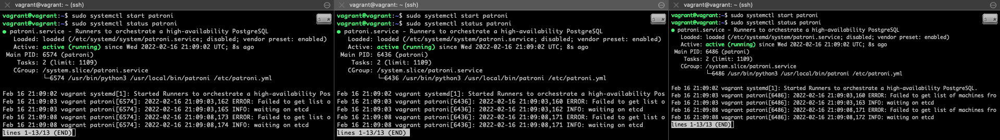

# Postgres Cluster with Vagrant

## Overview



## Versions
- vagrant: 2.2.19
- etcd: 3.5
- patroni: 2.1.2
- haproxy: 1.8.8-1ubuntu0.11
- postgres: 10.19

## Start up Vagrant
1. start vagrant. (4 machines: `node-1`, `node-2`, `node-3`, `haproxy`)

    ```
    vagrant up
    ```

    ```
    vagrant status
    Current machine states:

    node-1                    running (virtualbox)
    node-2                    running (virtualbox)
    node-3                    running (virtualbox)
    haproxy                   running (virtualbox)
    ```

## etcd cluster (Vagrant machine: `node-1`, `node-2`, `node-3`)
1. log in to all nodes (convenient to use `Broadcasting Input` in iTerm2)

    ```
    vagrant ssh node-1~3
    ```

    Check ips: `192.168.56.3`, `192.168.56.4`, `192.168.56.5`

    ```
    vagrant@vagrant:~$ ifconfig eth1
    eth1: flags=4163<UP,BROADCAST,RUNNING,MULTICAST>  mtu 1500
            inet 192.168.56.3  netmask 255.255.255.0  broadcast 192.168.56.255
            inet6 fe80::a00:27ff:fe99:f7a2  prefixlen 64  scopeid 0x20<link>
            ether 08:00:27:99:f7:a2  txqueuelen 1000  (Ethernet)
            RX packets 35  bytes 17616 (17.6 KB)
            RX errors 0  dropped 0  overruns 0  frame 0
            TX packets 12  bytes 1470 (1.4 KB)
            TX errors 0  dropped 0 overruns 0  carrier 0  collisions 0
    ```

1. (For each node) Install etcd.

    ```
    sudo apt-get update -y
    sudo apt-get install -y etcd
    ```

    official way

    ```
    ETCD_VER=v3.5.2

    # choose either URL
    GOOGLE_URL=https://storage.googleapis.com/etcd
    GITHUB_URL=https://github.com/etcd-io/etcd/releases/download
    DOWNLOAD_URL=${GOOGLE_URL}

    rm -f /tmp/etcd-${ETCD_VER}-linux-amd64.tar.gz
    rm -rf /tmp/etcd-download-test && mkdir -p /tmp/etcd-download-test

    curl -L ${DOWNLOAD_URL}/${ETCD_VER}/etcd-${ETCD_VER}-linux-amd64.tar.gz -o /tmp/etcd-${ETCD_VER}-linux-amd64.tar.gz
    tar xzvf /tmp/etcd-${ETCD_VER}-linux-amd64.tar.gz -C /tmp/etcd-download-test --strip-components=1
    rm -f /tmp/etcd-${ETCD_VER}-linux-amd64.tar.gz

    /tmp/etcd-download-test/etcd --version
    /tmp/etcd-download-test/etcdctl version
    /tmp/etcd-download-test/etcdutl version

    sudo mv /tmp/etcd-download-test/etcd /usr/bin/etcd
    sudo mv /tmp/etcd-download-test/etcdctl /usr/bin/etcdctl
    sudo mv /tmp/etcd-download-test/etcdutl /usr/bin/etcdutl
    ```

1. Set variables.

    ```bash
    local_ip=$(ifconfig eth1 | grep 'inet ' | sed 's/.*inet \(192\.168\.56\.[0-9]\+\).*/\1/g')
    echo $local_ip # 192.168.56.3, 192.168.56.4, 192.168.56.5 on each node
    num=$(($(ifconfig eth1 | grep 'inet ' | sed 's/.*inet 192.168.56.\([0-9]\+\).*/\1/g')-2))
    echo $num # 1,2,3 on each node
    ```

1. Run etcd (Just for confirmation).

    ```bash
    etcd --name node-${num} --initial-advertise-peer-urls http://${local_ip}:2380 \
    --listen-peer-urls http://${local_ip}:2380 \
    --listen-client-urls http://${local_ip}:2379,http://127.0.0.1:2379 \
    --advertise-client-urls http://${local_ip}:2379 \
    --initial-cluster-token etcd-cluster \
    --initial-cluster node-1=http://192.168.56.3:2380,node-2=http://192.168.56.4:2380,node-3=http://192.168.56.5:2380 \
    --initial-cluster-state new
    ```

    After confirming the command can start up, we can stop the command.

1. Add systemd template. ([ref](https://etcd.io/blog/2017/etcd-container-linux-with-systemd/))

    ```
    cat >etcd.service <<EOF
    [Service]
    Environment="ETCD_DATA_DIR=/var/lib/etcd"
    Environment="ETCD_OPTS=--name node-${num} --initial-advertise-peer-urls http://${local_ip}:2380 --listen-peer-urls http://${local_ip}:2380 --listen-client-urls http://${local_ip}:2379,http://127.0.0.1:2379 --advertise-client-urls http://${local_ip}:2379 --initial-cluster-token etcd-cluster --initial-cluster node-1=http://192.168.56.3:2380,node-2=http://192.168.56.4:2380,node-3=http://192.168.56.5:2380 --initial-cluster-state new"
    ExecStart=/usr/bin/etcd $ETCD_OPTS
    EOF
    ```

1. Start etcd service.
    ```
    sudo systemctl start etcd
    ```

    ```
    sudo systemctl status etcd
    ```

    

1. Check status with `etcdctl` (on one of the etcd machine).

    ```
    etcdctl member list
    9f16b99ff797148, started, node-3, http://192.168.56.5:2380, http://192.168.56.5:2379, false
    de5365f8233167d3, started, node-2, http://192.168.56.4:2380, http://192.168.56.4:2379, false
    f6e21250ef798b6d, started, node-1, http://192.168.56.3:2380, http://192.168.56.3:2379, false
    ```

## Haproxy

1. log in to haproxy machine (`192.168.56.6`).

    ```
    vagrant ssh haproxy
    ```
1. Install haproxy.
    ```
    sudo apt-get update -y
    sudo apt-get install haproxy -y
    ```
1. Set config file.
    ```
    sudo vi /etc/haproxy/haproxy.cfg
    ```

    ```
    global
        maxconn 100

    defaults
        log global
        mode tcp
        retries 2
        timeout client 30m
        timeout connect 4s
        timeout server 30m
        timeout check 5s

    frontend etcd
        bind 192.168.56.6:2379
        option tcplog
        mode tcp
        default_backend etcd-cluster-nodes

    backend etcd-cluster-nodes
        mode tcp
        balance roundrobin
        option tcp-check
        server etcd_01 192.168.56.3:2379 check fall 3 rise 2
        server etcd_02 192.168.56.4:2379 check fall 3 rise 2
        server etcd_03 192.168.56.5:2379 check fall 3 rise 2
    ```
1. Start haproxy.
    ```
    sudo systemctl start haproxy
    ```
1. Check with `etcdctl`.

    ```
    vagrant@vagrant:~$ /tmp/etcd-download-test/etcdctl put greeting "hello via haproxy" --endpoints 192.168.56.6:2379
    OK
    vagrant@vagrant:~$ /tmp/etcd-download-test/etcdctl get greeting --endpoints 192.168.56.6:2379
    greeting
    hello via haproxy
    ```

    <details><summary>Details</summary>

    ```
    vagrant@vagrant:~$ /tmp/etcd-download-test/etcdctl put greeting "Hello, etcd" --endpoints 192.168.56.3:2379
    OK
    vagrant@vagrant:~$ /tmp/etcd-download-test/etcdctl get greeting  --endpoints 192.168.56.3:2379
    greeting
    Hello, etcd
    vagrant@vagrant:~$ /tmp/etcd-download-test/etcdctl get greeting  --endpoints 192.168.56.4:2379
    greeting
    Hello, etcd
    vagrant@vagrant:~$ /tmp/etcd-download-test/etcdctl get greeting  --endpoints 192.168.56.5:2379
    greeting
    Hello, etcd
    ```

    ```
    vagrant@vagrant:~$ /tmp/etcd-download-test/etcdctl put greeting "hello via haproxy" --endpoints 192.168.56.6:2379
    OK
    vagrant@vagrant:~$ /tmp/etcd-download-test/etcdctl get greeting --endpoints 192.168.56.6:2379
    greeting
    hello via haproxy
    vagrant@vagrant:~$ /tmp/etcd-download-test/etcdctl get greeting  --endpoints 192.168.56.3:2379
    greeting
    hello via haproxy
    vagrant@vagrant:~$ /tmp/etcd-download-test/etcdctl get greeting  --endpoints 192.168.56.4:2379
    greeting
    hello via haproxy
    vagrant@vagrant:~$ /tmp/etcd-download-test/etcdctl get greeting  --endpoints 192.168.56.5:2379
    greeting
    hello via haproxy
    ```

    </details>

## Create Postgres cluster with Patroni (Vagrant machine: `node-1`, `node-2`, `node-3`)

(Use the same three VMs for postgres cluster this time.)
The following steps need to be done on each of `node-1~3`.

1. sudo

    ```
    sudo -i
    ```

1. Set variables

    ```bash
    local_ip=$(ifconfig eth1 | grep 'inet ' | sed 's/.*inet \(192\.168\.56\.[0-9]\+\).*/\1/g')
    echo $local_ip # 192.168.56.3, 192.168.56.4, 192.168.56.5 on each node
    num=$(($(ifconfig eth1 | grep 'inet ' | sed 's/.*inet 192.168.56.\([0-9]\+\).*/\1/g')-2))
    echo $num # 1,2,3 on each node
    haproxy_ip=192.168.56.6
    ```

1. Install postgres.

    ```
    sudo apt-get update -y
    # sudo apt install python3-pip python3-dev libpq-dev -y
    sudo apt-get install python-psycopg2 -y
    sudo apt-get install -y postgresql python3-psycopg2 python-psycopg2 python3-pip python-pip
    ```
1. create symlink for super user.
    ```
    sudo ln -s /usr/lib/postgresql/10/bin/* /usr/sbin/
    ```

1. Check the status of Postgres and stop it.

    ```
    sudo systemctl status postgresql
    sudo systemctl stop postgresql
    ```
1. Install `patroni` and `python-etcd`.

    ```
    pip3 install patroni python-etcd psycopg2
    ```

1. Create `/etc/patroni.yml`.

    ```bash
    cat >/etc/patroni.yml <<EOF
    scope: postgres
    namespace: /db/
    name: postgres-${num}

    restapi:
        listen: ${local_ip}:8008
        connect_address: ${local_ip}:8008

    etcd3:
        host: ${haproxy_ip}:2379 # <ETCD_LB_IP>

    bootstrap:
        dcs:
            ttl: 30
            loop_wait: 10
            retry_timeout: 10
            maximum_lag_on_failover: 1048576
            postgresql:
                use_pg_rewind: true

        initdb:
        - encoding: UTF8
        - data-checksums

        pg_hba:
        - host replication replicator 127.0.0.1/32 md5
        - host replication replicator 192.168.56.3/0 md5 # hard-coded
        - host replication replicator 192.168.56.4/0 md5 # hard-coded
        - host replication replicator 192.168.56.5/0 md5 # hard-coded
        - host all all 0.0.0.0/0 md5

        users:
            admin:
                password: admin
                options:
                    - createrole
                    - createdb

    postgresql:
        listen: ${local_ip}:5432
        connect_address: ${local_ip}:5432
        data_dir: /data/patroni
        pgpass: /tmp/pgpass
        authentication:
            replication:
                username: replicator
                password: password
            superuser:
                username: postgres
                password: password
        parameters:
            unix_socket_directories: '.'

    tags:
        nofailover: false
        noloadbalance: false
        clonefrom: false
        nosync: false
    EOF
    ```

1. Make data dir.
    ```
    mkdir -p /data/patroni
    ```

    ```
    sudo mkdir -p /data/patroni
    sudo chown postgres:postgres /data/patroni
    sudo chown postgres:postgres /data
    sudo chmod 700 /data/patroni
    ```

1. Create service `/etc/systemd/system/patroni.service`.

    ```
    sudo vi /etc/systemd/system/patroni.service
    ```

    ```
    [Unit]
    Description=Runners to orchestrate a high-availability PostgreSQL
    After=syslog.target network.target
    [Service]
    Type=simple
    User=postgres
    Group=postgres
    ExecStart=/usr/local/bin/patroni /etc/patroni.yml
    KillMode=process
    TimeoutSec=30
    Restart=no
    [Install]
    WantedBy=multi-user.targ
    ```

1. Start patroni.
    ```
    sudo systemctl start patroni
    ```

    

1. Enable postgres.

    ```
    sudo systemctl enable postgresql
    ```
1. Check with patronictl

    ```
    patronictl -c /etc/patroni.yml list
    +------------+--------------+---------+---------+----+-----------+
    | Member     | Host         | Role    | State   | TL | Lag in MB |
    + Cluster: postgres (7065443514187960088) ------+----+-----------+
    | postgres-1 | 192.168.56.3 | Replica | running |  1 |         0 |
    | postgres-2 | 192.168.56.4 | Replica | running |  1 |         0 |
    | postgres-3 | 192.168.56.5 | Leader  | running |  1 |           |
    +------------+--------------+---------+---------+----+-----------+
    ```

1. Try `failover`.

    ```
    root@vagrant:~# patronictl -c /etc/patroni.yml failover
    Candidate ['postgres-1', 'postgres-2'] []: postgres-1
    Current cluster topology
    +------------+--------------+---------+---------+----+-----------+
    | Member     | Host         | Role    | State   | TL | Lag in MB |
    + Cluster: postgres (7065443514187960088) ------+----+-----------+
    | postgres-1 | 192.168.56.3 | Replica | running |  1 |         0 |
    | postgres-2 | 192.168.56.4 | Replica | running |  1 |         0 |
    | postgres-3 | 192.168.56.5 | Leader  | running |  1 |           |
    +------------+--------------+---------+---------+----+-----------+
    Are you sure you want to failover cluster postgres, demoting current master postgres-3? [y/N]: y
    2022-02-16 23:03:23.21020 Successfully failed over to "postgres-1"
    +------------+--------------+---------+---------+----+-----------+
    | Member     | Host         | Role    | State   | TL | Lag in MB |
    + Cluster: postgres (7065443514187960088) ------+----+-----------+
    | postgres-1 | 192.168.56.3 | Leader  | running |  1 |           |
    | postgres-2 | 192.168.56.4 | Replica | running |  1 |         0 |
    | postgres-3 | 192.168.56.5 | Replica | stopped |    |   unknown |
    +------------+--------------+---------+---------+----+-----------+
    root@vagrant:~# patronictl -c /etc/patroni.yml list
    +------------+--------------+---------+---------+----+-----------+
    | Member     | Host         | Role    | State   | TL | Lag in MB |
    + Cluster: postgres (7065443514187960088) ------+----+-----------+
    | postgres-1 | 192.168.56.3 | Leader  | running |  2 |           |
    | postgres-2 | 192.168.56.4 | Replica | running |  2 |         0 |
    | postgres-3 | 192.168.56.5 | Replica | running |  2 |         0 |
    +------------+--------------+---------+---------+----+-----------+
    ```

## Update haproxy for postgres (vagrant machine: `haproxy`)

1. Update `/etc/haproxy/haproxy.cfg`

    ```
    global
        maxconn 100

    defaults
        log global
        mode tcp
        retries 2
        timeout client 30m
        timeout connect 4s
        timeout server 30m
        timeout check 5s

    frontend etcd
        bind 192.168.56.6:2379
        option tcplog
        mode tcp
        default_backend etcd-cluster-nodes

    backend etcd-cluster-nodes
        mode tcp
        balance roundrobin
        option tcp-check
        server etcd_01 192.168.56.3:2379 check fall 3 rise 2
        server etcd_02 192.168.56.4:2379 check fall 3 rise 2
        server etcd_03 192.168.56.5:2379 check fall 3 rise 2

    listen stats
        mode http
        bind *:7000
        stats enable
        stats uri /

    listen postgres
        bind *:5000
        option httpchk
        http-check expect status 200
        default-server inter 3s fall 3 rise 2 on-marked-down shutdown-sessions
        server postgresql_01 192.168.56.3:5432 maxconn 100 check port 8008
        server postgresql_02 192.168.56.4:5432 maxconn 100 check port 8008
        server postgresql_03 192.168.56.5:5432 maxconn 100 check port 8008
    ```

1. Check with psql client

    ```
    sudo apt-get install postgresql-client
    ```

1. login with postgres user `postgres` with `password` (defined in patroni.yml)

    ```
    vagrant@vagrant:~$ psql --host 127.0.0.1 --port 5000 postgres postgres
    Password for user postgres:
    psql (10.19 (Ubuntu 10.19-0ubuntu0.18.04.1))
    Type "help" for help.

    postgres=#
    ```

## Clean up

```
vagrant destroy
```

## FAQ

1. Patroni keeps idling with *"waiing for leader to bootstrap"*. https://github.com/zalando/patroni/issues/937 -> initialization is skipped from the second time or later.

    If you want to reinitialize, you need to remove the configuration from etcd by `patronictl remove <cluster_name>` or remove the data from your etcd.

    To check cluster name, you can hit the patroni endpoint:

    ```
    curl 192.168.56.4:8008/cluster
    ```

    ```
    patronictl -c /etc/patroni.yml remove postgres
    +------------+--------------+---------+---------+----+-----------+
    | Member     | Host         | Role    | State   | TL | Lag in MB |
    + Cluster: postgres (7065052552577460720) ------+----+-----------+
    | postgres-1 | 192.168.56.3 | Replica | stopped |    |   unknown |
    | postgres-2 | 192.168.56.4 | Replica | stopped |    |   unknown |
    | postgres-3 | 192.168.56.5 | Replica | stopped |    |   unknown |
    +------------+--------------+---------+---------+----+-----------+
    Please confirm the cluster name to remove: postgres
    You are about to remove all information in DCS for postgres, please type: "Yes I am aware": Yes I am aware
    ```

## Reference
- [Configure HA PostgreSQL Cluster in Active/Passive Mode](https://medium.com/nonstopio/configure-ha-postgresql-cluster-in-active-passive-mode-b9994aca9d1d)
- [Patroni HA PostgreSQL made easy PostgresConf US](https://postgresconf.org/system/events/document/000/000/228/Patroni_tutorial_4x3-2.pdf)
- [Patroni Documentation](https://readthedocs.org/projects/patroni/downloads/pdf/latest/)
- https://github.com/zalando/patroni
