# context

https://pkg.go.dev/context

Package context defines the Context type, which carries **deadlines**, **cancellation signals**, and other **request-scoped values** across API boundaries and between processes.




```go
func DoSomething(ctx context.Context, arg Arg) error {
    // ... use ctx ...
}
```

### Example: Timeout

```go
package main

import (
	"context"
	"fmt"
	"math/rand"
	"time"
)

func main() {
	rand.Seed(time.Now().UnixNano())
	ctx := context.Background()
	for i := 0; i < 10; i++ { // Call process func 10 times
		err := process(ctx)
		if err != nil {
			fmt.Println(err)
		}
	}
}

func process(ctx context.Context) error {
	ctx, cancel := context.WithTimeout(ctx, 3*time.Second) // time out with 3 seconds
	defer cancel()

	// randomly decide the processing time
	sec := rand.Intn(6)
	fmt.Printf("wait %d sec: ", sec)

	// pseudo process that takes <sec> seconds
	done := make(chan error, 1)
	go func(sec int) {
		time.Sleep(time.Duration(sec) * time.Second)
		done <- nil
	}(sec)

	// if context is done before receiving message from done channel, consider it as timeout.
	select {
	case <-done:
		fmt.Println("complete")
		return nil
	case <-ctx.Done():
		fmt.Println("timeout")
		return ctx.Err()
	}
}
```

1. `main`
    1. ctx is initialized with `Background` (empty context).
    1. call `process` 10 times.
1. `process`
    1. create a child context with `WithTimeout` (3 seconds to timeout)
        ```go
        ctx, cancel := context.WithTimeout(ctx, 3*time.Second)
        ```
    1. generate random int to decide how much the pseudo process takes to complete
        ```go
        sec := rand.Intn(6)
        ```
    1. make a `done` channel and run `time.Sleep` in the anonymous function with goroutine.
        ```go
        done := make(chan error, 1)
        go func(sec int) {
            time.Sleep(time.Duration(sec) * time.Second)
            done <- nil
        }(sec)
        ```
    1. if done channel gets result before timeout, return `nil` otherwise return `ctx.Err()`
        ```go
        select {
        case <-done:
            fmt.Println("complete")
            return nil
        case <-ctx.Done():
            fmt.Println("timeout")
            return ctx.Err()
        }
        ```


## References

1. [context](https://pkg.go.dev/context)
1. [Go Concurrency Patterns: Context](https://go.dev/blog/context)
1. [contextの概要](https://zenn.dev/hsaki/books/golang-context/viewer/definition)
