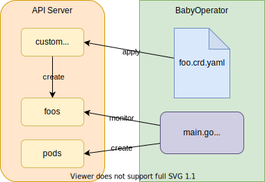

# Baby Operator


## Description

This is a Kubernetes operator-ish application, which is not a complete operator in that it lacks a lot of features and its implementation is different. The purpose of making this Operator-ish application is for an experience writing a program that interactive with Kubernetes API server using your own custom resource.

**Baby Operator (赤ちゃんOperator)** can be considered as an immature version of a Kubernetes operator, which uses a naive approach to implement the main logic without sophisticated Kubernetes componets such as informer or workqueue.

**Baby Operator** consists of
1. a custom resource `Foo`, which we created in [Create CRD](../01-crd/) and
1. a custom controller which creates a Pod for each `Foo` object.

## Steps

### 1. Create custom resource `Foo`

Create custom resource `Foo` with [foo.crd.yaml](../01-crd/foo.crd.yaml) and `Foo` object with [foo.yaml](../01-crd/foo.yaml).
```
kubectl apply -f ../01-crd
```
### 2. Create a custom controller-ish code `main.go`

1. Init module.
    ```
    go mod init baby-operator
    ```
1. Start with [03-client-go-list-foo/main.go](../03-client-go-list-foo/main.go). (Code to list `Foo` objects)
    ```
    cp <PATH TO 03-client-go-list-foo'S DIR>/main.go .
    ```

    ```
    go mod tidy
    ```

1. Make a loop to continuously list `Foo` objects.

    <details><summary>diff</summary>

    ```diff
    +++ b/06-operator-development-method/04-baby-operator/main.go
    @@ -6,6 +6,7 @@ import (
            "flag"
            "fmt"
            "path/filepath"
    +       "time"

            metav1 "k8s.io/apimachinery/pkg/apis/meta/v1"
            "k8s.io/apimachinery/pkg/runtime/schema"
    @@ -83,12 +84,14 @@ func main() {
            // https://pkg.go.dev/k8s.io/client-go/    kubernetes#NewForConfig
            clientset, _ := dynamic.NewForConfig(config)

    -       // Get list of Foo objects from all namespaces
    -       foos, _ := listFoos(clientset, "")
    +       for {
    +               // Get list of Foo objects from all namespaces
    +               foos, _ := listFoos(clientset, "")

    -       // Print Foo objects
    -       fmt.Println("INDEX\tNAMESPACE\tNAME")
    -       for i, foo := range foos.Items {
    -               fmt.Printf("%d\t%s\t%s\n", i, foo.GetNamespace    (), foo.GetName())
    +               // Print Foo objects
    +               for i, foo := range foos.Items {
    +                       fmt.Printf("%d\t%s\t%s\n", i, foo.    GetNamespace(), foo.GetName())
    +               }
    +               time.Sleep(1 * time.Second)
            }
     }
    ```

    </details>

    Run:
    ```
    go run main.go
    0       default test
    0       default test
    0       default test
    0       default test
    0       default test
    ^Csignal: interrupt
    ```

1. Check if there's corresponding Pod.

    <details><summary>diff</summary>

    ```diff
    +++ b/06-operator-development-method/04-baby-operator/main.go
    @@ -11,6 +11,7 @@ import (
            metav1 "k8s.io/apimachinery/pkg/apis/meta/v1"
            "k8s.io/apimachinery/pkg/runtime/schema"
            "k8s.io/client-go/dynamic"
    +       "k8s.io/client-go/kubernetes"
            "k8s.io/client-go/tools/clientcmd"
            "k8s.io/client-go/util/homedir"
     )
    @@ -84,6 +85,8 @@ func main() {
            // https://pkg.go.dev/k8s.io/client-go/dynamic#NewForConfig
            client, _ := dynamic.NewForConfig(config)

    +       clientset, _ := kubernetes.NewForConfig(config)
    +
            for {
                    // Get list of Foo objects from all namespaces
                    foos, _ := listFoos(client, "")
    @@ -92,7 +95,12 @@ func main() {
                    for i, foo := range foos.Items {
                            fmt.Printf("%d\t%s\t%s\n", i, foo.GetNamespace(), foo.GetName())
                            // Check if there's corresponding Pod.
    -
    +                       pod, err := clientset.CoreV1().Pods(foo.GetNamespace()).Get(context.Background(), foo.GetName(), metav1.GetOptions{})
    +                       if err != nil {
    +                               fmt.Printf("failed to get pod %v\n", err)
    +                       } else {
    +                               fmt.Printf("successfully got pod %s\n", pod.GetName())
    +                       }
                    }
                    time.Sleep(1 * time.Second)
            }
    ```


    </details>

    Update necessary packages:
    ```
    go mod tidy
    ```

    Run:
    ```
    go run main.go
    0       default test
    failed to get pod pods "test" not found
    0       default test
    failed to get pod pods "test" not found
    0       default test
    failed to get pod pods "test" not found
    0       default test
    failed to get pod pods "test" not found
    0       default test
    failed to get pod pods "test" not found
    ^Csignal: interrupt
    ```

1. Create one if there's no corresponding Pod.

    <details><summary>diff</summary>

    ```diff
    --- a/06-operator-development-method/04-baby-operator/main.go
    +++ b/06-operator-development-method/04-baby-operator/main.go
    @@ -8,6 +8,8 @@ import (
            "path/filepath"
            "time"

    +       v1 "k8s.io/api/core/v1"
    +       "k8s.io/apimachinery/pkg/api/errors"
            metav1 "k8s.io/apimachinery/pkg/apis/meta/v1"
            "k8s.io/apimachinery/pkg/runtime/schema"
            "k8s.io/client-go/dynamic"
    @@ -62,6 +64,31 @@ func listFoos(client dynamic.Interface, namespace string) (*FooList, error) {
            return &fooList, nil
     }

    +func createPod(clientset *kubernetes.Clientset, namespace, name string) error {
    +       pod := &v1.Pod{
    +               ObjectMeta: metav1.ObjectMeta{
    +                       Name:      name,
    +                       Namespace: namespace,
    +               },
    +               Spec: v1.PodSpec{
    +                       Containers: []v1.Container{
    +                               {
    +                                       Name:  "busybox",
    +                                       Image: "gcr.io/google_containers/echoserver:1.4",
    +                               },
    +                       },
    +                       RestartPolicy: v1.RestartPolicyAlways,
    +               },
    +       }
    +       _, err := clientset.CoreV1().Pods(namespace).Create(context.TODO(), pod, metav1.CreateOptions{})
    +       if err != nil {
    +               fmt.Printf("failed to create Pod %v\n", err)
    +               return err
    +       }
    +       fmt.Printf("Successfully created a Pod (%s)", name)
    +       return nil
    +}
     func main() {
            var defaultKubeConfigPath string
            if home := homedir.HomeDir(); home != "" {
    @@ -93,13 +120,21 @@ func main() {

                    // Print Foo objects
                    for i, foo := range foos.Items {
    -                       fmt.Printf("%d\t%s\t%s\n", i, foo.GetNamespace(), foo.GetName())
    +                       namespace := foo.GetNamespace()
    +                       name := foo.GetName()
    +                       fmt.Printf("%d\t%s\t%s\n", i, namespace, name)
                            // Check if there's corresponding Pod.
    -                       pod, err := clientset.CoreV1().Pods(foo.GetNamespace()).Get(context.Background(), foo.GetN
    ame(), metav1.GetOptions{})
    +                       _, err := clientset.CoreV1().Pods(namespace).Get(context.Background(), name, metav1.GetOpt
    ions{})
                            if err != nil {
    -                               fmt.Printf("failed to get pod %v\n", err)
    +                               if errors.IsNotFound(err) {
    +                                       // create new pod
    +                                       fmt.Println("Pod doesn't exist. Creating new Pod")
    +                                       createPod(clientset, namespace, name)
    +                               } else {
    +                                       fmt.Printf("failed to get pod %v\n", err)
    +                               }
                            } else {
    -                               fmt.Printf("successfully got pod %s\n", pod.GetName())
    +                               fmt.Printf("successfully got pod %s\n", name)
                            }
                    }
                    time.Sleep(1 * time.Second)
    ```

    </details>

    Run:
    ```
    go run main.go
    0       default test
    Pod doesn't exist. Creating new Pod
    Successfully created a Pod (test)0      default test
    successfully got pod test
    0       default test
    successfully got pod test
    0       default test
    successfully got pod test
    0       default test
    ...
    ```

    Delete the Pod (from another prompt):
    ```
    successfully got pod test
    Pod doesn't exist. Creating new Pod
    Successfully created a Pod (test)
    0      default test
    successfully got pod test
    0      default test
    successfully got pod test
    ^Csignal: interrupt
    ```

    Delete `Foo`:
    ```
    ... (does nothing)
    ```

    - [x] Create a Pod with same name as `Foo` object when `Foo` object exists.
    - [x] When the Pod is deleted, recreate a Pod for `Foo`.
    - [x] `Foo` object is deleted, the controller doesn't do anything. (The `Pod` remains)

## ToDo

**Baby Operator** has several things to improve:

1. A for-loop is not effective if `Foo` is not frequently created or changed.
1. The workload of the API server might be significantly increased if multiple controllers are continuously sending a request to the API server.
1. It's hard to make CRD yaml file and `Foo` struct consistent when `Foo` structure gets complicated.
1. No API version management mechanism exists (e.g. `v1`, `v2`)
1. Default value and validation of Custom Resource fields are not supported.
1. No tests are written.
1. RBAC (permission) needs to considered when running the operator in Kubernetes cluster.
1. And more.
