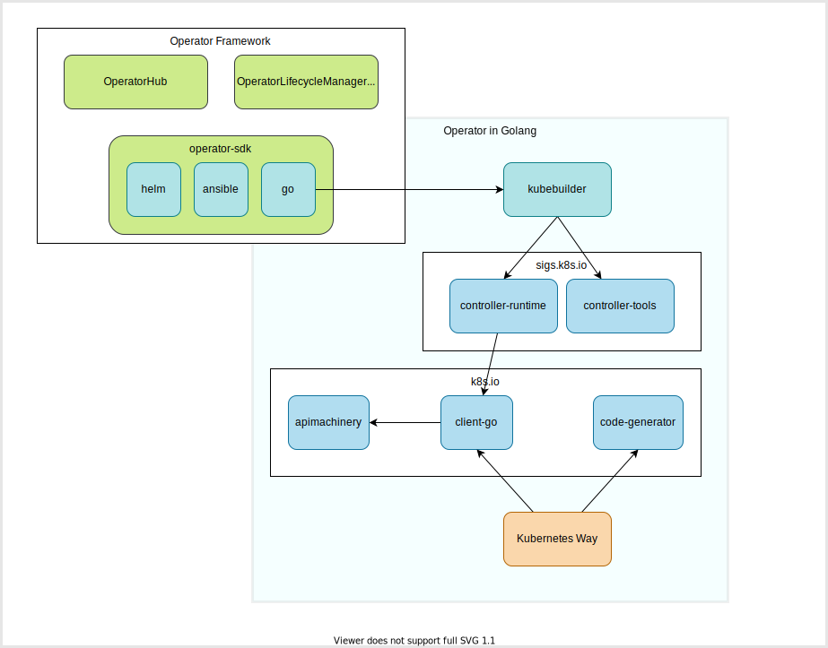

# Kubernetes Operator Development Methods

## Methods
There are several ways to develop your own Kubernetes operator but this course will only introduce the first three:
1. [Operator SDK](https://github.com/operator-framework/operator-sdk): a **framework** that uses the controller-runtime library to make writing operators easier by providing:
    - High level APIs and abstractions to write the operational logic more intuitively
    - Tools for scaffolding and code generation to bootstrap a new project fast
    - Extensions to cover common Operator use cases
1. [Kubebuilder](https://github.com/kubernetes-sigs/kubebuilder) (framework): a **framework** for building Kubernetes APIs using custom resource definitions (CRDs).
1. **Kubernetes way** (not a framework but a way to create Kubernetes operator in the same way as the Kubernetes built-in controllers are developed)

Others:
1. [kopf](https://github.com/nolar/kopf) (Kubernetes Operator Pythonic Framework): a framework and a library to make Kubernetes operators development easier, just in a few lines of Python code
1. [KubeOps (dotnet-operator-sdk)](https://buehler.github.io/dotnet-operator-sdk/): a kubernetes operator sdk written in dotnet
1. [KUDO (Kubernetes Universal Declarative Operator)](https://kudo.dev/): a toolkit that makes it easy to build Kubernetes Operators, in most cases just using YAML
1. [Metacontroller](https://metacontroller.github.io/metacontroller/intro.html): an add-on for Kubernetes that makes it easy to write and deploy custom controllers.
1. [shell-operator](https://github.com/flant/shell-operator): a tool for running event-driven scripts in a Kubernetes cluster. Shell-operator provides an integration layer between Kubernetes cluster events and shell scripts by treating scripts as hooks triggered by events. Think of it as an operator-sdk but for scripts.

## Dependencies (Go libraries and Tools)



1. [k8s.io/client-go](https://pkg.go.dev/k8s.io/client-go): Go clients for talking to a kubernetes cluster.
1. [k8s.io/apimachinery](https://pkg.go.dev/k8s.io/apimachinery): Scheme, typing, encoding, decoding, and conversion packages for Kubernetes and Kubernetes-like API objects.
1. [k8s.io/code-generator](https://pkg.go.dev/k8s.io/code-generator): Golang code-generators used to implement Kubernetes-style API types.
    <details><summary>Usage</summary>

    - in the context of CustomResourceDefinition to build native, versioned clients, informers and other helpers
    - in the context of User-provider API Servers to build conversions between internal and versioned types, defaulters, protobuf codecs, internal and versioned clients and informers.

    </details>
1. [sigs.k8s.io/controller-runtime](https://pkg.go.dev/sigs.k8s.io/controller-runtime): The Kubernetes controller-runtime Project is a set of go libraries for building Controllers. controller-runtime is a **subproject of the kubebuilder project** in sig apimachinery.
    <details><summary>More</summary>

    *Package controllerruntime provides tools to construct Kubernetes-style controllers that manipulate both Kubernetes CRDs and aggregated/built-in Kubernetes APIs.*

    *It defines easy helpers for the common use cases when building CRDs, built on top of customizable layers of abstraction. Common cases should be easy, and uncommon cases should be possible. In general, controller-runtime tries to guide users towards Kubernetes controller best-practices.*

    </details>
1. [sigs.k8s.io/controller-tools](https://pkg.go.dev/sigs.k8s.io/controller-tools): The Kubernetes controller-tools Project is a set of go libraries for building Controllers. controller-tools is a **subproject of the kubebuilder project** in sig apimachinery.

## Operator SDK vs. kubebuilder

Simply input:
1. Operator SDK provides additional features on top of `kubebuilder`.
    1. support ansible-based operator and helm-based operator
    1. support integration with OperatorLifecycleManager (OLM)
1. If you want to use a Operator Framework feature or develop an ansible/helm-based operator, **Operator SDK** is a good choice.
1. If you want to develop an operator in Go without depending on any Operator Framework, **kubebuilder** is enough.

For more information:
> Kubebuilder and Operator SDK are both projects that allow you to quickly create and manage an operator project. **Operator SDK uses Kubebuilder under the hood to do so for Go projects**, such that the operator-sdk CLI tool will work with a project created by kubebuilder. Therefore each project makes use of controller-runtime and will have the **same basic layout**. For further information also check the SDK Project Layout.

> Operator SDK offers additional features on top of the basic project scaffolding that Kubebuilder provides.

- **Operator Lifecycle Manager**, an installation and runtime management system for operators
- **OperatorHub**, a community hub for publishing operators
- **Operator SDK scorecard**, a tool for ensuring operator best-practices and developing cluster tests

From [Operator SDK FAQ - What are the the differences between Kubebuilder and Operator-SDK?](https://sdk.operatorframework.io/docs/faqs/#what-are-the-the-differences-between-kubebuilder-and-operator-sdk)

On 11th July 2020, New kubebuilder aligned CLI was introduced in [v0.19.0](https://github.com/operator-framework/operator-sdk/releases/tag/v0.19.0) with [Switch over to new CLI and deprecate operator-sdk new --type=go](https://github.com/operator-framework/operator-sdk/pull/3190)

Operator SDK uses kubebuilder:

https://github.com/operator-framework/operator-sdk/blob/master/internal/cmd/operator-sdk/cli/cli.go#L106-L128

```go
import (
    ...
    "sigs.k8s.io/kubebuilder/v3/pkg/cli"
    ...
)
// GetPluginsCLIAndRoot returns the plugins based CLI configured to use operator-sdk as the root command
// This CLI can run kubebuilder commands and certain SDK specific commands that are aligned for
// the kubebuilder project layout
func GetPluginsCLIAndRoot() (*cli.CLI, *cobra.Command) {
    ...
	c, err := cli.New(
		cli.WithCommandName("operator-sdk"),
		cli.WithVersion(makeVersionString()),
		cli.WithPlugins(
			ansibleBundle,
			gov2Bundle,
			gov3Bundle,
			helmBundle,
			hybridBundle,
			kustomizev1.Plugin{},
			declarativev1.Plugin{},
			&quarkusv1.Plugin{},
		),
		cli.WithDefaultPlugins(cfgv2.Version, gov2Bundle),
		cli.WithDefaultPlugins(cfgv3.Version, gov3Bundle),
		cli.WithDefaultProjectVersion(cfgv3.Version),
		cli.WithExtraCommands(commands...),
		cli.WithExtraAlphaCommands(alphaCommands...),
		cli.WithCompletion(),
	)
}
```

References:
- [Operator-SDK integrates Kubebuilder for Golang Operators (operator-framework/operator-sdk)](https://github.com/operator-framework/operator-sdk/blob/e2303705a481546e7b17e6727448f56fc2199199/proposals/kubebuilder-integration.md)
- [Integrating Kubebuilder and Operator SDK (kubernetes-sigs/kubebuilder)](https://github.com/kubernetes-sigs/kubebuilder/blob/master/designs/integrating-kubebuilder-and-osdk.md)
