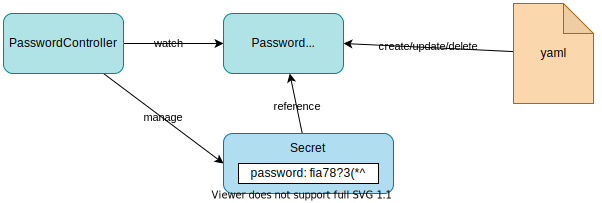

# [PasswordOperator](https://github.com/nakamasato/password-operator/tree/v0.0.1)

## Versions

This document is confirmed with the following version pairs:
- Go 1.19
- Kubebuilder: [v3.10.0](https://github.com/kubernetes-sigs/kubebuilder/releases/tag/v3.10.0)

Checked version combinations:

|Docker Engine|Go|kind|kubernetes|kubebuilder|cert manager|kustomize|controller-tools|password-operator (code)|doc version|
|---|---|---|---|---|---|---|---|---|---|
|[20.10.14](https://docs.docker.com/engine/release-notes/#201014)|1.17.9|[v0.12.0](https://github.com/kubernetes-sigs/kind/releases/tag/v0.12.0)|v1.23.4|[v3.4.0](https://github.com/kubernetes-sigs/kubebuilder/releases/tag/v3.4.0)|[v1.8.0](https://github.com/cert-manager/cert-manager/releases/tag/v1.8.0)|-|-|
|[20.10.14](https://docs.docker.com/engine/release-notes/#201014)|1.17.9|[v0.12.0](https://github.com/kubernetes-sigs/kind/releases/tag/v0.12.0)|v1.23.4|[v3.4.1](https://github.com/kubernetes-sigs/kubebuilder/releases/tag/v3.4.1)|[v1.8.0](https://github.com/cert-manager/cert-manager/releases/tag/v1.8.0)|-|[v0.8.0](https://github.com/kubernetes-sigs/controller-tools/releases/tag/v0.8.0)|[v0.0.1](https://github.com/nakamasato/password-operator/releases/tag/v0.0.1)|
|[20.10.20](https://docs.docker.com/engine/release-notes/#201020)|1.18|[v0.17.0](https://github.com/kubernetes-sigs/kind/releases/tag/v0.17.0)|v1.25.3|[v3.5.0](https://github.com/kubernetes-sigs/kubebuilder/releases/tag/v3.5.0)|[v1.8.0](https://github.com/cert-manager/cert-manager/releases/tag/v1.8.0)|[v4.5.5](https://github.com/kubernetes-sigs/kustomize/releases/tag/kustomize%2Fv4.5.5)|[v0.9.0](https://github.com/kubernetes-sigs/controller-tools/releases/tag/v0.9.0)|[v0.0.2](https://github.com/nakamasato/password-operator/releases/tag/v0.0.2)|[1.0.1](https://github.com/nakamasato/kubernetes-operator-basics/releases/tag/1.0.1)|
|[20.10.20](https://docs.docker.com/engine/release-notes/#201020)|1.18|[v0.17.0](https://github.com/kubernetes-sigs/kind/releases/tag/v0.17.0)|v1.25.3|[v3.6.0](https://github.com/kubernetes-sigs/kubebuilder/releases/tag/v3.6.0)|[v1.8.0](https://github.com/cert-manager/cert-manager/releases/tag/v1.8.0)|[v4.5.5](https://github.com/kubernetes-sigs/kustomize/releases/tag/kustomize%2Fv4.5.5)|[v0.9.2](https://github.com/kubernetes-sigs/controller-tools/releases/tag/v0.9.2)|[v0.0.3](https://github.com/nakamasato/password-operator/releases/tag/v0.0.3)|[1.0.1](https://github.com/nakamasato/kubernetes-operator-basics/releases/tag/1.0.1)|
|[20.10.20](https://docs.docker.com/engine/release-notes/#201020)|1.19|[v0.17.0](https://github.com/kubernetes-sigs/kind/releases/tag/v0.17.0)|v1.25.3|[v3.7.0](https://github.com/kubernetes-sigs/kubebuilder/releases/tag/v3.7.0)|[v1.8.0](https://github.com/cert-manager/cert-manager/releases/tag/v1.8.0)|[v4.5.5](https://github.com/kubernetes-sigs/kustomize/releases/tag/kustomize%2Fv4.5.5)|[v0.9.2](https://github.com/kubernetes-sigs/controller-tools/releases/tag/v0.9.2)|[v0.0.4](https://github.com/nakamasato/password-operator/releases/tag/v0.0.4)|[1.0.1](https://github.com/nakamasato/kubernetes-operator-basics/releases/tag/1.0.1)|
|[20.10.20](https://docs.docker.com/engine/release-notes/#201020)|1.19|[v0.17.0](https://github.com/kubernetes-sigs/kind/releases/tag/v0.17.0)|v1.25.3|[v3.8.0](https://github.com/kubernetes-sigs/kubebuilder/releases/tag/v3.8.0)|[v1.8.0](https://github.com/cert-manager/cert-manager/releases/tag/v1.8.0)|[v4.5.5](https://github.com/kubernetes-sigs/kustomize/releases/tag/kustomize%2Fv4.5.5)|[v0.10.0](https://github.com/kubernetes-sigs/controller-tools/releases/tag/v0.10.0)|[v0.0.5](https://github.com/nakamasato/password-operator/releases/tag/v0.0.5)|[1.0.2](https://github.com/nakamasato/kubernetes-operator-basics/releases/tag/1.0.2)|
|[20.10.20](https://docs.docker.com/engine/release-notes/#201020)|1.19|[v0.17.0](https://github.com/kubernetes-sigs/kind/releases/tag/v0.17.0)|v1.25.3|[v3.9.0](https://github.com/kubernetes-sigs/kubebuilder/releases/tag/v3.9.0)|[v1.8.0](https://github.com/cert-manager/cert-manager/releases/tag/v1.8.0)|[v4.5.5](https://github.com/kubernetes-sigs/kustomize/releases/tag/kustomize%2Fv4.5.5)|[v0.11.1](https://github.com/kubernetes-sigs/controller-tools/releases/tag/v0.11.1)|[v0.0.6](https://github.com/nakamasato/password-operator/releases/tag/v0.0.6)|[1.0.2](https://github.com/nakamasato/kubernetes-operator-basics/releases/tag/1.0.3)|
|[ 24.0.2](https://docs.docker.com/engine/release-notes/24.0/#2402)|1.19|[v0.17.0](https://github.com/kubernetes-sigs/kind/releases/tag/v0.17.0)|v1.25.3|[v3.10.0](https://github.com/kubernetes-sigs/kubebuilder/releases/tag/v3.10.0)|[v1.8.0](https://github.com/cert-manager/cert-manager/releases/tag/v1.8.0)|[v5.0.0](https://github.com/kubernetes-sigs/kustomize/releases/tag/kustomize%2Fv5.0.0)|[v0.12.0](https://github.com/kubernetes-sigs/controller-tools/releases/tag/v0.12.0)|[v0.0.7](https://github.com/nakamasato/password-operator/releases/tag/v0.0.7)|[1.0.4](https://github.com/nakamasato/kubernetes-operator-basics/releases/tag/1.0.4)|

## 0. Design Operator `PasswordOperator`

1. Make only one Custom Resource `Password`.
1. When custom resource `Password` is created, the controller generates a password, create a `Secret` with the same name as the `Password` object, and store the password in `password` field.
1. Provide password generation options. e.g. password length, the number of digits and symbols, etc.



## 1. [kubebuilder] Init project

Make a directory and initialize git repository

```
mkdir -p ~/projects/password-operator
cd ~/projects/password-operator
git init
```

Initialize a project

```
kubebuilder init --domain example.com --repo example.com/password-operator
```

Commit
```
git add . && git commit -m "[kubebuilder] Init project"
```

## 2. [kubebuilder] Create API `Password` (Controller & Resource)
Create an API `password` (and choose `y` for resource and controller)

```
kubebuilder create api --group secret --version v1alpha1 --kind Password
```

<details><summary>Check if failed</summary>

If you're using `kubebuilder` version less than 3.4.0 and go version 1.18, you'll encounter the following error.

```
bash: /path/to/your/guestbook/bin/controller-gen: No such file or directory
make: *** [generate] Error 127
```

Fix `Makefile` -> Commit `git commit -m "Fix Makefile"`

```Makefile
##@ Build Dependencies
## Location to install dependencies to
LOCALBIN ?= $(shell pwd)/bin
$(LOCALBIN): ## Ensure that the directory exists
  mkdir -p $(LOCALBIN)
## Tool Binaries
KUSTOMIZE ?= $(LOCALBIN)/kustomize
CONTROLLER_GEN ?= $(LOCALBIN)/controller-gen
ENVTEST ?= $(LOCALBIN)/setup-envtest
## Tool Versions
KUSTOMIZE_VERSION ?= v3.8.7
CONTROLLER_TOOLS_VERSION ?= v0.8.0
ENVTEST_VERSION ?= latest
KUSTOMIZE_INSTALL_SCRIPT ?= "https://raw.githubusercontent.com/kubernetes-sigs/kustomize/master/hack/install_kustomize.sh"
.PHONY: kustomize
kustomize: $(KUSTOMIZE) ## Download kustomize locally if necessary.
$(KUSTOMIZE):
  curl -s $(KUSTOMIZE_INSTALL_SCRIPT) | bash -s -- $(subst v,,$(KUSTOMIZE_VERSION)) $(LOCALBIN)
.PHONY: controller-gen
controller-gen: $(CONTROLLER_GEN) ## Download controller-gen locally if necessary.
$(CONTROLLER_GEN):
  GOBIN=$(LOCALBIN) go install sigs.k8s.io/controller-tools/cmd/controller-gen@$(CONTROLLER_TOOLS_VERSION)
.PHONY: envtest
envtest: ## Download envtest-setup locally if necessary.
  GOBIN=$(LOCALBIN) go install sigs.k8s.io/controller-runtime/tools/setup-envtest@$(ENVTEST_VERSION)
```

Try again.

```
kubebuilder create api --group secret --version v1alpha1 --kind Password --force --controller --resource
```

</details>

Update CRD yaml files (Go types → CRD)

```
make manifests
```

Commit

```
git add . && git commit -m "[kubebuilder] Create API Password (Controller & Resource)"
```

### Column: About `kubebuilder` project development


There are three types of changes:
1. **kubebuilder** command create files (`init`, `create api`, `create webhook`, et.c)
1. Implement **API** (schema `apis/<version>/xxx_types.go`, `apis/<version>/xxx_webhook.go`)
1. Implement **controller** (reconcile loop `controllers/xxx_controller.go`)

If you're aware of which kind of change you're making, it'll be helpful to understand what exactly you're doing. I use `[kubebuilder]`, `[Controller]`, `[API]` as a prefix for each step title.

## 3. [Controller] Add log in Reconcile function

Update `internal/controller/password_controller.go` (before kubebuilder 3.10 `controllers/password_controller.go`)

```go
func (r *PasswordReconciler) Reconcile(ctx context.Context, req ctrl.Request) (ctrl.Result, error) {
    logger := log.FromContext(ctx)

    logger.Info("Reconcile is called.")

    return ctrl.Result{}, nil
}
```

Install CRD

```
make install
```

<details><summary>if error occurs</summary>

If you encounter the following error:

```
make install
/Users/m.naka/projects/guestbook/bin/controller-gen rbac:roleName=manager-role crd webhook paths="./..." output:crd:artifacts:config=config/crd/bases
curl -s "https://raw.githubusercontent.com/kubernetes-sigs/kustomize/master/hack/install_kustomize.sh" | bash -s -- 3.8.7 /Users/m.naka/projects/guestbook/bin
Version v3.8.7 does not exist or is not available for darwin/arm64.
make: *** [/Users/m.naka/projects/guestbook/bin/kustomize] Error 1
```

You can specify kustomize version or you can update the default KUSTOMIZE_VERSION in Makefile.

```
KUSTOMIZE_VERSION=4.5.5 make install
```

</details>

Run
```
make run
```

Result:

```
go fmt ./...
go vet ./...
go run ./cmd/main.go
2023-07-28T07:17:32+09:00       INFO    controller-runtime.metrics      Metrics server is starting to listen    {"addr": ":8080"}
2023-07-28T07:17:32+09:00       INFO    setup   starting manager
2023-07-28T07:17:32+09:00       INFO    Starting server {"kind": "health probe", "addr": "[::]:8081"}
2023-07-28T07:17:32+09:00       INFO    Starting server {"path": "/metrics", "kind": "metrics", "addr": "[::]:8080"}
2023-07-28T07:17:32+09:00       INFO    Starting EventSource    {"controller": "password", "controllerGroup": "secret.example.com", "controllerKind": "Password", "source": "kind source: *v1alpha1.Password"}
2023-07-28T07:17:32+09:00       INFO    Starting Controller     {"controller": "password", "controllerGroup": "secret.example.com", "controllerKind": "Password"}
2023-07-28T07:17:32+09:00       INFO    Starting workers        {"controller": "password", "controllerGroup": "secret.example.com", "controllerKind": "Password", "worker count": 1}
```

Create `Password` object
```
kubectl apply -k config/samples
```

See logs

Reconcile function is called with `Password` with name `password-sample`
```
2023-07-28T07:17:58+09:00       INFO    Reconcile is called.    {"controller": "password", "controllerGroup": "secret.example.com", "controllerKind": "Password", "Password": {"name":"password-sample","namespace":"default"}, "namespace": "default", "name": "password-sample", "reconcileID": "f2e46175-e05f-4db7-b92b-080f1018dc9a"}
```

Let's see the arguments of `Reconcile`: `Reconcile(ctx context.Context, req ctrl.Request)`
- `context.Context`:
- `ctrl.Request`: <- Request that calls the Reconcile function. Get the object from the request.


Delete the object with
```
kubectl delete -k config/samples
```

See logs.
Reconcile function is called with `Password` with name `password-sample`

```
2023-07-28T07:18:29+09:00       INFO    Reconcile is called.    {"controller": "password", "controllerGroup": "secret.example.com", "controllerKind": "Password", "Password": {"name":"password-sample","namespace":"default"}, "namespace": "default", "name": "password-sample", "reconcileID": "d90e037e-48d8-49cb-a080-a19f88613ae1"}
```

From the logs, the two events (creation and deletion) triggered the `Reconcile` function exactly the same way. We cannot distinguish them in `Reconcile`. (**Important**)

Stop the controller with `Ctrl+C`.
Commit
```
git add . && git commit -m "[Controller] Add log in Reconcile function"
```

**Point**: Reconcile function is called when custom resource object is created, updated, or deleted. Inside the Reconcile function, the reconciliation logic should not be dependent on the triggering type (`created`, `updated`, `deleted`).

## 4. [API] Remove Foo field from custom resource Password

By default, `Password` has `PasswordSpec` (with `Foo` field) and `PasswordStatus` (without any field):
```go
type PasswordSpec struct {
    // INSERT ADDITIONAL SPEC FIELDS - desired state of cluster
    // Important: Run "make" to regenerate code after modifying this file
    // Foo is an example field of Password. Edit password_types.go to remove/update
    Foo string `json:"foo,omitempty"`
}
type PasswordStatus struct {
    // INSERT ADDITIONAL STATUS FIELD - define observed state of cluster
    // Important: Run "make" to regenerate code after modifying this file
}
type Password struct {
    metav1.TypeMeta   `json:",inline"`
    metav1.ObjectMeta `json:"metadata,omitempty"`
    Spec   PasswordSpec   `json:"spec,omitempty"`
    Status PasswordStatus `json:"status,omitempty"`
}
```
- `TypeMeta`: API version and Kind (all Kubernetes objects have)
- `ObjectMeta`: name, namespace, labels, ... (all Kubernetes object have)
- `Spec`: Desired State
- `Status`: Actual State
- `+kubebuilder:object:root` comment is called a marker. -> telling controller-tools (our code and YAML generator) extra information.
    - `+kubebuilder:object:root`: tell the object generator that this type represents a Kind. → the object generator generates an implementation of the runtime.Object interface (Kinds must implement)
- add the Go types to the API group
    ```go
    func init() {
      SchemeBuilder.Register(&Password{}, &PasswordList{})
    }
    ```

When you create a new resource with `kubebuilder create api`, it automatically adds a field `Foo` in spec of the new resource. You can see it in the CRD.

```bash
kubectl get crd passwords.secret.example.com -o jsonpath='{.spec.versions[].schema.openAPIV3Schema.properties.spec}' | jq
{
    "description": "PasswordSpec defines the desired state of Password",
    "properties": {
    "foo": {
        "description": "Foo is an example field of Password. Edit password_types.go to remove/update",
        "type": "string"
    }
    },
    "type": "object"
}
```

Let's remove `Foo` field from `api/v1alpha1/password_types.go` and run `make manifests` to update the CRD yaml files `config/crd/bases/secret.example.com_passwords.yaml`.

We also need to update the CRD registered in `api-server` as `Foo` is already removed:

```bash
make install
```

<details><summary>error</summary>

If you encounter the following error:

```
make install
/Users/m.naka/projects/guestbook/bin/controller-gen rbac:roleName=manager-role crd webhook paths="./..." output:crd:artifacts:config=config/crd/bases
curl -s "https://raw.githubusercontent.com/kubernetes-sigs/kustomize/master/hack/install_kustomize.sh" | bash -s -- 3.8.7 /Users/m.naka/projects/guestbook/bin
Version v3.8.7 does not exist or is not available for darwin/arm64.
make: *** [/Users/m.naka/projects/guestbook/bin/kustomize] Error 1
```

You can specify kustomize version or you can update the default KUSTOMIZE_VERSION in Makefile.

```
KUSTOMIZE_VERSION=4.5.5 make install
```

</details>

Now you can confirm the field `Foo` is removed.

```bash
kubectl get crd passwords.secret.example.com -o jsonpath='{.spec.versions[].schema.openAPIV3Schema.properties.spec}' | jq
{
    "description": "PasswordSpec defines the desired state of Password",
    "type": "object"
}
```

Commit
```
git commit -am "[API] Remove Foo field from custom resource Password"
```

**Point**: When updating API resource:

1. update in `api/<version>/<custom_resource>_types.go`
1. `make install`
    1. `make manifests`: Generate CRD `config/crd/bases/<custom_resource>.<domain>_<custom_resource>.yaml`
    1. `$(KUSTOMIZE) build config/crd | kubectl apply -f -`: Apply crd yaml file.

Other API files:
- `groupversion_info.go`:
- `zz_generated.deepcopy.go`:

## About Controller
In [controller-runtime](https://pkg.go.dev/sigs.k8s.io/controller-runtime), the logic that implements the reconciling for a specific kind is called a **Reconciler**.

<details><summary>what's controller-runtime?</summary>

We studied in [operator development method](../../06-operator-development-method/05-methods/)


</details>


A reconciler takes the name of an object, and returns whether or not we need to try again. (err -> reconcile again later, no error -> reconciliation completed.)

[Reconciler](https://pkg.go.dev/sigs.k8s.io/controller-runtime@v0.11.0/pkg/reconcile#Reconciler):

```go
type Reconciler interface {
    // Reconcile performs a full reconciliation for the object referred to by the Request.
    // The Controller will requeue the Request to be processed again if an error is non-nil or
    // Result.Requeue is true, otherwise upon completion it will remove the work from the queue.
    Reconcile(context.Context, Request) (Result, error)
}
```

[Request](https://pkg.go.dev/sigs.k8s.io/controller-runtime@v0.11.0/pkg/reconcile#Request):

```go
type Request struct {
    // NamespacedName is the name and namespace of the object to reconcile.
    types.NamespacedName
}
```

[Result](https://pkg.go.dev/sigs.k8s.io/controller-runtime@v0.11.0/pkg/reconcile#Result):

```go
type Result struct {
    // Requeue tells the Controller to requeue the reconcile key.  Defaults to false.
    Requeue bool

    // RequeueAfter if greater than 0, tells the Controller to requeue the reconcile key after the Duration.
    // Implies that Requeue is true, there is no need to set Requeue to true at the same time as RequeueAfter.
    RequeueAfter time.Duration
}
```

- `PasswordReconciler` with `client.Client`.
- RBAC markers for autogeneration of rbac yaml.
- Request just has a name.
- Register `PasswordReconciler` to Manager.

## 5. [Controller] Fetch Password object

Add the following lines to `Reconcile function`
```go
// Fetch Password object
var password secretv1alpha1.Password
if err := r.Get(ctx, req.NamespacedName, &password); err != nil {
    logger.Error(err, "Fetch Password object - failed")
    return ctrl.Result{}, client.IgnoreNotFound(err)
}

logger.Info("Fetch Password object - succeeded", "password", password.Name, "createdAt", password.CreationTimestamp)
```

run!

```
make run
```

```
kubectl apply -k config/samples
```

```
2023-07-28T07:22:48+09:00       INFO    Fetch Password object - succeeded       {"controller": "password", "controllerGroup": "secret.example.com", "controllerKind": "Password", "Password": {"name":"password-sample","namespace":"default"}, "namespace": "default", "name": "password-sample", "reconcileID": "e21a347d-8092-43ac-8cd1-6da7092b4088", "password": "password-sample", "createdAt": "2023-07-28 07:22:48 +0900 JST"}
```

```
kubectl delete -k config/samples
```

```
2023-07-28T07:23:26+09:00       ERROR   Fetch Password object - failed  {"controller": "password", "controllerGroup": "secret.example.com", "controllerKind": "Password", "Password": {"name":"password-sample","namespace":"default"}, "namespace": "default", "name": "password-sample", "reconcileID": "0cbb4fa3-fe1d-4f35-942f-2386cf224185", "error": "Password.secret.example.com \"password-sample\" not found"}
example.com/password-operator/internal/controller.(*PasswordReconciler).Reconcile
        /Users/m.naka/projects/password-operator/internal/controller/password_controller.go:57
sigs.k8s.io/controller-runtime/pkg/internal/controller.(*Controller).Reconcile
        /Users/m.naka/go/pkg/mod/sigs.k8s.io/controller-runtime@v0.14.4/pkg/internal/controller/controller.go:122
sigs.k8s.io/controller-runtime/pkg/internal/controller.(*Controller).reconcileHandler
        /Users/m.naka/go/pkg/mod/sigs.k8s.io/controller-runtime@v0.14.4/pkg/internal/controller/controller.go:323
sigs.k8s.io/controller-runtime/pkg/internal/controller.(*Controller).processNextWorkItem
        /Users/m.naka/go/pkg/mod/sigs.k8s.io/controller-runtime@v0.14.4/pkg/internal/controller/controller.go:274
sigs.k8s.io/controller-runtime/pkg/internal/controller.(*Controller).Start.func2.2
        /Users/m.naka/go/pkg/mod/sigs.k8s.io/controller-runtime@v0.14.4/pkg/internal/controller/controller.go:235
```

Commit

```
git commit -am "[Controller] Fetch Password object"
```

## 6. [Controller] Create Secret object if not exists

Logic:
1. Try to fetch a `Secret` with the same name as `Password` object.
1. Return if already exists. Otherwise, create a `Secret`.

Secret: https://pkg.go.dev/k8s.io/api/core/v1#Secret

```go
import (
    // existing packages...
    corev1 "k8s.io/api/core/v1"
    "k8s.io/apimachinery/pkg/api/errors"
    metav1 "k8s.io/apimachinery/pkg/apis/meta/v1"
)
```

```go
    // Create Secret object if not exists
    var secret corev1.Secret
    if err := r.Get(ctx, req.NamespacedName, &secret); err != nil {
        if errors.IsNotFound(err) {
            // Create Secret
            logger.Info("Create Secret object if not exists - create secret")
            secret := newSecretFromPassword(&password)
            err = r.Create(ctx, secret)
            if err != nil {
                logger.Error(err, "Create Secret object if not exists - failed to create Secret")
                return ctrl.Result{}, err
            }
            logger.Info("Create Secret object if not exists - Secret successfully created")
        } else {
            logger.Error(err, "Create Secret object if not exists - failed to fetch Secret")
            return ctrl.Result{}, err
        }
    }

    logger.Info("Create Secret object if not exists - completed")
```

```go
func newSecretFromPassword(password *secretv1alpha1.Password) *corev1.Secret {
    secret := &corev1.Secret{
        ObjectMeta: metav1.ObjectMeta{
            Name:      password.Name,
            Namespace: password.Namespace,
        },
        Data: map[string][]byte{
            "password": []byte("123456789"), // password=123456789
        },
    }
    return secret
}
```

Run!

```
make run
```

```
kubectl apply -k config/samples
```

```
2023-07-28T07:25:29+09:00       INFO    Reconcile is called.    {"controller": "password", "controllerGroup": "secret.example.com", "controllerKind": "Password", "Password": {"name":"password-sample","namespace":"default"}, "namespace": "default", "name": "password-sample", "reconcileID": "50383d60-6afa-4dd9-901e-d9732f6ce0a6"}
2023-07-28T07:25:29+09:00       INFO    Fetch Password object - succeeded       {"controller": "password", "controllerGroup": "secret.example.com", "controllerKind": "Password", "Password": {"name":"password-sample","namespace":"default"}, "namespace": "default", "name": "password-sample", "reconcileID": "50383d60-6afa-4dd9-901e-d9732f6ce0a6", "password": "password-sample", "createdAt": "2023-07-28 07:25:29 +0900 JST"}
2023-07-28T07:25:29+09:00       INFO    Create Secret object if not exists - create secret      {"controller": "password", "controllerGroup": "secret.example.com", "controllerKind": "Password", "Password": {"name":"password-sample","namespace":"default"}, "namespace": "default", "name": "password-sample", "reconcileID": "50383d60-6afa-4dd9-901e-d9732f6ce0a6"}
2023-07-28T07:25:29+09:00       INFO    Create Secret object if not exists - Secret successfully created        {"controller": "password", "controllerGroup": "secret.example.com", "controllerKind": "Password", "Password": {"name":"password-sample","namespace":"default"}, "namespace": "default", "name": "password-sample", "reconcileID": "50383d60-6afa-4dd9-901e-d9732f6ce0a6"}
2023-07-28T07:25:29+09:00       INFO    Create Secret object if not exists - completed  {"controller": "password", "controllerGroup": "secret.example.com", "controllerKind": "Password", "Password": {"name":"password-sample","namespace":"default"}, "namespace": "default", "name": "password-sample", "reconcileID": "50383d60-6afa-4dd9-901e-d9732f6ce0a6"}
```

```
kubectl get secret password-sample
NAME              TYPE     DATA   AGE
password-sample   Opaque   1      47s
```

```
kubectl get secret password-sample -o jsonpath='{.data}'
{"password":"MTIzNDU2Nzg5"}%
echo -n MTIzNDU2Nzg5 | base64 --decode
123456789%
```

```
kubectl delete -k config/samples
```

```
2023-07-28T07:26:29+09:00       INFO    Reconcile is called.    {"controller": "password", "controllerGroup": "secret.example.com", "controllerKind": "Password", "Password": {"name":"password-sample","namespace":"default"}, "namespace": "default", "name": "password-sample", "reconcileID": "891e164d-11ab-4d25-8f1c-f23d7257e973"}
2023-07-28T07:26:29+09:00       ERROR   Fetch Password object - failed  {"controller": "password", "controllerGroup": "secret.example.com", "controllerKind": "Password", "Password": {"name":"password-sample","namespace":"default"}, "namespace": "default", "name": "password-sample", "reconcileID": "891e164d-11ab-4d25-8f1c-f23d7257e973", "error": "Password.secret.example.com \"password-sample\" not found"}
example.com/password-operator/internal/controller.(*PasswordReconciler).Reconcile
        /Users/m.naka/projects/password-operator/internal/controller/password_controller.go:60
sigs.k8s.io/controller-runtime/pkg/internal/controller.(*Controller).Reconcile
        /Users/m.naka/go/pkg/mod/sigs.k8s.io/controller-runtime@v0.14.4/pkg/internal/controller/controller.go:122
sigs.k8s.io/controller-runtime/pkg/internal/controller.(*Controller).reconcileHandler
        /Users/m.naka/go/pkg/mod/sigs.k8s.io/controller-runtime@v0.14.4/pkg/internal/controller/controller.go:323
sigs.k8s.io/controller-runtime/pkg/internal/controller.(*Controller).processNextWorkItem
        /Users/m.naka/go/pkg/mod/sigs.k8s.io/controller-runtime@v0.14.4/pkg/internal/controller/controller.go:274
sigs.k8s.io/controller-runtime/pkg/internal/controller.(*Controller).Start.func2.2
        /Users/m.naka/go/pkg/mod/sigs.k8s.io/controller-runtime@v0.14.4/pkg/internal/controller/controller.go:235
```

```
kubectl get password
No resources found in default namespace.
```

```
kubectl get secret password-sample
NAME              TYPE     DATA   AGE
password-sample   Opaque   1      2m25s
```

manually delete secret at this point.

```
kubectl delete secret password-sample
```

Let's run the operator on kubernetes cluster!

```
IMG=password-operator:v1
make docker-build IMG=$IMG
kind load docker-image $IMG
make deploy IMG=$IMG
```

Check pod

```
kubectl get po -n password-operator-system
NAME                                                    READY   STATUS    RESTARTS   AGE
password-operator-controller-manager-5648556967-jxpkx   2/2     Running   0          11s
```

Check logs

```
kubectl logs password-operator-controller-manager-5648556967-jxpkx -n password-operator-system -f
```

```
kubectl apply -k config/samples
```

```
W0727 22:29:56.838445       1 reflector.go:424] pkg/mod/k8s.io/client-go@v0.26.1/tools/cache/reflector.go:169: failed to list *v1.Secret: secrets is forbidden: User "system:serviceaccount:password-operator-system:password-operator-controller-manager" cannot list resource "secrets" in API group "" at the cluster scope
```

The permission granted to the service account used by the controller-manager is not enough!

**Important point!** This controller needs to manipulate Secret! Let's grant the permissions by the following RBAC markers!

```go
//+kubebuilder:rbac:groups="",resources=secrets,verbs=get;list;watch;create;
```

Need to run `make manifests` to update `ClusterRole` for the controller.

```
make manifests
```

You can see the following lines are added to `config/rbac/role.yaml`.

```yaml
- apiGroups:
  - ""
  resources:
  - secrets
  verbs:
  - create
  - get
  - list
  - watch
```

```
make deploy IMG=$IMG
```

```
kubectl get secret
NAME              TYPE     DATA   AGE
password-sample   Opaque   1      17s
```

Now you can see a new secret is created by the operator!

```
make undeploy
```

```
kubectl delete secret password-sample
```

Next: Clean up the orphaned secret!

Commit

```
git add . && git commit -m "[Controller] Create Secret object if not exists"
```

## 7. [Controller] Clean up Secret when Password is deleted

Logic:
1. If Password is deleted, the corresponding Secret is also deleted.

Add the following lines to `Reconcile` function just after `secret := newSecretFromPassword(&password)`

```go
    err := ctrl.SetControllerReference(&password, secret, r.Scheme) // Set owner of this Secret
    if err != nil {
        logger.Error(err, "Create Secret object if not exists - failed to set SetControllerReference")
        return ctrl.Result{}, err
    }
```

[SetControllerReference](https://pkg.go.dev/sigs.k8s.io/controller-runtime@v0.11.0/pkg/controller/controllerutil#SetControllerReference)

> SetControllerReference sets owner as a Controller OwnerReference on controlled. This is used for **garbage collection of the controlled object** and for reconciling the owner object on changes to controlled (with a Watch + EnqueueRequestForOwner)

```
make install run
```

```
kubectl apply -k config/samples
```

```
kubectl get secret

NAME              TYPE     DATA   AGE
password-sample   Opaque   1      6s
```

```
kubectl delete -k config/samples
```

Check Secret

```
kubectl get secret
No resources found in default namespace.
```

Secret `password-sample` is deleted!

Commit
```
git commit -am "[Controller] Clean up Secret when Password is deleted"
```

## 8. [Controller] Generate random password

Use for password generation: https://github.com/sethvargo/go-password

Import `github.com/sethvargo/go-password/password`

```go
import (
    passwordGenerator "github.com/sethvargo/go-password/password"
    ...
)
```

remove:
```diff
- secret := newSecretFromPassword(&password)
- err := ctrl.SetControllerReference(&password, secret, r.Scheme) // Set owner of this Secret
```

new:
```go
    passwordStr, err := passwordGenerator.Generate(64, 10, 10, false, false)
    if err != nil {
        logger.Error(err, "Create Secret object if not exists - failed to generate password")
        return ctrl.Result{}, err
    }
    secret := newSecretFromPassword(&password, passwordStr)
    err = ctrl.SetControllerReference(&password, secret, r.Scheme) // Set owner of this Secret
```

Update `newSecretFromPassword` to pass `passwordStr` as an argument:

```go
func newSecretFromPassword(password *secretv1alpha1.Password, passwordStr string) *corev1.Secret {
	secret := &corev1.Secret{
		ObjectMeta: metav1.ObjectMeta{
			Name:      password.Name,
			Namespace: password.Namespace,
		},
		Data: map[string][]byte{
			"password": []byte(passwordStr),
		},
	}
	return secret
}
```

```
make run
```

<details><summary>If error occurs</summary>

```
internal/controller/password_controller.go:22:2: no required module provides package github.com/sethvargo/go-password/password; to add it:
        go get github.com/sethvargo/go-password/password
Error: not all generators ran successfully
```

Run the command to add it:

```
go get github.com/sethvargo/go-password/password
```

</details>

```
kubectl apply -k config/samples
```

Check password

```
kubectl get secret password-sample -o jsonpath='{.data.password}' |
 base64 --decode
yh0<B-?qfOkolF#EKa>D5Ig924rZQxiU_dneAX86S1YsLR@TjvW}u\3mM7]NHGVz%
```

Delete & create a new one

```
kubectl delete -k config/samples
password.secret.example.com "password-sample" deleted
kubectl apply -k config/samples
password.secret.example.com/password-sample created
kubectl get secret password-sample -o jsonpath='{.data.password}' | base64 --decode
noY$Xa9KI3At(J+bwvLdqi4hDB/CT~ZxGfpR[7elWrS5Ocz=VMym)u#2F1_60jN8%
```

Confirmed password is randomly generated.

Commit

```
git commit -am "[Controller] Generate random password"
```

## 9. [API&Controller] Make password configurable with CRD fields

When generating a password in this line,

```go
passwordStr, err := password.Generate(64, 10, 10, false, false)
```

`64, 10, 10, false, false` are hard-coded in the Reconcile function.

Each argument represents:
1. password length
1. the number of digits
1. the number of symbols
1. allow upper and lower case letters if true
1. disallow repeat characters if true

Let's enable to configure them with our custom resource `Password`.

`api/v1alpha1/password_types.go`:

```go
type PasswordSpec struct {
    //+kubebuilder:validation:Minimum=8
    //+kubebuilder:default:=20
    //+kubebuilder:validation:Required
    Length int `json:"length"`

    //+kubebuilder:validation:Minimum=0
    //+kubebuilder:default:=10
    //+kubebuilder:validation:Optional
    Digit int `json:"digit"`

    //+kubebuilder:validation:Minimum=0
    //+kubebuilder:default:=10
    //+kubebuilder:validation:Optional
    Symbol int `json:"symbol"`

    //+kubebuilder:default:=false
    //+kubebuilder:validation:Optional
    CaseSensitive  bool `json:"caseSensitive"`
    //+kubebuilder:default:=false
    //+kubebuilder:validation:Optional
    DisallowRepeat bool `json:"disallowRepeat"`
}
```

Run the following command to update `config/crd/bases/secret.example.com_passwords.yaml` and apply the CRD:

```
make install
```

Apply `Password`:

```yaml
apiVersion: secret.example.com/v1alpha1
kind: Password
metadata:
  labels:
    app.kubernetes.io/name: password
    app.kubernetes.io/instance: password-sample
    app.kubernetes.io/part-of: password-operator
    app.kubernetes.io/managed-by: kustomize
    app.kubernetes.io/created-by: password-operator
  name: password-sample
spec:
  length: 20 # <- added
```

```
kubectl apply -k config/samples/
```

<details>

```
kubectl get -k config/samples/ -o yaml
apiVersion: secret.example.com/v1alpha1
kind: Password
metadata:
  annotations:
    kubectl.kubernetes.io/last-applied-configuration: |
      {"apiVersion":"secret.example.com/v1alpha1","kind":"Password","metadata":{"annotations":{},"labels":{"app.kubernetes.io/created-by":"password-operator","app.kubernetes.io/instance":"password-sample","app.kubernetes.io/managed-by":"kustomize","app.kubernetes.io/name":"password","app.kubernetes.io/part-of":"password-operator"},"name":"password-sample","namespace":"default"},"spec":{"length":20}}
  creationTimestamp: "2023-07-27T22:39:03Z"
  generation: 2
  labels:
    app.kubernetes.io/created-by: password-operator
    app.kubernetes.io/instance: password-sample
    app.kubernetes.io/managed-by: kustomize
    app.kubernetes.io/name: password
    app.kubernetes.io/part-of: password-operator
  name: password-sample
  namespace: default
  resourceVersion: "7454"
  uid: 6cc59d4e-4e42-430c-bbd6-49a19e4b1fe5
spec:
  caseSensitive: false
  digit: 10
  disallowRepeat: false
  length: 20
  symbol: 10
```

</details>

You can see the spec:
```yaml
spec:
  caseSensitive: false
  digit: 10
  disallowRepeat: false
  length: 20
  symbol: 10
```

Use these values in the controller (`controllers/password_controller.go`).

```go
            passwordStr, err := passwordGenerator.Generate(
                password.Spec.Length,
                password.Spec.Digit,
                password.Spec.Symbol,
                password.Spec.CaseSensitive,
                password.Spec.DisallowRepeat,
            )
```

```
make run
```

Recreate the custom resource `Password`.
```
kubectl delete -k config/samples/ && kubectl apply -k config/samples/
```

Check the length of the password of the generated Secret:

```
kubectl get secret password-sample -o jsonpath='{.data.password}' | base64 --decode
,<!463[1$58#90_7>2)~
kubectl get secret password-sample -o jsonpath='{.data.password}' | base64 --decode | wc -m
      20
```

Change the length to 30 in `config/samples/secret_v1alpha1_password.yaml` and recreate the custom resource `Password`:

```
kubectl delete -k config/samples/ && kubectl apply -k config/samples/
```

```
kubectl get secret password-sample -o jsonpath='{.data.password}' | base64 --decode
?f*%76X0:/41Y.3V8$2=r>q9m5I{ax%
kubectl get secret password-sample -o jsonpath='{.data.password}' | base64 --decode | wc -m
      30
```

Change the length to 10 and recreate the custom resource `Password`:

```
kubectl delete -k config/samples/ && kubectl apply -k config/samples/
```

You'll see the following `Error` log: `number of digits and symbols must be less than total length`

```
2023-07-28T07:44:53+09:00       ERROR   Create Secret object if not exists - failed to generate password        {"controller": "password", "controllerGroup": "secret.example.com", "controllerKind": "Password", "Password": {"name":"password-sample","namespace":"default"}, "namespace": "default", "name": "password-sample", "reconcileID": "4ffaf83a-ab95-4598-bfd5-a60e897cf5c8", "error": "number of digits and symbols must be less than total length"}
```

The reconcilation loop failed to generate password. `Secret` was not successfully generated.

```
kubectl get secret password-sample -o jsonpath='{.data.password}'
Error from server (NotFound): secrets "password-sample" not found
```

Commit

```
git commit -am "[API&Controller] Make password configurable with CRD fields"
```

Next:
- [ ] Update `Password`'s status to tell if custom resource is successfully updated.
- [ ] Add validation for `digit`, `symbol`, and `length`: `number of digits and symbols must be less than total length`

## 10. [API&Controller] Add Password Status

Update Go types: `api/v1alpha1/password_types.go`

Create new type `PasswordState`

```go
type PasswordState string

const (
	PasswordInSync  PasswordState = "InSync"
	PasswordFailed  PasswordState = "Failed"
)
```

Add `State` to `PasswordStatus`

```go
// PasswordStatus defines the observed state of Password
type PasswordStatus struct {

    // Information about if Password is in-sync.
    State PasswordState `json:"state,omitempty"` // in-sync, failed
}
```

Update CRD yaml files:

```
make manifests
```

Add the following lines at the end of `Reconcile` function in the controller:

```go
func (r *PasswordReconciler) Reconcile(ctx context.Context, req ctrl.Request) (ctrl.Result, error) {
    // ...
    password.Status.State = secretv1alpha1.PasswordInSync
    if err := r.Status().Update(ctx, &password); err != nil {
        logger.Error(err, "Failed to update Password status")
        return ctrl.Result{}, err
    }
    return ctrl.Result{}, nil
}
```

Run (Apply new CRD and run the controller):

```
make install run
```

```yaml
apiVersion: secret.example.com/v1alpha1
kind: Password
metadata:
  labels:
    app.kubernetes.io/name: password
    app.kubernetes.io/instance: password-sample
    app.kubernetes.io/part-of: password-operator
    app.kubernetes.io/managed-by: kustomize
    app.kubernetes.io/created-by: password-operator
  name: password-sample
spec:
  length: 20
```

```
kubectl delete -k config/samples/ && kubectl apply -k config/samples/
```

```
kubectl get password password-sample -o jsonpath='{.status}'
{"state":"InSync"}
```

In the same way, let's add status for `Failed`. Add the following lines to where to return error in reconcile function.

```go
password.Status.State = secretv1alpha1.PasswordFailed
if err := r.Status().Update(ctx, &password); err != nil {
    logger.Error(err, "Failed to update Password status")
    return ctrl.Result{}, err
}
```

Run

```
make run
```

```yaml
apiVersion: secret.example.com/v1alpha1
kind: Password
metadata:
  name: password-sample
spec:
  length: 10 # this will cause 'number of digits and symbols must be less than total length' error
```

```
kubectl delete -k config/samples/ && kubectl apply -k config/samples/
```

```
kubectl get password password-sample -o jsonpath='{.status}'
{"state":"Failed"}
```

Commit
```
git commit -am "[API&Controller] Add Password Status"
```

Homework: Add `Reason` to `PasswordStatus` and store the failure reason for `Failed` state.
1. Add new field to `PasswordStatus` (Go types).
1. Regenerate CRD manifests.
1. Add a logic to update it (controller).
1. Run controller and apply custom resource with failure condition.

## 11. [API] Add AdditionalPrinterColumns

We cannot see `State` with `kubectl get` now. Let's make it visible!

```
kubectl get password password-sample
NAME              AGE
password-sample   6m34s
```

Add a marker to `api/v1alpha1/password_types.go`:

```diff
 //+kubebuilder:object:root=true
 //+kubebuilder:subresource:status
+//+kubebuilder:printcolumn:name="State",type=string,JSONPath=`.status.state`

 // Password is the Schema for the passwords API
 type Password struct {
 	metav1.TypeMeta   `json:",inline"`
 	metav1.ObjectMeta `json:"metadata,omitempty"`

 	Spec   PasswordSpec   `json:"spec,omitempty"`
 	Status PasswordStatus `json:"status,omitempty"`
 }
```

Update the CRD yaml file by the command:
```
make manifests
```

With this marker, controller-gen will update CRD by adding `additionalPrinterColumns`:

```diff
+++ b/config/crd/bases/secret.example.com_passwords.yaml
@@ -15,7 +15,11 @@ spec:
     singular: password
   scope: Namespaced
   versions:
-  - name: v1alpha1
+  - additionalPrinterColumns:
+    - jsonPath: .status.state
+      name: State
+      type: string
+    name: v1alpha1
```

```
make install run
```

Fix the `spec.length` to `20` and apply the password-sample:

```
kubectl delete -k config/samples/ && kubectl apply -k config/samples/
```

```
kubectl get password password-sample
NAME              STATE
password-sample   InSync
```

Why `AGE` column is gone after setting `additionalPrinterColumns`? -> `AGE` is added if there's no `additionalPrinterColumn` specified: [apiserver/helpers.go#L81-L88](https://github.com/kubernetes/kubernetes/blob/e7a2ce75e5df96ba6ea51d904bf2735397b3e203/staging/src/k8s.io/apiextensions-apiserver/pkg/apiserver/helpers.go#L81-L88). If you want to get `AGE` back, you can add the following line:

```go
//+kubebuilder:printcolumn:name="Age",type=date,JSONPath=`.metadata.creationTimestamp`
```

```diff
-  - name: v1alpha1
+  - additionalPrinterColumns:
+    - jsonPath: .metadata.creationTimestamp
+      name: Age
+      type: date
+    - jsonPath: .status.state
+      name: State
+      type: string
+    name: v1alpha1
```

```
NAME              AGE   STATE
password-sample   18m   InSync
```

Commit

```
git commit -am "[API] Add AdditionalPrinterColumns"
```

## 12. [kubebuilder] Create validating admission webhook

In this section, we'll implement a validation for `digit`, `symbol`, and `length`: `number of digits and symbols must be less than total length`

### 12.1. Admission Webhook in general

Let's start with **Admission Webhook**.

> Admission webhooks are HTTP callbacks that receive admission requests and do something with them.

For more details, you can read the official documentation:

1. [validating admission webhook](https://kubernetes.io/docs/reference/access-authn-authz/admission-controllers/#validatingadmissionwebhook):
1. [mutating admission webhook](https://kubernetes.io/docs/reference/access-authn-authz/admission-controllers/#mutatingadmissionwebhook):

Admission Controller: a piece of code that intercepts requests to the Kubernetes API server prior to persistence of the object, but after the request is authenticated and authorized.


### 12.2. Admission Webhook with kubebuilder

`kubebuilder` makes it much simpler and easier to create a webhook by automating the following steps:
1. Create a webhook with `kubebuilder` command.
1. Add the webhook server to the manager.
1. Create handlers for the webhook.
1. Register each handler with a path in your server.

All you need to do is to implement the [Defaulter](https://github.com/kubernetes-sigs/controller-runtime/blob/3cb67228604239d3cd764b41719565bb4a46add6/pkg/webhook/admission/defaulter.go#L27-L31) and the [Validator](https://github.com/kubernetes-sigs/controller-runtime/blob/3cb67228604239d3cd764b41719565bb4a46add6/pkg/webhook/admission/validator.go#L29-L35) interface.

Create a webhook with `kubebuilder` command:

<details><summary>kubebuilder</summary>

```
kubebuilder create webhook --help
Scaffold a webhook for an API resource. You can choose to scaffold defaulting,
validating and/or conversion webhooks.

Usage:
  kubebuilder create webhook [flags]

Examples:
  # Create defaulting and validating webhooks for Group: ship, Version: v1beta1
  # and Kind: Frigate
  kubebuilder create webhook --group ship --version v1beta1 --kind Frigate --defaulting --programmatic-validation

  # Create conversion webhook for Group: ship, Version: v1beta1
  # and Kind: Frigate
  kubebuilder create webhook --group ship --version v1beta1 --kind Frigate --conversion


Flags:
      --conversion                if set, scaffold the conversion webhook
      --defaulting                if set, scaffold the defaulting webhook
      --force                     attempt to create resource even if it already exists
      --group string              resource Group
  -h, --help                      help for webhook
      --kind string               resource Kind
      --plural string             resource irregular plural form
      --programmatic-validation   if set, scaffold the validating webhook
      --version string            resource Version

Global Flags:
      --plugins strings   plugin keys to be used for this subcommand execution
```

</details>

### 12.3. Admission Webhook in our case
To validate our custom resource object, we'll use **Validating Admission Webhook**.

```
kubebuilder create webhook --group secret --version v1alpha1 --kind Password --programmatic-validation
```

The command above automatically adds the following lines to `cmd/main.go`, which adds the webhook server to the manager.

```diff
+       if err = (&secretv1alpha1.Password{}).SetupWebhookWithManager(mgr); err != nil {
+               setupLog.Error(err, "unable to create webhook", "webhook", "Password")
+               os.Exit(1)
+       }
```

Generated files:
1. `api`: implementation of webhook
    <details>

    1. `api/v1alpha1/password_webhook.go`: main logic of validating and defaulting.
    1. `api/v1alpha1/webhook_suite_test.go`: test for webhook

    </details>
1. `config`:
    1. certmanager for certificate used by webhook
        <details>

        1. `config/certmanager/certificate.yaml`
        1. `config/certmanager/kustomization.yaml`
        1. `config/certmanager/kustomizeconfig.yaml`

        </details>
    1. expose port and create service for webhook
        <details>

        1. `config/default/manager_webhook_patch.yaml`: Patch `controller-manager` to expose a port for webhook and mount certificate.
        1. `config/default/webhookcainjection_patch.yaml`: Patch `MutatingWebhookConfiguration` and `ValidatingWebhookConfiguration` to add annotations.

        </details>
    1. definition of webhook

        <details>

        1. `config/webhook/kustomization.yaml`
        1. `config/webhook/kustomizeconfig.yaml`: reference service from webhook config
        1. `config/webhook/service.yaml`: service for webhook

        </details>

1. `cmd/main.go`: Register the webhook server to the manager.

Let's check what's inside `api/v1alpha1/password_webhook.go`, where we'll write the validation logic in the next section.

There are already four functions:
1. `SetupWebhookWithManager`: This is used in `cmd/main.go` to register the webhook.
    `cmd/main.go`:
    ```go
	if err = (&secretv1alpha1.Password{}).SetupWebhookWithManager(mgr); err != nil {
		setupLog.Error(err, "unable to create webhook", "webhook", "Password")
		os.Exit(1)
	}
    ```
1. `ValidateCreate`: Validation logic for `CREATE`
1. `ValidateUpdate`: Validation logic for `UPDATE`
1. `ValidateDelete`: Validation logic for `DELETE`

Commit:

```
git add . && git commit -am "[kubebuilder] Create validating admission webhook"
```

## 13. [API] Implement Validating Admission Webhook

Implement a common validate function `validatePassword` and use it in `ValidateCreate` and `ValidateUpdate`. We just leave `ValidateDelete` as it is as we don't need to validate on deletion.

```go
// ValidateCreate implements webhook.Validator so a webhook will be registered for the type
func (r *Password) ValidateCreate() error {
	passwordlog.Info("validate create", "name", r.Name)

	return r.validatePassword()
}

// ValidateUpdate implements webhook.Validator so a webhook will be registered for the type
func (r *Password) ValidateUpdate(old runtime.Object) error {
	passwordlog.Info("validate update", "name", r.Name)

	return r.validatePassword()
}

// ValidateDelete implements webhook.Validator so a webhook will be registered for the type
func (r *Password) ValidateDelete() error {
	passwordlog.Info("validate delete", "name", r.Name)

	// TODO(user): fill in your validation logic upon object deletion.
	return nil
}

var ErrSumOfDigitAndSymbolMustBeLessThanLength = errors.New("Number of digits and symbols must be less than total length")

func (r *Password) validatePassword() error {
	if r.Spec.Digit+r.Spec.Symbol > r.Spec.Length {
		return ErrSumOfDigitAndSymbolMustBeLessThanLength
	}
	return nil
}
```

Import `"errors"`.

```go
import (
  "errors"
  ...
)
```

Run! (We need to run the controller with cert manager because webhook requires TLS)

Install [Cert Manager](https://github.com/cert-manager/cert-manager)

```
kubectl apply -f https://github.com/cert-manager/cert-manager/releases/download/v1.8.0/cert-manager.yaml
```

Uncomment `[WEBHOOK]` and `[CERTMANAGER]` sections in `config/default/kustomization.yaml` and `config/crd/kustomization.yaml`

Comment out `mutating`:

<details><summary>config/webhook/kustomizeconfig.yaml</summary>

```yaml
# the following config is for teaching kustomize where to look at when substituting nameReference.
# It requires kustomize v2.1.0 or newer to work properly.
nameReference:
- kind: Service
  version: v1
  fieldSpecs:
  # - kind: MutatingWebhookConfiguration
  #   group: admissionregistration.k8s.io
  #   path: webhooks/clientConfig/service/name
  - kind: ValidatingWebhookConfiguration
    group: admissionregistration.k8s.io
    path: webhooks/clientConfig/service/name

namespace:
# - kind: MutatingWebhookConfiguration
#   group: admissionregistration.k8s.io
#   path: webhooks/clientConfig/service/namespace
#   create: true
- kind: ValidatingWebhookConfiguration
  group: admissionregistration.k8s.io
  path: webhooks/clientConfig/service/namespace
  create: true
```

</details>

<details><summary>config/default/webhookcainjection_patch.yaml</summary>

```yaml
# This patch add annotation to admission webhook config and
# CERTIFICATE_NAMESPACE and CERTIFICATE_NAME will be substituted by kustomize
# apiVersion: admissionregistration.k8s.io/v1
# kind: MutatingWebhookConfiguration
# metadata:
#   labels:
#     app.kubernetes.io/name: mutatingwebhookconfiguration
#     app.kubernetes.io/instance: mutating-webhook-configuration
#     app.kubernetes.io/component: webhook
#     app.kubernetes.io/created-by: password-operator
#     app.kubernetes.io/part-of: password-operator
#     app.kubernetes.io/managed-by: kustomize
#   name: mutating-webhook-configuration
#   annotations:
#     cert-manager.io/inject-ca-from: CERTIFICATE_NAMESPACE/CERTIFICATE_NAME
# ---
apiVersion: admissionregistration.k8s.io/v1
kind: ValidatingWebhookConfiguration
metadata:
  labels:
    app.kubernetes.io/name: validatingwebhookconfiguration
    app.kubernetes.io/instance: validating-webhook-configuration
    app.kubernetes.io/component: webhook
    app.kubernetes.io/created-by: password-operator
    app.kubernetes.io/part-of: password-operator
    app.kubernetes.io/managed-by: kustomize
  name: validating-webhook-configuration
  annotations:
    cert-manager.io/inject-ca-from: CERTIFICATE_NAMESPACE/CERTIFICATE_NAME

```

</details>

```
make install
```

<details><summary>if error occurs</summary>

If you encounter the following error:

```
error: unable to decode "STDIN": parsing time "null" as "2006-01-02T15:04:05Z07:00": cannot parse "null" as "2006"
make: *** [install] Error 1
```

You can resolve it by specifying the version of controller-tools v0.12.0

```
CONTROLLER_TOOLS_VERSION=v0.12.0 make install
```

</details>

```
IMG=password-operator:webhook
make docker-build IMG=$IMG
kind load docker-image $IMG
make deploy IMG=$IMG
```

```
kubectl get po -n password-operator-system
NAME                                                    READY   STATUS    RESTARTS   AGE
password-operator-controller-manager-5cf44d87cf-drxfq   2/2     Running   0          2m33s
```

Apply invalid `Password`:

```yaml
apiVersion: secret.example.com/v1alpha1
kind: Password
metadata:
  labels:
    app.kubernetes.io/name: password
    app.kubernetes.io/instance: password-sample
    app.kubernetes.io/part-of: password-operator
    app.kubernetes.io/managed-by: kustomize
    app.kubernetes.io/created-by: password-operator
  name: password-sample
spec:
  length: 10
```

```
kubectl apply -f config/samples/secret_v1alpha1_password.yaml
Error from server (Number of digits and symbols must be less than total length): error when creating "config/samples/secret_v1alpha1_password.yaml": admission webhook "vpassword.kb.io" denied the request: Number of digits and symbols must be less than total length
```

**Validating Admission Webhook** works!

Clean up

```
make undeploy
kubectl delete -f https://github.com/cert-manager/cert-manager/releases/download/v1.8.0/cert-manager.yaml
```

Commit: `git add . && git commit -am "[API] Implement validating admission webhook"`

## Wrap Up

1. `[kubebuilder]` Init project
1. `[kubebuilder]` Create API Password (Controller & Resource)
1. Implement controller
    1. `[Controller]` Add log in Reconcile function
    1. `[API]` Remove Foo field from custom resource Password
    1. `[Controller]` Fetch Password object
    1. `[Controller]` Create Secret object if not exists
    1. `[Controller]` Clean up Secret when Password is deleted
    1. `[Controller]` Generate random password
1. Design API
    1. `[API&Controller]` Make password configurable with CRD fields
    1. `[API&Controller]` Add Password Status
    1. `[API]` Add AdditionalPrinterColumns
1. Webhook
    1. `[kubebuilder]` Create validating admission webhook
    1. `[API]` Implement validating admission webhook


## Errors

### 1. `failed calling webhook "webhook.cert-manager.io": failed to call webhook`

<details><summary>log details</summary>

```
cd config/manager && /Users/m.naka/repos/nakamasato/password-operator/bin/kustomize edit set image controller=password-operator:webhook
/Users/m.naka/repos/nakamasato/password-operator/bin/kustomize build config/default | kubectl apply -f -
# Warning: 'patchesStrategicMerge' is deprecated. Please use 'patches' instead. Run 'kustomize edit fix' to update your Kustomization automatically.
# Warning: 'patchesStrategicMerge' is deprecated. Please use 'patches' instead. Run 'kustomize edit fix' to update your Kustomization automatically.
namespace/password-operator-system created
customresourcedefinition.apiextensions.k8s.io/passwords.secret.example.com configured
serviceaccount/password-operator-controller-manager created
role.rbac.authorization.k8s.io/password-operator-leader-election-role created
clusterrole.rbac.authorization.k8s.io/password-operator-manager-role created
clusterrole.rbac.authorization.k8s.io/password-operator-metrics-reader created
clusterrole.rbac.authorization.k8s.io/password-operator-proxy-role created
rolebinding.rbac.authorization.k8s.io/password-operator-leader-election-rolebinding created
clusterrolebinding.rbac.authorization.k8s.io/password-operator-manager-rolebinding created
clusterrolebinding.rbac.authorization.k8s.io/password-operator-proxy-rolebinding created
service/password-operator-controller-manager-metrics-service created
service/password-operator-webhook-service created
deployment.apps/password-operator-controller-manager created
validatingwebhookconfiguration.admissionregistration.k8s.io/password-operator-validating-webhook-configuration created
Error from server (InternalError): error when creating "STDIN": Internal error occurred: failed calling webhook "webhook.cert-manager.io": failed to call webhook: Post "https://cert-manager-webhook.cert-manager.svc:443/mutate?timeout=10s": x509: certificate signed by unknown authority
Error from server (InternalError): error when creating "STDIN": Internal error occurred: failed calling webhook "webhook.cert-manager.io": failed to call webhook: Post "https://cert-manager-webhook.cert-manager.svc:443/mutate?timeout=10s": x509: certificate signed by unknown authority
make: *** [deploy] Error 1
```

</details>

This might be caused by lack of Secret referenced by the password-operator.

Ususally it's resolved by deploying again:

```
IMG=password-operator:webhook
make docker-build IMG=$IMG
kind load docker-image $IMG
make deploy IMG=$IMG
```

<details><summary>detailed steps</summary>

1. Confirm the status of the Pod:

    ```
    kubectl get pod -n password-operator-system
    password-operator-system   password-operator-controller-manager-864b6659c6-br8sj   0/2     ContainerCreating   0          30m
    ```

1. If the Pod is stuck in `ContainerCreating`, you can check the cause by the following command:

    ```
    kubectl describe pod -n password-operator-system
    ```

    If the result contains the following message, the cause is related to the `Secret`.

    ```
    Events:
      Type     Reason       Age                   From               Message
      ----     ------       ----                  ----               -------
      ...
      Warning  FailedMount  3m53s (x21 over 30m)  kubelet            MountVolume.SetUp failed for volume "cert" : secret "webhook-server-cert" not found
    ```

    The secret `webhook-server-cert` is referenced by the `Deployment` `password-operator-controller-manager` in `password-operator-system` `Namespace` but the corresponding secret `webhook-server-cert` is not created. This is the cause of the failure of startup of the Pods.

    For further investigation, this is supposed be created by `CertManager`

1. Check if `Certificate` exists with the foollowing command

    ```
    kubectl get certificate -n password-operator-system
    ```

    This is supposed to be created in `make deploy IMG=$IMG`

1. Check if `Certificate` is included in the applied yaml

    ```
    bin/kustomize build config/default | yq '. | select(.kind == "Certificate")'
    ```

1. Redeploy again as it might be a timing issue. Webhook might have failed before `Certificate` and its `Secret` are created.
    ```
    IMG=password-operator:webhook
    make docker-build IMG=$IMG
    kind load docker-image $IMG
    make deploy IMG=$IMG
    ```
1. If it doesn't work, you can apply `Namespace` and `Certificate` first and then deploy.

    ```
    bin/kustomize build config/default | yq '. | select(.kind == "Certificate" or .kind == "Namespace")' | kubectl apply -f -
    ```

    ```
    IMG=password-operator:webhook
    make docker-build IMG=$IMG
    kind load docker-image $IMG
    make deploy IMG=$IMG
    ```

<details>

## References

1. Groups, Kinds, Versions https://github.com/kubernetes/community/blob/master/contributors/devel/sig-architecture/api-conventions.md & https://book.kubebuilder.io/cronjob-tutorial/gvks.html
