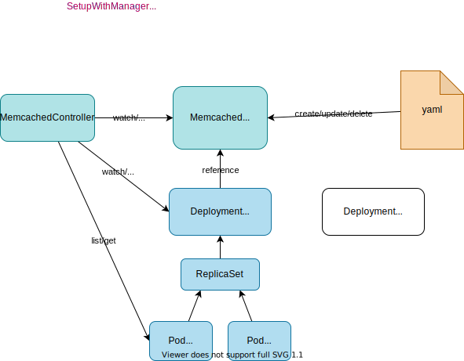
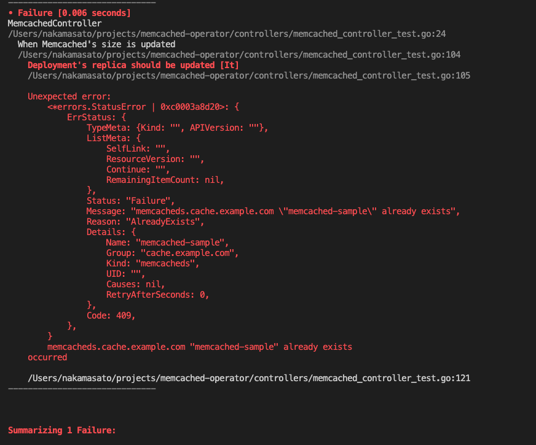

# [Memcached Operator](https://sdk.operatorframework.io/docs/building-operators/golang/tutorial/)

## Versions
- Go: go1.17.9
- operator-sdk: v1.21.0

## Codes

You can check the codes created in the tutorial [here](https://github.com/nakamasato/memcached-operator/commits/udemy-record):

- [1. [operator-sdk] Init project with operator-sdk init](https://github.com/nakamasato/memcached-operator/commit/268fc19615b8d3b23eb71d1460f5320ea9b644b7)
- [2. [operator-sdk] Create API Memcached (Controller & Resource) with `…](https://github.com/nakamasato/memcached-operator/commit/f5e795820654f86eb4e1bbd4c73ae5230cf13c55)
- [3. [API] Define API Memcached](https://github.com/nakamasato/memcached-operator/commit/4d1dc51672730d902e4aef18ba3b551a489b519e)
- [4.1. [Controller] Fetch the Memcached instance](https://github.com/nakamasato/memcached-operator/commit/8ce6e67b28023c8a85300c1e2342272d39247979)
- [4.2. [Controller] Check if the deployment already exists, and create …](https://github.com/nakamasato/memcached-operator/commit/21003bc4facdff09a5b2d2c86dfba5baae4a3517)
- [4.3. [Controller] Ensure the deployment size is the same as the spec](https://github.com/nakamasato/memcached-operator/commit/7a4631368d9ce8f9acbc9d9c824255dd90e8a7f2)
- [4.4. [Controller] Update the Memcached status with the pod names](https://github.com/nakamasato/memcached-operator/commit/ba13576865bd223e77d1ae5b341b4fce409f8241)
- [5. [Test] Write controller tests](https://github.com/nakamasato/memcached-operator/commit/d9734bcbb4b7ae51e465662ee0bc565fd0c90c0b)
- [6. Deploy with OLM](https://github.com/nakamasato/memcached-operator/commit/4a2045f55ec796eaef20ec6a8a0054bc661f9053)

You can also check the latest codes in https://github.com/nakamasato/memcached-operator.

## 0. memcached-operator overview

1. When custom resource `Memcached` is created, the controller creates a `Deployment` if it doesn't exist.
1. Ensure that the Deployment's `replicas` field is same as `Memcached`(CR)'s `size` field.
1. Update the `Memcached` CR status with the names of the Pods created by the corresponding `Deployment`


## 1. [operator-sdk] Init project with `operator-sdk init`

```
mkdir -p ~/projects/memcached-operator && cd ~/projects/memcached-operator
git init
```

```
operator-sdk init --domain example.com --repo github.com/example/memcached-operator
```

<details>

```
tree .
.
├── Dockerfile
├── Makefile
├── PROJECT
├── config
│   ├── default
│   │   ├── kustomization.yaml
│   │   ├── manager_auth_proxy_patch.yaml
│   │   └── manager_config_patch.yaml
│   ├── manager
│   │   ├── controller_manager_config.yaml
│   │   ├── kustomization.yaml
│   │   └── manager.yaml
│   ├── manifests
│   │   └── kustomization.yaml
│   ├── prometheus
│   │   ├── kustomization.yaml
│   │   └── monitor.yaml
│   ├── rbac
│   │   ├── auth_proxy_client_clusterrole.yaml
│   │   ├── auth_proxy_role.yaml
│   │   ├── auth_proxy_role_binding.yaml
│   │   ├── auth_proxy_service.yaml
│   │   ├── kustomization.yaml
│   │   ├── leader_election_role.yaml
│   │   ├── leader_election_role_binding.yaml
│   │   ├── role_binding.yaml
│   │   └── service_account.yaml
│   └── scorecard
│       ├── bases
│       │   └── config.yaml
│       ├── kustomization.yaml
│       └── patches
│           ├── basic.config.yaml
│           └── olm.config.yaml
├── go.mod
├── go.sum
├── hack
│   └── boilerplate.go.txt
└── main.go

10 directories, 29 files
```

</details>

`operator-sdk` generates exactly the same files as `kubebuilder`.
As we saw in the previous section with `kubebuilder`, the `main.go` initializes and runs a `Manager`.
When you initialize a Manager, you can specify namespace to restrict which namespace to monitor by the operator. e.g. `Namespace: "some-ns"`. The default is all namespaces. For more details: [manager#Options](https://pkg.go.dev/sigs.k8s.io/controller-runtime@v0.12.1/pkg/manager#Options)

Commit:

```
git add . && git commit -m "1. [operator-sdk] Init project with \`operator-sdk init\`"
```

## 2. [operator-sdk] Create API Memcached (Controller & Resource) with `operator-sdk create api`

```
operator-sdk create api --group cache --version v1alpha1 --kind Memcached --resource --controller
```

<details><summary>If fails</summary>

If you encountered the following error

```
/Users/nakamasato/projects/memcached-operator/bin/controller-gen object:headerFile="hack/boilerplate.go.txt" paths="./..."
bash: line 1: /Users/nakamasato/projects/memcached-operator/bin/controller-gen: No such file or directory
make: *** [generate] Error 127
Error: failed to create API: unable to run post-scaffold tasks of "base.go.kubebuilder.io/v3": exit status 2
Usage:
```

You can fix it by replacing installation steps of controller-gen, kustomize, and envtest with the following codes in `Makefile`:

```makefile
##@ Build Dependencies
## Location to install dependencies to
LOCALBIN ?= $(shell pwd)/bin
$(LOCALBIN): ## Ensure that the directory exists
    mkdir -p $(LOCALBIN)
## Tool Binaries
KUSTOMIZE ?= $(LOCALBIN)/kustomize
CONTROLLER_GEN ?= $(LOCALBIN)/controller-gen
ENVTEST ?= $(LOCALBIN)/setup-envtest
## Tool Versions
KUSTOMIZE_VERSION ?= v3.8.7
CONTROLLER_TOOLS_VERSION ?= v0.8.0
ENVTEST_VERSION ?= latest
KUSTOMIZE_INSTALL_SCRIPT ?= "https://raw.githubusercontent.com/kubernetes-sigs/kustomize/master/hack/install_kustomize.sh"
.PHONY: kustomize
kustomize: $(KUSTOMIZE) ## Download kustomize locally if necessary.
$(KUSTOMIZE):
    curl -s $(KUSTOMIZE_INSTALL_SCRIPT) | bash -s -- $(subst v,,$(KUSTOMIZE_VERSION)) $(LOCALBIN)
.PHONY: controller-gen
controller-gen: $(CONTROLLER_GEN) ## Download controller-gen locally if necessary.
$(CONTROLLER_GEN):
    GOBIN=$(LOCALBIN) go install sigs.k8s.io/controller-tools/cmd/controller-gen@$(CONTROLLER_TOOLS_VERSION)
.PHONY: envtest
envtest: ## Download envtest-setup locally if necessary.
    GOBIN=$(LOCALBIN) go install sigs.k8s.io/controller-runtime/tools/setup-envtest@$(ENVTEST_VERSION)
```

The diff is something like this:

```diff
        $(KUSTOMIZE) build config/default | kubectl delete --ignore-not-found=$(ignore-not-found) -f -

-CONTROLLER_GEN = $(shell pwd)/bin/controller-gen
-.PHONY: controller-gen
-controller-gen: ## Download controller-gen locally if necessary.
-       $(call go-get-tool,$(CONTROLLER_GEN),sigs.k8s.io/controller-tools/cmd/controller-gen@v0.8.0)
-
-KUSTOMIZE = $(shell pwd)/bin/kustomize
+##@ Build Dependencies
+## Location to install dependencies to
+LOCALBIN ?= $(shell pwd)/bin
+$(LOCALBIN): ## Ensure that the directory exists
+       mkdir -p $(LOCALBIN)
+## Tool Binaries
+KUSTOMIZE ?= $(LOCALBIN)/kustomize
+CONTROLLER_GEN ?= $(LOCALBIN)/controller-gen
+ENVTEST ?= $(LOCALBIN)/setup-envtest
+## Tool Versions
+KUSTOMIZE_VERSION ?= v3.8.7
+CONTROLLER_TOOLS_VERSION ?= v0.8.0
+ENVTEST_VERSION ?= latest
+KUSTOMIZE_INSTALL_SCRIPT ?= "https://raw.githubusercontent.com/kubernetes-sigs/kustomize/master/hack/install_kustomize.sh"
 .PHONY: kustomize
-kustomize: ## Download kustomize locally if necessary.
-       $(call go-get-tool,$(KUSTOMIZE),sigs.k8s.io/kustomize/kustomize/v3@v3.8.7)
-
-ENVTEST = $(shell pwd)/bin/setup-envtest
+kustomize: $(KUSTOMIZE) ## Download kustomize locally if necessary.
+$(KUSTOMIZE):
+       curl -s $(KUSTOMIZE_INSTALL_SCRIPT) | bash -s -- $(subst v,,$(KUSTOMIZE_VERSION)) $(LOCALBIN)
+.PHONY: controller-gen
+controller-gen: $(CONTROLLER_GEN) ## Download controller-gen locally if necessary.
+$(CONTROLLER_GEN):
+       GOBIN=$(LOCALBIN) go install sigs.k8s.io/controller-tools/cmd/controller-gen@$(CONTROLLER_TOOLS_VERSION)
 .PHONY: envtest
 envtest: ## Download envtest-setup locally if necessary.
-       $(call go-get-tool,$(ENVTEST),sigs.k8s.io/controller-runtime/tools/setup-envtest@latest)
-
-# go-get-tool will 'go get' any package $2 and install it to $1.
-PROJECT_DIR := $(shell dirname $(abspath $(lastword $(MAKEFILE_LIST))))
-define go-get-tool
-@[ -f $(1) ] || { \
-set -e ;\
-TMP_DIR=$$(mktemp -d) ;\
-cd $$TMP_DIR ;\
-go mod init tmp ;\
-echo "Downloading $(2)" ;\
-GOBIN=$(PROJECT_DIR)/bin go get $(2) ;\
-rm -rf $$TMP_DIR ;\
-}
-endef
+       GOBIN=$(LOCALBIN) go install sigs.k8s.io/controller-runtime/tools/setup-envtest@$(ENVTEST_VERSION)
```

Commit:

```
git add Makefile && git commit -m "1. Fix Makefile"
```

Then try the command again with `--force`

```
operator-sdk create api --group cache --version v1alpha1 --kind Memcached --resource --controller --force
```

</details>

```
make manifests
```

this commands generates:
- `config/rbac/role.yaml`: `Role` for the controller to access to the new resource `Memcached`
- `config/crd/bases`: CRD for the new resource `Memcached`

Let's make a commit for the newly generated resource and controller.

```
git add . && git commit -m "2. [operator-sdk] Create API Memcached (Controller & Resource) with \`operator-sdk create api\`"
```

In general, it is recommended to have one controller for one API resource. (e.g. memcached controller & memcached resource)

## 3. [API] Define API Memcached

- `MemcachedSpec.Size`: replicas of memcached Deployment
- `MemcachedStatus.Nodes`: the names of the memcached Pods

Update `MemcachedSpec` and `MemcachedStatus` in `api/v1alpha1/memcached_types.go`

```go
// MemcachedSpec defines the desired state of Memcached
type MemcachedSpec struct {
	//+kubebuilder:validation:Minimum=0
	// Size is the size of the memcached deployment
	Size int32 `json:"size"`
}

// MemcachedStatus defines the observed state of Memcached
type MemcachedStatus struct {
	// Nodes are the names of the memcached pods
	Nodes []string `json:"nodes"`
}
```

Let's update the codes automatically generated based on the Go types.

```bash
make fmt generate manifests
```

- `fmt`: format go codes
- `generate`: go types -> zz_generated.deepcopy.go
- `manifests`: go types & marker -> yaml (crd, rbac...)

Let's commit the changes:

```
git add . && git commit -m "3. [API] Define API Memcached"
```

## 4. Implement Controller

### 4.1. [Controller] Fetch the Memcached instance

1. Add necessary package.
    ```go
    import (
        "context" // already imported

        "k8s.io/apimachinery/pkg/api/errors"
        ///...
    )
    ```

1. Write the following lines in `Reconcile` function in [controllers/memcached_controller.go]().

    ```go
    func (r *MemcachedReconciler) Reconcile(ctx context.Context, req ctrl.Request) (ctrl.Result,     error) {
        log := log.FromContext(ctx)

        // 1. Fetch the Memcached instance
        memcached := &cachev1alpha1.Memcached{}
        err := r.Get(ctx, req.NamespacedName, memcached)
        if err != nil {
            if errors.IsNotFound(err) {
                log.Info("1. Fetch the Memcached instance. Memcached resource not found. Ignoring since object must be deleted")
                return ctrl.Result{}, nil
            }
            // Error reading the object - requeue the request.
            log.Error(err, "1. Fetch the Memcached instance. Failed to get Mmecached")
            return ctrl.Result{}, err
        }
        log.Info("1. Fetch the Memcached instance. Memchached resource found", "memcached.Name", memcached.Name, "memcached.Namespace", memcached.Namespace)
        return ctrl.Result{}, nil
    }
    ```

1. Check
    1. Install CRD and run the controller.
        ```bash
        make install run
        ```
    1. Apply a `Memcached` (CR).
        ```bash
        kubectl apply -f config/samples/cache_v1alpha1_memcached.yaml
        ```
    1. Check logs.

        ```bash
        2021-12-10T12:14:10.123+0900    INFO    controller.memcached    1. Fetch the Memcached instance. Memchached resource found {"reconciler group": "cache.example.com", "reconciler kind": "Memcached", "name": "memcached-sample", "namespace": "default", "memcached.Name": "memcached-sample", "memcached.Namespace": "default"}
        ```

    1. Delete the CR.
        ```bash
        kubectl delete -f config/samples/cache_v1alpha1_memcached.yaml
        ```

    1. Check logs.
        ```bash
        2021-12-10T12:15:37.234+0900    INFO    controller.memcached    1. Fetch the Memcached instance. Memcached resource not found. Ignoring since object must be deleted       {"reconciler group": "cache.example.com", "reconciler kind": "Memcached", "name": "memcached-sample", "namespace": "default"}
        ```
    1. Stop the controller.

Commit:
```
git add . && git commit -m "4.1. [Controller] Fetch the Memcached instance"
```
### 4.2. [Controller] Check if the deployment already exists, and create one if not exists

1. Add necessary packages to `import`.
    ```go
    import (
        ...
        "k8s.io/apimachinery/pkg/types"
        ...

        appsv1 "k8s.io/api/apps/v1"
        corev1 "k8s.io/api/core/v1"
        metav1 "k8s.io/apimachinery/pkg/apis/meta/v1"

        ...
    )
    ```

1. Add the following logics to `Reconcile` function.

    ```go
    // 2. Check if the deployment already exists, if not create a new one
    found := &appsv1.Deployment{}
    err = r.Get(ctx, types.NamespacedName{Name: memcached.Name, Namespace: memcached.Namespace}, found)
    if err != nil && errors.IsNotFound(err) {
            // Define a new deployment
            dep := r.deploymentForMemcached(memcached)
            log.Info("2. Check if the deployment already exists, if not create a new one. Creating a new Deployment", "Deployment.Namespace", dep.Namespace, "Deployment.Name", dep.Name)
            err = r.Create(ctx, dep)
            if err != nil {
                    log.Error(err, "2. Check if the deployment already exists, if not create a new one. Failed to create new Deployment", "Deployment.Namespace", dep.Namespace, "Deployment.Name", dep.Name)
                    return ctrl.Result{}, err
            }
            // Deployment created successfully
            return ctrl.Result{}, nil
    } else if err != nil {
            log.Error(err, "2. Check if the deployment already exists, if not create a new one. Failed to get Deployment")
            return ctrl.Result{}, err
    }
    ```
1. Create `deploymentForMemcached` and `labelsForMemcached` functions.

    <details><summary>deploymentForMemcached</summary>

    ```go
    // deploymentForMemcached returns a memcached Deployment object
    func (r *MemcachedReconciler) deploymentForMemcached(m *cachev1alpha1.Memcached) *appsv1.Deployment {
        ls := labelsForMemcached(m.Name)
        replicas := m.Spec.Size

        dep := &appsv1.Deployment{
                ObjectMeta: metav1.ObjectMeta{
                        Name:      m.Name,
                        Namespace: m.Namespace,
                },
                Spec: appsv1.DeploymentSpec{
                        Replicas: &replicas,
                        Selector: &metav1.LabelSelector{
                                MatchLabels: ls,
                        },
                        Template: corev1.PodTemplateSpec{
                                ObjectMeta: metav1.ObjectMeta{
                                        Labels: ls,
                                },
                                Spec: corev1.PodSpec{
                                        Containers: []corev1.Container{{
                                                Image:   "memcached:1.4.36-alpine",
                                                Name:    "memcached",
                                                Command: []string{"memcached", "-m=64", "-o", "modern", "-v"},
                                                Ports: []corev1.ContainerPort{{
                                                        ContainerPort: 11211,
                                                        Name:          "memcached",
                                                }},
                                        }},
                                },
                        },
                },
        }
        // Set Memcached instance as the owner and controller
        ctrl.SetControllerReference(m, dep, r.Scheme)
        return dep
    }
    ```

    </details>

    <details><summary>labelsForMemcached</summary>

    ```go
    // labelsForMemcached returns the labels for selecting the resources
    // belonging to the given memcached CR name.
    func labelsForMemcached(name string) map[string]string {
        return map[string]string{"app": "memcached", "memcached_cr": name}
    }
    ```

    </details>
1. Add necessary `RBAC` to the reconciler.

    ```diff
    //+kubebuilder:rbac:groups=cache.example.com,resources=memcacheds,verbs=get;list;watch;create;update;patch;delete
    //+kubebuilder:rbac:groups=cache.example.com,resources=memcacheds/status,verbs=get;update;patch
    //+kubebuilder:rbac:groups=cache.example.com,resources=memcacheds/finalizers,verbs=update
    + //+kubebuilder:rbac:groups=apps,resources=deployments,verbs=get;list;watch;create;update;patch;delete
    ```

1. Check
    1. Run the controller.
        ```bash
        make run
        ```
    1. Change `spec.size` in `config/samples/cache_v1alpha1_memcached.yaml` to 3 and apply a `Memcached` (CR).

    	```yaml
        apiVersion: cache.example.com/v1alpha1
        kind: Memcached
        metadata:
          labels:
            app.kubernetes.io/name: memcached
            app.kubernetes.io/instance: memcached-sample
            app.kubernetes.io/part-of: memcached-operator
            app.kubernetes.io/managed-by: kustomize
            app.kubernetes.io/created-by: memcached-operator
          name: memcached-sample
        spec:
          size: 3
	```

        ```bash
        kubectl apply -f config/samples/cache_v1alpha1_memcached.yaml
        ```
    1. Check logs.

        ```bash
        2021-12-10T12:34:34.587+0900    INFO    controller.memcached    1. Fetch the Memcached instance. Memchached resource found      {"reconciler group": "cache.example.com", "reconciler kind": "Memcached", "name": "memcached-sample", "namespace": "default", "memcached.Name": "memcached-sample", "memcached.Namespace": "default"}
        2021-12-10T12:34:34.587+0900    INFO    controller.memcached    2. Check if the deployment already exists, if not create a new one. Creating a new Deployment       {"reconciler group": "cache.example.com", "reconciler kind": "Memcached", "name": "memcached-sample", "namespace": "default", "Deployment.Namespace": "default", "Deployment.Name": "memcached-sample"}
        2021-12-10T12:34:34.599+0900    INFO    controller.memcached    1. Fetch the Memcached instance. Memchached resource found      {"reconciler group": "cache.example.com", "reconciler kind": "Memcached", "name": "memcached-sample", "namespace": "default", "memcached.Name": "memcached-sample", "memcached.Namespace": "default"}
        2021-12-10T12:34:34.604+0900    INFO    controller.memcached    1. Fetch the Memcached instance. Memchached resource found      {"reconciler group": "cache.example.com", "reconciler kind": "Memcached", "name": "memcached-sample", "namespace": "default", "memcached.Name": "memcached-sample", "memcached.Namespace": "default"}
        2021-12-10T12:34:34.648+0900    INFO    controller.memcached    1. Fetch the Memcached instance. Memchached resource found      {"reconciler group": "cache.example.com", "reconciler kind": "Memcached", "name": "memcached-sample", "namespace": "default", "memcached.Name": "memcached-sample", "memcached.Namespace": "default"}
        2021-12-10T12:34:34.662+0900    INFO    controller.memcached    1. Fetch the Memcached instance. Memchached resource found      {"reconciler group": "cache.example.com", "reconciler kind": "Memcached", "name": "memcached-sample", "namespace": "default", "memcached.Name": "memcached-sample", "memcached.Namespace": "default"}
        2021-12-10T12:34:34.724+0900    INFO    controller.memcached    1. Fetch the Memcached instance. Memchached resource found      {"reconciler group": "cache.example.com", "reconciler kind": "Memcached", "name": "memcached-sample", "namespace": "default", "memcached.Name": "memcached-sample", "memcached.Namespace": "default"}
        2021-12-10T12:34:43.285+0900    INFO    controller.memcached    1. Fetch the Memcached instance. Memchached resource found      {"reconciler group": "cache.example.com", "reconciler kind": "Memcached", "name": "memcached-sample", "namespace": "default", "memcached.Name": "memcached-sample", "memcached.Namespace": "default"}
        2021-12-10T12:34:46.333+0900    INFO    controller.memcached    1. Fetch the Memcached instance. Memchached resource found      {"reconciler group": "cache.example.com", "reconciler kind": "Memcached", "name": "memcached-sample", "namespace": "default", "memcached.Name": "memcached-sample", "memcached.Namespace": "default"}
        2021-12-10T12:34:48.363+0900    INFO    controller.memcached    1. Fetch the Memcached instance. Memchached resource found      {"reconciler group": "cache.example.com", "reconciler kind": "Memcached", "name": "memcached-sample", "namespace": "default", "memcached.Name": "memcached-sample", "memcached.Namespace": "default"}
        ```

        Logs:
        1. When `Memcached` object is created.
        1. Create `Deployment`
        1. Memcached resource found. (no need to create `Deployment` as it already exists)

    1. Check `Deployment`.

        ```
        kubectl get deploy memcached-sample
        NAME               READY   UP-TO-DATE   AVAILABLE   AGE
        memcached-sample   3/3     3            3           19s
        ```

    1. Change `Deployment`'s replicas to 2 manually.

        ```
        kubectl patch deploy memcached-sample -p '{"spec":{"replicas": 2}}'
        ```

        Now `Memcached.Spec.Size` is different from `Deployment.Spec.Replicas`. -> Fix in next section.

    1. Delete the CR.
        ```bash
        kubectl delete -f config/samples/cache_v1alpha1_memcached.yaml
        ```

    1. Check logs.
        ```bash
        1.65394828262848e+09    INFO    controller.memcached    1. Fetch the Memcached instance. Memcached resource not found. Ignoring since object must be deleted {"reconciler group": "cache.example.com", "reconciler kind": "Memcached", "name": "memcached-sample", "namespace": "default"}
        1.653948282750252e+09   INFO    controller.memcached    1. Fetch the Memcached instance. Memcached resource not found. Ignoring since object must be deleted {"reconciler group": "cache.example.com", "reconciler kind": "Memcached", "name": "memcached-sample", "namespace": "default"}
        ```
    1. Check `Deployment`.
        ```
        kubectl get deploy
        No resources found in default namespace.
        ```
    1. Stop the controller.

Commit:
```
git add . && git commit -m "4.2. [Controller] Check if the deployment already exists, and create one if not exists"
```

### 4.3. [Controller] Ensure the deployment size is the same as the spec

1. Add `Owns(&appsv1.Deployment{})` to the controller manager.

    ```go
    // SetupWithManager sets up the controller with the Manager.
    func (r *MemcachedReconciler) SetupWithManager(mgr ctrl.Manager) error {
        return ctrl.NewControllerManagedBy(mgr).
            For(&cachev1alpha1.Memcached{}).
            Owns(&appsv1.Deployment{}).
            Complete(r)
    }
    ```

    

    - [For](https://pkg.go.dev/sigs.k8s.io/controller-runtime/pkg/builder#Builder.For): primary resource to monitor -> `Reconcile` will be called for `Create/Update/Delete` of the resource.
    - [Owns](https://pkg.go.dev/sigs.k8s.io/controller-runtime/pkg/builder#Builder.Owns): secondary resource to monitor. -> `Reconcile` will be called for `Create/Update/Delete` for **the owner** (`Memcached` in this example) of the secondary resource (`Deployment` in this example).
    - for more details: [builder (controller-runtime)](https://pkg.go.dev/sigs.k8s.io/controller-runtime/pkg/builder).

    Check:

    ```
    make run
    ```

    ```
    kubectl apply -f config/samples/cache_v1alpha1_memcached.yaml
    ```

    ```
    kubectl patch deploy memcached-sample -p '{"spec":{"replicas": 2}}'
    ```

    You can check `Reconcile` is called.

1. Add the following lines to `Reconcile` function.

    ```go
    // 3. Ensure the deployment size is the same as the spec
    size := memcached.Spec.Size
    if *found.Spec.Replicas != size {
            found.Spec.Replicas = &size
            err = r.Update(ctx, found)
            if err != nil {
                    log.Error(err, "3. Ensure the deployment size is the same as the spec. Failed to update Deployment", "Deployment.Namespace", found.Namespace, "Deployment.Name", found.Name)
                    return ctrl.Result{}, err
            }
            // Spec updated - return and requeue
            log.Info("3. Ensure the deployment size is the same as the spec. Update deployment size", "Deployment.Spec.Replicas", size)
            return ctrl.Result{}, nil
    }
    ```

1. Check
    1. Run the controller.
        ```bash
        make run
        ```
    1. Apply a `Memcached` (CR).
        ```bash
        kubectl apply -f config/samples/cache_v1alpha1_memcached.yaml
        ```
    1. Check `Deployment`.

        ```
        kubectl get deploy memcached-sample
        NAME               READY   UP-TO-DATE   AVAILABLE   AGE
        memcached-sample   3/3     3            3           19s
        ```

    1. Change the size to 2 in [config/samples/cache_v1alpha1_memcached.yaml]()

        ```
        kubectl apply -f config/samples/cache_v1alpha1_memcached.yaml
        ```

    1. Check logs.

        ```bash
        2021-12-10T12:59:09.880+0900    INFO    controller.memcached    1. Fetch the Memcached instance. Memchached resource found      {"reconciler group": "cache.example.com", "reconciler kind": "Memcached", "name": "memcached-sample", "namespace": "default", "memcached.Name": "memcached-sample", "memcached.Namespace": "default"}
        2021-12-10T12:59:09.888+0900    INFO    controller.memcached    3. Ensure the deployment size is the same as the spec. Update deployment size{"reconciler group": "cache.example.com", "reconciler kind": "Memcached", "name": "memcached-sample", "namespace": "default", "Deployment.Spec.Replicas": 2}
        2021-12-10T12:59:09.888+0900    INFO    controller.memcached    1. Fetch the Memcached instance. Memchached resource found      {"reconciler group": "cache.example.com", "reconciler kind": "Memcached", "name": "memcached-sample", "namespace": "default", "memcached.Name": "memcached-sample", "memcached.Namespace": "default"}
        2021-12-10T12:59:09.894+0900    INFO    controller.memcached    1. Fetch the Memcached instance. Memchached resource found      {"reconciler group": "cache.example.com", "reconciler kind": "Memcached", "name": "memcached-sample", "namespace": "default", "memcached.Name": "memcached-sample", "memcached.Namespace": "default"}
        2021-12-10T12:59:09.911+0900    INFO    controller.memcached    1. Fetch the Memcached instance. Memchached resource found      {"reconciler group": "cache.example.com", "reconciler kind": "Memcached", "name": "memcached-sample", "namespace": "default", "memcached.Name": "memcached-sample", "memcached.Namespace": "default"}
        2021-12-10T12:59:09.951+0900    INFO    controller.memcached    1. Fetch the Memcached instance. Memchached resource found      {"reconciler group": "cache.example.com", "reconciler kind": "Memcached", "name": "memcached-sample", "namespace": "default", "memcached.Name": "memcached-sample", "memcached.Namespace": "default"}
        ```

    1. Check `Deployment`.

        ```
        kubectl get deploy
        NAME               READY   UP-TO-DATE   AVAILABLE   AGE
        memcached-sample   2/2     2            2           115s
        ```

    1. Delete the CR.
        ```bash
        kubectl delete -f config/samples/cache_v1alpha1_memcached.yaml
        ```

    1. Check logs.
        ```bash
        2021-12-10T13:00:50.149+0900    INFO    controller.memcached    1. Fetch the Memcached instance. Memcached resource not found. Ignoring since object must be deleted {"reconciler group": "cache.example.com", "reconciler kind": "Memcached", "name": "memcached-sample", "namespace": "default"}
        2021-12-10T13:00:50.185+0900    INFO    controller.memcached    1. Fetch the Memcached instance. Memcached resource not found. Ignoring since object must be deleted {"reconciler group": "cache.example.com", "reconciler kind": "Memcached", "name": "memcached-sample", "namespace": "default"}
        ```
    1. Check `Deployment`.
        ```
        kubectl get deploy
        No resources found in default namespace.
        ```
    1. Stop the controller.

Commit:

```
git commit -a -m "4.3. [Controller] Ensure the deployment size is the same as the spec"
```

### 4.4. [Controller] Update the Memcached status with the pod names

1. Add `"reflect"` to `import`.
1. Add the following logic to `Reconcile` functioin.

    ```go
    // 4. Update the Memcached status with the pod names
    // List the pods for this memcached's deployment
    podList := &corev1.PodList{}
    listOpts := []client.ListOption{
            client.InNamespace(memcached.Namespace),
            client.MatchingLabels(labelsForMemcached(memcached.Name)),
    }
    if err = r.List(ctx, podList, listOpts...); err != nil {
            log.Error(err, "4. Update the Memcached status with the pod names. Failed to list pods", "Memcached.Namespace", memcached.Namespace, "Memcached.Name", memcached.Name)
            return ctrl.Result{}, err
    }
    podNames := getPodNames(podList.Items)
    log.Info("4. Update the Memcached status with the pod names. Pod list", "podNames", podNames)
    // Update status.Nodes if needed
    if !reflect.DeepEqual(podNames, memcached.Status.Nodes) {
            memcached.Status.Nodes = podNames
            err := r.Status().Update(ctx, memcached)
            if err != nil {
                    log.Error(err, "4. Update the Memcached status with the pod names. Failed to update Memcached status")
                    return ctrl.Result{}, err
            }
    }
    log.Info("4. Update the Memcached status with the pod names. Update memcached.Status", "memcached.Status.Nodes", memcached.Status.Nodes)
    ```
1. Add `getPodNames` function.

    ```go
    // getPodNames returns the pod names of the array of pods passed in
    func getPodNames(pods []corev1.Pod) []string {
        var podNames []string
        for _, pod := range pods {
                podNames = append(podNames, pod.Name)
        }
        return podNames
    }
    ```
1. Add necessary `RBAC`.
    ```diff
      //+kubebuilder:rbac:groups=cache.example.com,resources=memcacheds,verbs=get;list;watch;create;update;patch;delete
      //+kubebuilder:rbac:groups=cache.example.com,resources=memcacheds/status,verbs=get;update;patch
      //+kubebuilder:rbac:groups=cache.example.com,resources=memcacheds/finalizers,verbs=update
      //+kubebuilder:rbac:groups=apps,resources=deployments,verbs=get;list;watch;create;update;patch;delete
    + //+kubebuilder:rbac:groups=core,resources=pods,verbs=get;list;
    ```

1. Check
    1. Run the controller.
        ```bash
        make run
        ```
    1. Apply a `Memcached` (CR).
        ```bash
        kubectl apply -f config/samples/cache_v1alpha1_memcached.yaml
        ```

    1. Check logs.

        ```bash
        2021-12-10T13:09:03.716+0900    INFO    controller.memcached    1. Fetch the Memcached instance. Memchached resource found      {"reconciler group": "cache.example.com", "reconciler kind": "Memcached", "name": "memcached-sample", "namespace": "default", "memcached.Name": "memcached-sample", "memcached.Namespace": "default"}
        2021-12-10T13:09:03.716+0900    INFO    controller.memcached    2. Check if the deployment already exists, if not create a new one. Creating a new Deployment    {"reconciler group": "cache.example.com", "reconciler kind": "Memcached", "name": "memcached-sample", "namespace": "default", "Deployment.Namespace": "default", "Deployment.Name": "memcached-sample"}
        2021-12-10T13:09:03.727+0900    INFO    controller.memcached    1. Fetch the Memcached instance. Memchached resource found      {"reconciler group": "cache.example.com", "reconciler kind": "Memcached", "name": "memcached-sample", "namespace": "default", "memcached.Name": "memcached-sample", "memcached.Namespace": "default"}
        2021-12-10T13:09:03.829+0900    INFO    controller.memcached    4. Update the Memcached status with the pod names. Pod list     {"reconciler group": "cache.example.com", "reconciler kind": "Memcached", "name": "memcached-sample", "namespace": "default", "podNames": ["memcached-sample-6c765df685-f9jpl", "memcached-sample-6c765df685-cf725"]}
        2021-12-10T13:09:03.841+0900    INFO    controller.memcached    4. Update the Memcached status with the pod names. Update memcached.Status       {"reconciler group": "cache.example.com", "reconciler kind": "Memcached", "name": "memcached-sample", "namespace": "default", "memcached.Status.Nodes": ["memcached-sample-6c765df685-f9jpl", "memcached-sample-6c765df685-cf725"]}
        2021-12-10T13:09:03.841+0900    INFO    controller.memcached    1. Fetch the Memcached instance. Memchached resource found      {"reconciler group": "cache.example.com", "reconciler kind": "Memcached", "name": "memcached-sample", "namespace": "default", "memcached.Name": "memcached-sample", "memcached.Namespace": "default"}
        2021-12-10T13:09:03.841+0900    INFO    controller.memcached    4. Update the Memcached status with the pod names. Pod list     {"reconciler group": "cache.example.com", "reconciler kind": "Memcached", "name": "memcached-sample", "namespace": "default", "podNames": ["memcached-sample-6c765df685-f9jpl", "memcached-sample-6c765df685-cf725"]}
        2021-12-10T13:09:03.841+0900    INFO    controller.memcached    4. Update the Memcached status with the pod names. Update memcached.Status       {"reconciler group": "cache.example.com", "reconciler kind": "Memcached", "name": "memcached-sample", "namespace": "default", "memcached.Status.Nodes": ["memcached-sample-6c765df685-f9jpl", "memcached-sample-6c765df685-cf725"]}
        2021-12-10T13:09:05.565+0900    INFO    controller.memcached    1. Fetch the Memcached instance. Memchached resource found      {"reconciler group": "cache.example.com", "reconciler kind": "Memcached", "name": "memcached-sample", "namespace": "default", "memcached.Name": "memcached-sample", "memcached.Namespace": "default"}
        2021-12-10T13:09:05.565+0900    INFO    controller.memcached    4. Update the Memcached status with the pod names. Pod list     {"reconciler group": "cache.example.com", "reconciler kind": "Memcached", "name": "memcached-sample", "namespace": "default", "podNames": ["memcached-sample-6c765df685-f9jpl", "memcached-sample-6c765df685-cf725"]}
        2021-12-10T13:09:05.565+0900    INFO    controller.memcached    4. Update the Memcached status with the pod names. Update memcached.Status       {"reconciler group": "cache.example.com", "reconciler kind": "Memcached", "name": "memcached-sample", "namespace": "default", "memcached.Status.Nodes": ["memcached-sample-6c765df685-f9jpl", "memcached-sample-6c765df685-cf725"]}
        2021-12-10T13:09:05.587+0900    INFO    controller.memcached    1. Fetch the Memcached instance. Memchached resource found      {"reconciler group": "cache.example.com", "reconciler kind": "Memcached", "name": "memcached-sample", "namespace": "default", "memcached.Name": "memcached-sample", "memcached.Namespace": "default"}
        2021-12-10T13:09:05.587+0900    INFO    controller.memcached    4. Update the Memcached status with the pod names. Pod list     {"reconciler group": "cache.example.com", "reconciler kind": "Memcached", "name": "memcached-sample", "namespace": "default", "podNames": ["memcached-sample-6c765df685-f9jpl", "memcached-sample-6c765df685-cf725"]}
        2021-12-10T13:09:05.588+0900    INFO    controller.memcached    4. Update the Memcached status with the pod names. Update memcached.Status       {"reconciler group": "cache.example.com", "reconciler kind": "Memcached", "name": "memcached-sample", "namespace": "default", "memcached.Status.Nodes": ["memcached-sample-6c765df685-f9jpl", "memcached-sample-6c765df685-cf725"]}
        ```

    1. Check `Deployment`.

        ```
        kubectl get deploy
        NAME               READY   UP-TO-DATE   AVAILABLE   AGE
        memcached-sample   2/2     2            2           115s
        ```

    1. Check `status` in `Memcached` object.

        ```bash
        kubectl get Memcached memcached-sample -o jsonpath='{.status}' | jq
        {
          "nodes": [
            "memcached-sample-6c765df685-9drvp",
            "memcached-sample-6c765df685-g7nl8"
          ]
        }
        ```

    1. Delete the CR.
        ```bash
        kubectl delete -f config/samples/cache_v1alpha1_memcached.yaml
        ```

    1. Stop the controller.

commit:

```
git commit -am "4.4. [Controller] Update the Memcached status with the pod names"
```

## 5. Write a test

### 5.1. Tools

1. [envtest](https://pkg.go.dev/sigs.k8s.io/controller-runtime/pkg/envtest): provides libraries for integration testing by starting a local control plane. (`etcd` and `kube-apiserver`)
1. [Ginkgo](https://pkg.go.dev/github.com/onsi/ginkgo): a BDD-style testing framework for Golang.
1. [Gomega](https://pkg.go.dev/github.com/onsi/gomega): the Ginkgo BDD-style testing framework's preferred matcher library.
### 5.2. Prepare `suite_test.go`

1. Import necessary packages.
    ```diff
     import (
    +       "context"
            "path/filepath"
            "testing"
    +       ctrl "sigs.k8s.io/controller-runtime"
    +
            . "github.com/onsi/ginkgo"
            . "github.com/onsi/gomega"
            "k8s.io/client-go/kubernetes/scheme"
    -       "k8s.io/client-go/rest"
            "sigs.k8s.io/controller-runtime/pkg/client"
            "sigs.k8s.io/controller-runtime/pkg/envtest"
            "sigs.k8s.io/controller-runtime/pkg/envtest/ter"
            logf "sigs.k8s.io/controller-runtime/pkg/log"
            "sigs.k8s.io/controller-runtime/pkg/log/zap"
    +       "sigs.k8s.io/controller-runtime/pkg/manager"
    ```

1. Prepare global variables.
    ```diff
    -var cfg *rest.Config
    -var k8sClient client.Client
    -var testEnv *envtest.Environment
    +var (
    +       k8sClient  client.Client
    +       k8sManager manager.Manager
    +       testEnv    *envtest.Environment
    +       ctx        context.Context
    +       cancel     context.CancelFunc
    +)
    ```

1. Add the following lines at the end of `BeforeSuite` in `controllers/suite_test.go`.

    ```go
        // Create context with cancel.
        ctx, cancel = context.WithCancel(context.TODO())

        // Register the schema to manager.
        k8sManager, err = ctrl.NewManager(cfg, ctrl.Options{
            Scheme: scheme.Scheme,
        })

        // Initialize `MemcachedReconciler` with the manager client schema.
        err = (&MemcachedReconciler{
            Client: k8sManager.GetClient(),
            Scheme: k8sManager.GetScheme(),
        }).SetupWithManager(k8sManager)

        // Start the with a goroutine.
        go func() {
            defer GinkgoRecover()
            err = k8sManager.Start(ctx)
            Expect(err).ToNot(HaveOccurred(), "failed to run manager")
        }()
    ```

1. Add `cancel()` to AfterSuite.

    ```diff
     var _ = AfterSuite(func() {
    +       cancel()
            By("tearing down the test environment")
            err := testEnv.Stop()
            Expect(err).NotTo(HaveOccurred())
    ```

### 5.3. Test Warm-Up

Create `controllers/memcached_controller_test.go`

```go
package controllers

import (
	. "github.com/onsi/ginkgo/v2"
	. "github.com/onsi/gomega"
)

var _ = Describe("MemcachedController", func() {
	It("Should be true", func() {
		Expect(true).To(BeTrue())
	})
})
```

Run test

```
make test
```

### 5.4. Test Case 1: When Memcached is created, Deployment should be created

Write a test case in `controllers/memcached_controller_test.go`

Set constant variables.

```go
const (
	memcachedApiVersion = "cache.example.com/v1alphav1"
	memcachedKind       = "Memcached"
	memcachedName       = "memcached-sample"
	memcachedNamespace  = "default"
	timeout             = time.Second * 10
	interval            = time.Millisecond * 250
)
```

```go
var _ = Describe("MemcachedController", func() {
    Context("When Memcached is created", func(){
	    It("Deployment should be created", func() {
            // Create Memcached

            // Get Deployment by the memcached's name and namespace

            // Expect error to be nil
    	})
    })
})
```

### 5.5. Test Case 2: When `Memcached`'s `size` is updated, `Deployment`'s `replicas` should be updated

```go
var _ = Describe("MemcachedController", func() {
    Context("When Memcached's size is updated", func(){
	    It("Deployment's replica should be updated", func() {
            // Create Memcached with size 3

            // Update Memcached's size with 2

            // Get Deployment by the memcached's name and namespace

            // Expect replicas to be 2
    	})
    })
})
```

```
make test
```

You'll get an error `memcacheds.cache.example.com "memcached-sample" already exists`

<details><summary>image</summary>



</details>

Let's add a logic to clean up `Memcached` and `Deployment` before each test case.

```go
	BeforeEach(func() {
		// Clean up Memcached
		memcached := &cachev1alpha1.Memcached{}
		err := k8sClient.Get(ctx,
			types.NamespacedName{
				Name:      memcachedName,
				Namespace: memcachedNamespace,
			},
			memcached,
		)
		if err == nil {
			err := k8sClient.Delete(ctx, memcached)
			Expect(err).NotTo(HaveOccurred())
		}
		// Clean up Deployment
		deployment := &appsv1.Deployment{}
		err = k8sClient.Get(ctx,
			types.NamespacedName{
				Name:      memcachedName,
				Namespace: memcachedNamespace,
			},
			deployment,
		)
		if err == nil {
			err := k8sClient.Delete(ctx, deployment)
			Expect(err).NotTo(HaveOccurred())
		}
	})
```

```
make test
```

All tests pass.

```
git add . && git commit -m "5. [Test] Write controller tests"
```

codes: [controllers/memcached_controller_test.go](https://github.com/nakamasato/memcached-operator/blob/main/controllers/memcached_controller_test.go)

### 5.6. Test Case 3: When `Deployment` is deleted, `Deployment` should be recreated

Please try to write by yourself.
Steps:

1. Create `Memcached`.
1. Check `Deployment` is created.
1. Delete `Deployment`.
1. Check `Deployment` is recreated.

<details><summary>memcached_controller_test.go</summary>

```go
package controllers

import (
	"context"
	"fmt"
	"time"

	cachev1alpha1 "github.com/example/memcached-operator/api/v1alpha1"
	. "github.com/onsi/ginkgo"
	. "github.com/onsi/gomega"

	appsv1 "k8s.io/api/apps/v1"
	v1 "k8s.io/api/core/v1"
	metav1 "k8s.io/apimachinery/pkg/apis/meta/v1"
	"k8s.io/apimachinery/pkg/types"

	"sigs.k8s.io/controller-runtime/pkg/client"
)

const (
	memcachedApiVersion = "cache.example.com/v1alphav1"
	memcachedKind       = "Memcached"
	memcachedName       = "sample"
	memcachedNamespace  = "default"
	memcachedStartSize  = int32(3)
	memcachedUpdateSize = int32(10)
	timeout             = time.Second * 10
	interval            = time.Millisecond * 250
)

var _ = Describe("Memcached controller", func() {

	lookUpKey := types.NamespacedName{Name: memcachedName, Namespace: memcachedNamespace}

	AfterEach(func() {
		// Delete Memcached
		deleteMemcached(ctx, lookUpKey)
		// Delete all Pods
		deleteAllPods(ctx)
	})

	Context("When creating Memcached", func() {
		BeforeEach(func() {
			// Create Memcached
			createMemcached(ctx, memcachedStartSize)
		})
		It("Should create Deployment with the specified size and memcached image", func() {
			// Deployment is created
			deployment := &appsv1.Deployment{}
			Eventually(func() error {
				return k8sClient.Get(ctx, lookUpKey, deployment)
			}, timeout, interval).Should(Succeed())
			Expect(*deployment.Spec.Replicas).Should(Equal(memcachedStartSize))
			Expect(deployment.Spec.Template.Spec.Containers[0].Image).Should(Equal("memcached:1.4.36-alpine"))
			// https://github.com/kubernetes-sigs/controller-runtime/blob/master/pkg/controller/controllerutil/controllerutil_test.go
			Expect(deployment.OwnerReferences).ShouldNot(BeEmpty())
		})
		It("Should have pods name in Memcached Node", func() {
			checkIfDeploymentExists(ctx, lookUpKey)

			By("By creating Pods with labels")
			podNames := createPods(ctx, int(memcachedStartSize))

			updateMemcacheSize(ctx, lookUpKey, memcachedUpdateSize) // just to trigger reconcile

			checkMemcachedStatusNodes(ctx, lookUpKey, podNames)
		})
	})

	Context("When updating Memcached", func() {
		BeforeEach(func() {
			// Create Memcached
			createMemcached(ctx, memcachedStartSize)
			// Deployment is ready
			checkDeploymentReplicas(ctx, lookUpKey, memcachedStartSize)
		})

		It("Should update Deployment replicas", func() {
			By("Changing Memcached size")
			updateMemcacheSize(ctx, lookUpKey, memcachedUpdateSize)

			checkDeploymentReplicas(ctx, lookUpKey, memcachedUpdateSize)
		})

		It("Should update the Memcached status with the pod names", func() {
			By("Changing Memcached size")
			updateMemcacheSize(ctx, lookUpKey, memcachedUpdateSize)

			podNames := createPods(ctx, int(memcachedUpdateSize))
			checkMemcachedStatusNodes(ctx, lookUpKey, podNames)
		})
	})
	Context("When changing Deployment", func() {
		BeforeEach(func() {
			// Create Memcached
			createMemcached(ctx, memcachedStartSize)
			// Deployment is ready
			checkDeploymentReplicas(ctx, lookUpKey, memcachedStartSize)
		})

		It("Should check if the deployment already exists, if not create a new one", func() {
			By("Deleting Deployment")
			deployment := &appsv1.Deployment{}
			Expect(k8sClient.Get(ctx, lookUpKey, deployment)).Should(Succeed())
			Expect(k8sClient.Delete(ctx, deployment)).Should(Succeed())

			// Deployment will be recreated by the controller
			checkIfDeploymentExists(ctx, lookUpKey)
		})

		It("Should ensure the deployment size is the same as the spec", func() {
			By("Changing Deployment replicas")
			deployment := &appsv1.Deployment{}
			Expect(k8sClient.Get(ctx, lookUpKey, deployment)).Should(Succeed())
			*deployment.Spec.Replicas = 0
			Expect(k8sClient.Update(ctx, deployment)).Should(Succeed())

			// replicas will be updated back to the original one by the controller
			checkDeploymentReplicas(ctx, lookUpKey, memcachedStartSize)
		})
	})

	// Deployment is expected to be deleted when Memcached is deleted.
	// As it's garbage collector's responsibility, which is not part of envtest, we don't test it here.
})

func checkIfDeploymentExists(ctx context.Context, lookUpKey types.NamespacedName) {
	deployment := &appsv1.Deployment{}
	Eventually(func() error {
		return k8sClient.Get(ctx, lookUpKey, deployment)
	}, timeout, interval).Should(Succeed())
}

func checkDeploymentReplicas(ctx context.Context, lookUpKey types.NamespacedName, expectedSize int32) {
	Eventually(func() (int32, error) {
		deployment := &appsv1.Deployment{}
		err := k8sClient.Get(ctx, lookUpKey, deployment)
		if err != nil {
			return int32(0), err
		}
		return *deployment.Spec.Replicas, nil
	}, timeout, interval).Should(Equal(expectedSize))
}

func newMemcached(size int32) *cachev1alpha1.Memcached {
	return &cachev1alpha1.Memcached{
		TypeMeta: metav1.TypeMeta{
			APIVersion: memcachedApiVersion,
			Kind:       memcachedKind,
		},
		ObjectMeta: metav1.ObjectMeta{
			Name:      memcachedName,
			Namespace: memcachedNamespace,
		},
		Spec: cachev1alpha1.MemcachedSpec{
			Size: size,
		},
	}
}

func createMemcached(ctx context.Context, size int32) {
	memcached := newMemcached(size)
	Expect(k8sClient.Create(ctx, memcached)).Should(Succeed())
}

func updateMemcacheSize(ctx context.Context, lookUpKey types.NamespacedName, size int32) {
	memcached := &cachev1alpha1.Memcached{}
	Expect(k8sClient.Get(ctx, lookUpKey, memcached)).Should(Succeed())
	memcached.Spec.Size = size
	Expect(k8sClient.Update(ctx, memcached)).Should(Succeed())
}

func deleteMemcached(ctx context.Context, lookUpKey types.NamespacedName) {
	memcached := &cachev1alpha1.Memcached{}
	Expect(k8sClient.Get(ctx, lookUpKey, memcached)).Should(Succeed())
	Expect(k8sClient.Delete(ctx, memcached)).Should(Succeed())
}

func checkMemcachedStatusNodes(ctx context.Context, lookUpKey types.NamespacedName, podNames []string) {
	memcached := &cachev1alpha1.Memcached{}
	Eventually(func() ([]string, error) {
		err := k8sClient.Get(ctx, lookUpKey, memcached)
		if err != nil {
			return nil, err
		}
		return memcached.Status.Nodes, nil
	}, timeout, interval).Should(ConsistOf(podNames))
}

func createPods(ctx context.Context, num int) []string {
	podNames := []string{}
	for i := 0; i < num; i++ {
		podName := fmt.Sprintf("pod-%d", i)
		podNames = append(podNames, podName)
		pod := newPod(podName)
		Expect(k8sClient.Create(ctx, pod)).Should(Succeed())
	}
	return podNames
}

func deleteAllPods(ctx context.Context) {
	err := k8sClient.DeleteAllOf(ctx, &v1.Pod{}, client.InNamespace(memcachedNamespace))
	Expect(err).NotTo(HaveOccurred())
}

func newPod(name string) *v1.Pod {
	return &v1.Pod{
		TypeMeta: metav1.TypeMeta{
			Kind:       "Pod",
			APIVersion: "v1",
		},
		ObjectMeta: metav1.ObjectMeta{
			Name:      name,
			Namespace: memcachedNamespace,
			Labels: map[string]string{
				"app":          "memcached",
				"memcached_cr": memcachedName,
			},
		},
		Spec: v1.PodSpec{
			Containers: []v1.Container{
				{
					Name:  "memcached",
					Image: "memcached",
				},
			},
		},
		Status: v1.PodStatus{},
	}
}
```

</details>

## 6. Deployment

### 6.1. Deploy with Deployment

1. (prerequisite) Prepare Docker image registry. (e.g. https://hub.docker.com/r/nakamasato/memcached-operator)

1. Build Docker image and push it to registry.

    ```bash
    export IMG="<image registry name>:v0.0.1" # e.g. nakamasato/memcached-operator:v0.0.1
    make docker-build docker-push IMG=$IMG
    ```

1. Deploy memcached-operator.

    ```
    make deploy IMG=$IMG
    ```

1. Create custom resource.

    ```
    kubectl apply -f config/samples/cache_v1alpha1_memcached.yaml
    ```

    Check controller's log:

    ```
    kubectl logs $(kubectl get po -n memcached-operator-system | grep memcached-operator-controller-manager | awk '{print $1}') -c manager -n memcached-operator-system -f
    ```

    Check Deployment:

    ```
    kubectl get deploy
    ```

1. Delete custom resource.

    ```
    kubectl delete -f config/samples/cache_v1alpha1_memcached.yaml
    ```

1. Uninstall memcached-operator.

    ```
    make undeploy
    ```

### 6.2. Deploy with Operator Lifecycle Manager (OLM)

#### Operators

Interestingly, OLM itself also consists of two Kubernetes operators:
1. **OLM Operator**: Watches for ClusterServiceVersion (CSVs) in a namespace and checks that requirements are met. If so, runs the install strategy for the CSV.
1. **Catalog Operator**: resolving and installing CSVs and the required resources they specify.

#### Custom Resources

OLM manages operator lifecycle with the following custom resources:
- [ClusterServiceVersion](https://olm.operatorframework.io/docs/concepts/crds/clusterserviceversion/): a particular version of a running operator on a cluster: a template for the operator `Deployment`

    - metadata: display name, maintainers, version,...
    - operator scope: installModes
    - installation: strategy, spec (permission, clusterPermission, deployments)
    - customresourcedefinitions

    <details><summary>example</summary>

    ```yaml
    apiVersion: operators.coreos.com/v1alpha1
    kind: ClusterServiceVersion
    metadata:
      annotations:
      name: memcached-operator.v0.10.0
    spec:
      # metadata
      description: This is an operator for memcached.
      displayName: Memcached Operator
      keywords:
      - memcached
      - app
      maintainers:
      - email: corp@example.com
        name: Some Corp
      maturity: alpha
      provider:
        name: Example
        url: www.example.com
      version: 0.10.0
      minKubeVersion: 1.16.0

      # operator scope
      installModes:
      - supported: true
        type: OwnNamespace
      - supported: true
        type: SingleNamespace
      - supported: false
        type: MultiNamespace
      - supported: true
        type: AllNamespaces

      # installation
      install:
        # strategy indicates what type of deployment artifacts are used
        strategy: deployment
        # spec for the deployment strategy is a list of deployment specs and required permissions - similar to a pod template used in a deployment
        spec:
          permissions:
          - serviceAccountName: memcached-operator
            rules:
            - apiGroups:
              - ""
              resources:
              - pods
              verbs:
              - '*'
              # the rest of the rules
          # permissions required at the cluster scope
          clusterPermissions:
          - serviceAccountName: memcached-operator
            rules:
            - apiGroups:
              - ""
              resources:
              - serviceaccounts
              verbs:
              - '*'
              # the rest of the rules
          deployments:
          - name: memcached-operator
            spec:
              replicas: 1
              # the rest of a deployment spec

      # apis provided by the operator
      customresourcedefinitions:
        owned:
        # a list of CRDs that this operator owns
        # name is the metadata.name of the CRD (which is of the form <plural>.<group>)
        - name: memcacheds.cache.example.com
          # version is the spec.versions[].name value defined in the CRD
          version: v1alpha1
          # kind is the CamelCased singular value defined in spec.names.kind of the CRD.
          kind: Memcached
        required:
        # a list of CRDs that this operator requires
        # see field descriptions above
        - name: others.example.com
          version: v1alpha1
          kind: Other
    ```

    </details>
- [OperatorGroup](https://olm.operatorframework.io/docs/concepts/crds/operatorgroup/): provide rudimentary multitenant configuration to OLM installed operators
- [CatalogSource](https://olm.operatorframework.io/docs/concepts/crds/catalogsource/): a store of metadata that OLM can query to discover and install operators and their dependencies
    - types
        - `grpc` with `image` reference
        - `grpc` with `address` field
        - `internal` or `configmap`
- [OperatorCondition](https://olm.operatorframework.io/docs/concepts/crds/operatorcondition/): communicatin between OLM and a managed operator.
- [Subscription](https://olm.operatorframework.io/docs/concepts/crds/subscription/): an intention to install an operator, which relates an operator to a `CatalogSource`.
    <details><summary>example</summary>

    ```yaml
    apiVersion: operators.coreos.com/v1alpha1
    kind: Subscription
    metadata:
      name: my-operator
      namespace: operators
    spec:
      channel: stable
      name: my-operator
      source: my-catalog # specify CatalogSource
      sourceNamespace: operators
    ```

    </details>

- [InstallPlan](https://olm.operatorframework.io/docs/concepts/crds/installplan/): Specifying which CSV to install

#### Steps

1. (prerequisite) Prepare Docker image registry. (e.g. https://hub.docker.com/r/nakamasato/memcached-operator) (same as above)

1. Build Docker image and push it to registry. (same as above)

    ```bash
    export IMG="<image registry name>:v0.0.1" # e.g. nakamasato/memcached-operator:v0.0.1
    make docker-build docker-push IMG=$IMG
    ```

1. Install OLM into your Kubernetes cluster.

    ```
    operator-sdk olm install
    ```

    <details><summary>Result</summary>

    ```
    INFO[0000] Fetching CRDs for version "latest"
    INFO[0000] Fetching resources for resolved version "latest"
    I0607 07:13:30.244273   59785 request.go:665] Waited for 1.041513494s due to client-side throttling, not priority and fairness, request: GET:https://127.0.0.1:55310/apis/node.k8s.io/v1beta1?timeout=32s
    INFO[0010] Creating CRDs and resources
    INFO[0010]   Creating CustomResourceDefinition "catalogsources.operators.coreos.com"
    INFO[0010]   Creating CustomResourceDefinition "clusterserviceversions.operators.coreos.com"
    INFO[0011]   Creating CustomResourceDefinition "installplans.operators.coreos.com"
    INFO[0011]   Creating CustomResourceDefinition "olmconfigs.operators.coreos.com"
    INFO[0011]   Creating CustomResourceDefinition "operatorconditions.operators.coreos.com"
    INFO[0011]   Creating CustomResourceDefinition "operatorgroups.operators.coreos.com"
    INFO[0011]   Creating CustomResourceDefinition "operators.operators.coreos.com"
    INFO[0011]   Creating CustomResourceDefinition "subscriptions.operators.coreos.com"
    INFO[0011]   Creating Namespace "olm"
    INFO[0012]   Creating Namespace "operators"
    INFO[0012]   Creating ServiceAccount "olm/olm-operator-serviceaccount"
    INFO[0012]   Creating ClusterRole "system:controller:operator-lifecycle-manager"
    INFO[0012]   Creating ClusterRoleBinding "olm-operator-binding-olm"
    INFO[0012]   Creating OLMConfig "cluster"
    INFO[0014]   Creating Deployment "olm/olm-operator"
    INFO[0014]   Creating Deployment "olm/catalog-operator"
    INFO[0014]   Creating ClusterRole "aggregate-olm-edit"
    INFO[0014]   Creating ClusterRole "aggregate-olm-view"
    INFO[0014]   Creating OperatorGroup "operators/global-operators"
    INFO[0014]   Creating OperatorGroup "olm/olm-operators"
    INFO[0014]   Creating ClusterServiceVersion "olm/packageserver"
    INFO[0015]   Creating CatalogSource "olm/operatorhubio-catalog"
    INFO[0015] Waiting for deployment/olm-operator rollout to complete
    INFO[0015]   Waiting for Deployment "olm/olm-operator" to rollout: 0 of 1 updated replicas are available
    INFO[0036]   Deployment "olm/olm-operator" successfully rolled out
    INFO[0036] Waiting for deployment/catalog-operator rollout to complete
    INFO[0036]   Waiting for Deployment "olm/catalog-operator" to rollout: 0 of 1 updated replicas are available
    INFO[0037]   Deployment "olm/catalog-operator" successfully rolled out
    INFO[0037] Waiting for deployment/packageserver rollout to complete
    INFO[0037]   Waiting for Deployment "olm/packageserver" to rollout: 0 of 2 updated replicas are available
    INFO[0056]   Deployment "olm/packageserver" successfully rolled out
    INFO[0056] Successfully installed OLM version "latest"

    NAME                                            NAMESPACE    KIND                        STATUS
    catalogsources.operators.coreos.com                          CustomResourceDefinition    Installed
    clusterserviceversions.operators.coreos.com                  CustomResourceDefinition    Installed
    installplans.operators.coreos.com                            CustomResourceDefinition    Installed
    olmconfigs.operators.coreos.com                              CustomResourceDefinition    Installed
    operatorconditions.operators.coreos.com                      CustomResourceDefinition    Installed
    operatorgroups.operators.coreos.com                          CustomResourceDefinition    Installed
    operators.operators.coreos.com                               CustomResourceDefinition    Installed
    subscriptions.operators.coreos.com                           CustomResourceDefinition    Installed
    olm                                                          Namespace                   Installed
    operators                                                    Namespace                   Installed
    olm-operator-serviceaccount                     olm          ServiceAccount              Installed
    system:controller:operator-lifecycle-manager                 ClusterRole                 Installed
    olm-operator-binding-olm                                     ClusterRoleBinding          Installed
    cluster                                                      OLMConfig                   Installed
    olm-operator                                    olm          Deployment                  Installed
    catalog-operator                                olm          Deployment                  Installed
    aggregate-olm-edit                                           ClusterRole                 Installed
    aggregate-olm-view                                           ClusterRole                 Installed
    global-operators                                operators    OperatorGroup               Installed
    olm-operators                                   olm          OperatorGroup               Installed
    packageserver                                   olm          ClusterServiceVersion       Installed
    operatorhubio-catalog                           olm          CatalogSource               Installed
    ```

    </details>

    Check:

    ```
    kubectl get po -n olm
    NAME                                READY   STATUS    RESTARTS      AGE
    catalog-operator-7bfdc86d78-ftsqp   1/1     Running   0             3m32s
    olm-operator-745fb9c45-xn9jq        1/1     Running   0             3m32s
    operatorhubio-catalog-5spvd         1/1     Running   3 (50s ago)   3m1s
    packageserver-b9659cb48-cmlfn       1/1     Running   0             2m59s
    packageserver-b9659cb48-swpcm       1/1     Running   0             2m59s
    ```

    ```
    operator-sdk olm status
    ```

1. Bundle your operator.

    **Operator bundle** is a container image to store Kubernetes manifests and metadata associated with an operator.

    Generate necessary files for bundle:

    ```
    make bundle IMG=$IMG
    ```

    1. Generate `ClusterServiceVersion` in config/manifests/bases/memcached-operator.clusterserviceversion.yaml
    1. Update image in `config/manager/kustomization.yaml`
    1. Generate `bundle.Dockerfile` and `bundle` files.
        <details>

        ```
        bundle/
        ├── manifests
        │   ├── cache.example.com_memcacheds.yaml
        │   ├── memcached-operator-controller-manager-metrics-service_v1_service.yaml
        │   ├── memcached-operator-manager-config_v1_configmap.yaml
        │   ├── memcached-operator-metrics-reader_rbac.authorization.k8s.io_v1_clusterrole.yaml
        │   └── memcached-operator.clusterserviceversion.yaml
        ├── metadata
        │   └── annotations.yaml
        └── tests
            └── scorecard
                └── config.yaml

        4 directories, 7 files
        ```

        </details>


    Create **another** docker image for bundle (deployment configuration) and push it to the registry. (e.g. [docker.io/nakamasato/memcached-operator-bundle](https://hub.docker.com/r/nakamasato/memcached-operator-bundle)):

    ```
    make bundle-build bundle-push BUNDLE_IMG=docker.io/nakamasato/memcached-operator-bundle:v0.0.1
    ```

1. Install `memcached-operator` with OLM.

    ```
    operator-sdk run bundle docker.io/nakamasato/memcached-operator-bundle:v0.0.1
    ```

    <details><summary>Result</summary>

    ```
    INFO[0025] Successfully created registry pod: docker-io-nakamasato-memcached-operator-bundle-v0-0-1
    INFO[0025] Created CatalogSource: memcached-operator-catalog
    INFO[0025] OperatorGroup "operator-sdk-og" created
    INFO[0025] Created Subscription: memcached-operator-v0-0-1-sub
    INFO[0033] Approved InstallPlan install-4lvt5 for the Subscription: memcached-operator-v0-0-1-sub
    INFO[0033] Waiting for ClusterServiceVersion "default/memcached-operator.v0.0.1" to reach 'Succeeded' phase
    INFO[0033]   Waiting for ClusterServiceVersion "default/memcached-operator.v0.0.1" to appear
    INFO[0051]   Found ClusterServiceVersion "default/memcached-operator.v0.0.1" phase: Pending
    INFO[0053]   Found ClusterServiceVersion "default/memcached-operator.v0.0.1" phase: Installing
    INFO[0084]   Found ClusterServiceVersion "default/memcached-operator.v0.0.1" phase: Succeeded
    INFO[0084] OLM has successfully installed "memcached-operator.v0.0.1"
    ```

    </details>

    Check:

    ```
    kubectl get po
    NAME                                                              READY   STATUS      RESTARTS   AGE
    d71c67e797ef5c5fbbaed16811c5e6052504e58d7c9b2b6e9c19bee2699brks   0/1     Completed   0          112s
    docker-io-nakamasato-memcached-operator-bundle-v0-0-1             1/1     Running     0          2m6s
    memcached-operator-controller-manager-c9457868d-s7m2w             2/2     Running     0          78s
    ```

1. Create custom resource. (same as above)

    ```
    kubectl apply -f config/samples/cache_v1alpha1_memcached.yaml
    ```

    Check controller's log:

    ```
    kubectl logs $(kubectl get po -n memcached-operator-system | grep memcached-operator-controller-manager | awk '{print $1}') -c manager -n memcached-operator-system -f
    ```

    Check Deployment:

    ```
    kubectl get deploy
    ```

1. Delete custom resource. (same as above)

    ```
    kubectl delete -f config/samples/cache_v1alpha1_memcached.yaml
    ```

1. Uninstall `memcached-operator`

    ```
    operator-sdk cleanup memcached-operator
    ```

1. Uninstall OLM.

    If you install manage your operators with OLM, no need to uninstall OLM.

    ```
    operator-sdk olm uninstall
    ```

## Checked Versions

Checked version pairs:

|Docker|kind|kubernetes|operator-sdk|
|---|-----|---|---|
|[4.7.0 (77141)](https://docs.docker.com/desktop/mac/release-notes/#docker-desktop-471)|[v0.12.0](https://github.com/kubernetes-sigs/kind/releases/tag/v0.12.0)|v1.23.4|[v1.19.1](https://github.com/operator-framework/operator-sdk/releases/tag/v1.19.1)|
|[4.7.0 (77141)](https://docs.docker.com/desktop/mac/release-notes/#docker-desktop-471)|[v0.12.0](https://github.com/kubernetes-sigs/kind/releases/tag/v0.12.0)|v1.23.4|[v1.20.1](https://github.com/operator-framework/operator-sdk/releases/tag/v1.21.0)|
|[4.7.0 (77141)](https://docs.docker.com/desktop/mac/release-notes/#docker-desktop-471)|[v0.12.0](https://github.com/kubernetes-sigs/kind/releases/tag/v0.12.0)|v1.23.4|[v1.21.0](https://github.com/operator-framework/operator-sdk/releases/tag/v1.21.0)|
