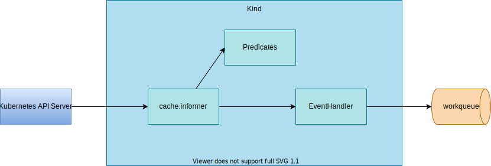

# Source



## Example

Overview:

1. Monitor `Pod` change with `kindWithCache`.
1. Write to `Queue` with `EventHandler`.
1. Keep getting items from the `Queue` and print them.

Codes:

1. Create and start `Cache`
    ```go
	// Create a Cache
	cache, err := cache.New(cfg, cache.Options{}) // &informerCache{InformersMap: im}, nil
	if err != nil {
		log.Error(err, "")
	}
	log.Info("cache is created")

	ctx := context.Background()
	pod := &v1.Pod{}
	cache.Get(ctx, client.ObjectKeyFromObject(pod), pod)

	// Start Cache
	go func() {
		if err := cache.Start(ctx); err != nil { // func (m *InformersMap) Start(ctx context.Context) error {
			log.Error(err, "failed to start cache")
		}
	}()
	log.Info("cache is started")
    ```
1. Create a `kindWithCache`
    ```go
    // Create a Kind (Source)
	kindWithCachePod := source.NewKindWithCache(pod, cache)
    ```
1. Create a `Queue`
    ```go
	queue := workqueue.NewNamedRateLimitingQueue(workqueue.DefaultControllerRateLimiter(), "test")
    ```
1. Create an `EventHandler`
    ```go
	eventHandler := handler.Funcs{
		CreateFunc: func(e event.CreateEvent, q workqueue.RateLimitingInterface) {
			log.Info("CreateFunc is called", "object", e.Object.GetName())
			queue.Add(WorkQueueItem{Event: "Create", Name: e.Object.GetName()})
		},
		UpdateFunc: func(e event.UpdateEvent, q workqueue.RateLimitingInterface) {
			log.Info("UpdateFunc is called", "objectNew", e.ObjectNew.GetName(), "objectOld", e.ObjectOld.GetName())
			queue.Add(WorkQueueItem{Event: "Update", Name: e.ObjectNew.GetName()})
		},
		DeleteFunc: func(e event.DeleteEvent, q workqueue.RateLimitingInterface) {
			log.Info("DeleteFunc is called", "object", e.Object.GetName())
			queue.Add(WorkQueueItem{Event: "Delete", Name: e.Object.GetName()})
		},
	}
    ```
1. Start `kindWithCache` (Source)
    ```go
	if err := kindWithCachePod.Start(ctx, eventHandler, queue); err != nil { // Get informer and set eventHandler
		log.Error(err, "")
	}
    ```
1. Wait for `Cache` synced
    ```go
	if err := kindWithCachePod.WaitForSync(ctx); err != nil {
		log.Error(err, "")
	}
	log.Info("kindWithCache is ready")
    ```
1. Get item from `Queue` and print
    ```go
	// Get items from Queue
	for {
		item, shutdown := queue.Get()
		if shutdown {
			break
		}
		log.Info("got item", "item", item)
	}
    ```
## Run

1. Run
    ```
    go run main.go
    ```

    <details>

    ```
    2022-09-15T06:58:43.895+0900    INFO    source-examples source start
    2022-09-15T06:58:44.070+0900    INFO    source-examples cache is created
    2022-09-15T06:58:44.071+0900    INFO    source-examples cache is started
    2022-09-15T06:58:44.096+0900    INFO    source-examples CreateFunc is called    {"object": "kube-apiserver-kind-control-plane"}
    2022-09-15T06:58:44.097+0900    INFO    source-examples CreateFunc is called    {"object": "kube-controller-manager-kind-control-plane"}
    2022-09-15T06:58:44.097+0900    INFO    source-examples CreateFunc is called    {"object": "kube-scheduler-kind-control-plane"}
    2022-09-15T06:58:44.097+0900    INFO    source-examples CreateFunc is called    {"object": "kube-proxy-zpj2w"}
    2022-09-15T06:58:44.097+0900    INFO    source-examples CreateFunc is called    {"object": "coredns-6d4b75cb6d-s2dhg"}
    2022-09-15T06:58:44.097+0900    INFO    source-examples CreateFunc is called    {"object": "coredns-6d4b75cb6d-25dbf"}
    2022-09-15T06:58:44.097+0900    INFO    source-examples CreateFunc is called    {"object": "etcd-kind-control-plane"}
    2022-09-15T06:58:44.097+0900    INFO    source-examples CreateFunc is called    {"object": "kindnet-8fjbg"}
    2022-09-15T06:58:44.097+0900    INFO    source-examples CreateFunc is called    {"object": "local-path-provisioner-9cd9bd544-xl67h"}
    2022-09-15T06:58:44.172+0900    INFO    source-examples kindWithCache is ready
    2022-09-15T06:58:44.172+0900    INFO    source-examples got item        {"item": {"Event":"Create","Name":"kube-apiserver-kind-control-plane"}}
    2022-09-15T06:58:44.172+0900    INFO    source-examples got item        {"item": {"Event":"Create","Name":"kube-controller-manager-kind-control-plane"}}
    2022-09-15T06:58:44.172+0900    INFO    source-examples got item        {"item": {"Event":"Create","Name":"kube-scheduler-kind-control-plane"}}
    2022-09-15T06:58:44.172+0900    INFO    source-examples got item        {"item": {"Event":"Create","Name":"kube-proxy-zpj2w"}}
    2022-09-15T06:58:44.172+0900    INFO    source-examples got item        {"item": {"Event":"Create","Name":"coredns-6d4b75cb6d-s2dhg"}}
    2022-09-15T06:58:44.172+0900    INFO    source-examples got item        {"item": {"Event":"Create","Name":"coredns-6d4b75cb6d-25dbf"}}
    2022-09-15T06:58:44.172+0900    INFO    source-examples got item        {"item": {"Event":"Create","Name":"etcd-kind-control-plane"}}
    2022-09-15T06:58:44.172+0900    INFO    source-examples got item        {"item": {"Event":"Create","Name":"kindnet-8fjbg"}}
    2022-09-15T06:58:44.172+0900    INFO    source-examples got item        {"item": {"Event":"Create","Name":"local-path-provisioner-9cd9bd544-xl67h"}}
    ```

    </details>

1. Create Pod

    ```
    kubectl run nginx --image=nginx
    ```

    Check logs

    ```
    2022-10-05T09:45:17.114+0900    INFO    source-examples CreateFunc is called      {"object": "nginx"}
    2022-10-05T09:45:17.114+0900    INFO    source-examples got item        {"item": {"Event":"Create","Name":"nginx"}}
    2022-10-05T09:45:17.132+0900    INFO    source-examples UpdateFunc is called      {"objectNew": "nginx", "objectOld": "nginx"}
    2022-10-05T09:45:17.132+0900    INFO    source-examples got item        {"item": {"Event":"Update","Name":"nginx"}}
    2022-10-05T09:45:17.160+0900    INFO    source-examples UpdateFunc is called      {"objectNew": "nginx", "objectOld": "nginx"}
    2022-10-05T09:45:20.672+0900    INFO    source-examples UpdateFunc is called      {"objectNew": "nginx", "objectOld": "nginx"}
    ```

1. Delete Pod
    ```
    kubectl delete pod nginx
    ```

    Check logs

    ```
    2022-10-05T09:45:48.958+0900    INFO    source-examples UpdateFunc is called      {"objectNew": "nginx", "objectOld": "nginx"}
    2022-10-05T09:45:49.857+0900    INFO    source-examples UpdateFunc is called      {"objectNew": "nginx", "objectOld": "nginx"}
    2022-10-05T09:45:49.865+0900    INFO    source-examples UpdateFunc is called      {"objectNew": "nginx", "objectOld": "nginx"}
    2022-10-05T09:45:49.868+0900    INFO    source-examples DeleteFunc is called      {"object": "nginx"}
    2022-10-05T09:45:49.868+0900    INFO    source-examples got item        {"item": {"Event":"Delete","Name":"nginx"}}
    ```
