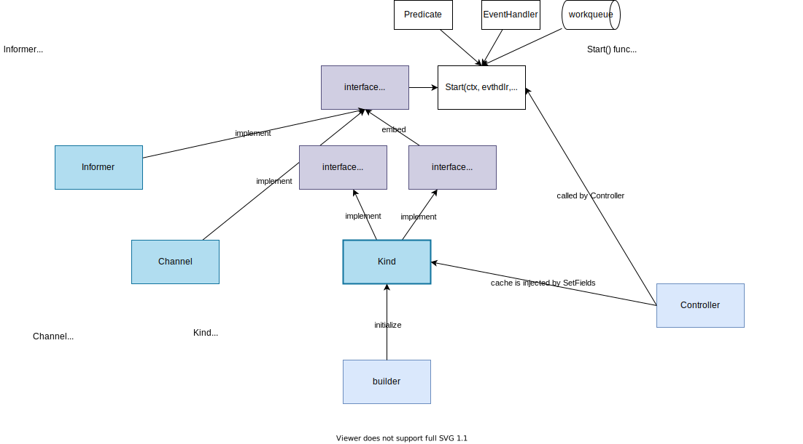
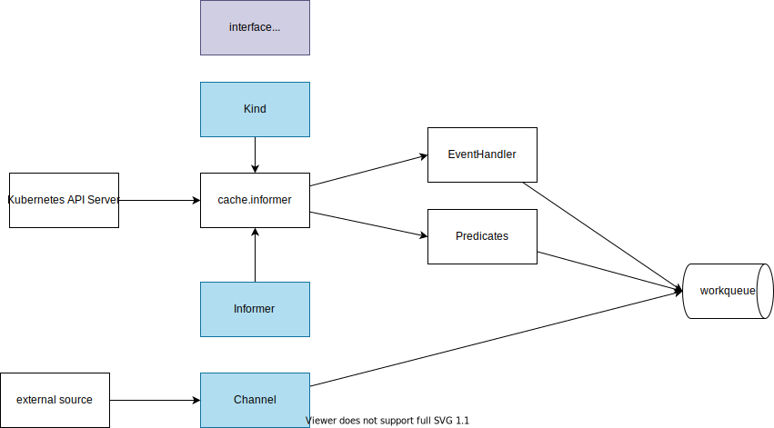

# Source

Component structure:


Dataflow:


## Example

1. Run the `kindWithCache`
    ```
    go run main.go
    ```

    <details>

    ```
    2022-09-15T06:58:43.895+0900    INFO    source-examples source start
    2022-09-15T06:58:44.070+0900    INFO    source-examples cache is created
    2022-09-15T06:58:44.071+0900    INFO    source-examples cache is started
    2022-09-15T06:58:44.096+0900    INFO    source-examples CreateFunc is called    {"object": "kube-apiserver-kind-control-plane"}
    2022-09-15T06:58:44.097+0900    INFO    source-examples CreateFunc is called    {"object": "kube-controller-manager-kind-control-plane"}
    2022-09-15T06:58:44.097+0900    INFO    source-examples CreateFunc is called    {"object": "kube-scheduler-kind-control-plane"}
    2022-09-15T06:58:44.097+0900    INFO    source-examples CreateFunc is called    {"object": "kube-proxy-zpj2w"}
    2022-09-15T06:58:44.097+0900    INFO    source-examples CreateFunc is called    {"object": "coredns-6d4b75cb6d-s2dhg"}
    2022-09-15T06:58:44.097+0900    INFO    source-examples CreateFunc is called    {"object": "coredns-6d4b75cb6d-25dbf"}
    2022-09-15T06:58:44.097+0900    INFO    source-examples CreateFunc is called    {"object": "etcd-kind-control-plane"}
    2022-09-15T06:58:44.097+0900    INFO    source-examples CreateFunc is called    {"object": "kindnet-8fjbg"}
    2022-09-15T06:58:44.097+0900    INFO    source-examples CreateFunc is called    {"object": "local-path-provisioner-9cd9bd544-xl67h"}
    2022-09-15T06:58:44.172+0900    INFO    source-examples kindWithCache is ready
    2022-09-15T06:58:44.172+0900    INFO    source-examples got item        {"item": {"Event":"Create","Name":"kube-apiserver-kind-control-plane"}}
    2022-09-15T06:58:44.172+0900    INFO    source-examples got item        {"item": {"Event":"Create","Name":"kube-controller-manager-kind-control-plane"}}
    2022-09-15T06:58:44.172+0900    INFO    source-examples got item        {"item": {"Event":"Create","Name":"kube-scheduler-kind-control-plane"}}
    2022-09-15T06:58:44.172+0900    INFO    source-examples got item        {"item": {"Event":"Create","Name":"kube-proxy-zpj2w"}}
    2022-09-15T06:58:44.172+0900    INFO    source-examples got item        {"item": {"Event":"Create","Name":"coredns-6d4b75cb6d-s2dhg"}}
    2022-09-15T06:58:44.172+0900    INFO    source-examples got item        {"item": {"Event":"Create","Name":"coredns-6d4b75cb6d-25dbf"}}
    2022-09-15T06:58:44.172+0900    INFO    source-examples got item        {"item": {"Event":"Create","Name":"etcd-kind-control-plane"}}
    2022-09-15T06:58:44.172+0900    INFO    source-examples got item        {"item": {"Event":"Create","Name":"kindnet-8fjbg"}}
    2022-09-15T06:58:44.172+0900    INFO    source-examples got item        {"item": {"Event":"Create","Name":"local-path-provisioner-9cd9bd544-xl67h"}}
    ```

    </details>

1. Create Pod

    ```
    kubectl run nginx --image=nginx
    ```

    Check logs

    ```
    2022-10-05T09:45:17.114+0900    INFO    source-examples CreateFunc is called      {"object": "nginx"}
    2022-10-05T09:45:17.114+0900    INFO    source-examples got item        {"item": {"Event":"Create","Name":"nginx"}}
    2022-10-05T09:45:17.132+0900    INFO    source-examples UpdateFunc is called      {"objectNew": "nginx", "objectOld": "nginx"}
    2022-10-05T09:45:17.132+0900    INFO    source-examples got item        {"item": {"Event":"Update","Name":"nginx"}}
    2022-10-05T09:45:17.160+0900    INFO    source-examples UpdateFunc is called      {"objectNew": "nginx", "objectOld": "nginx"}
    2022-10-05T09:45:20.672+0900    INFO    source-examples UpdateFunc is called      {"objectNew": "nginx", "objectOld": "nginx"}
    ```

1. Delete Pod
    ```
    kubectl delete pod nginx
    ```

    Check logs

    ```
    2022-10-05T09:45:48.958+0900    INFO    source-examples UpdateFunc is called      {"objectNew": "nginx", "objectOld": "nginx"}
    2022-10-05T09:45:49.857+0900    INFO    source-examples UpdateFunc is called      {"objectNew": "nginx", "objectOld": "nginx"}
    2022-10-05T09:45:49.865+0900    INFO    source-examples UpdateFunc is called      {"objectNew": "nginx", "objectOld": "nginx"}
    2022-10-05T09:45:49.868+0900    INFO    source-examples DeleteFunc is called      {"object": "nginx"}
    2022-10-05T09:45:49.868+0900    INFO    source-examples got item        {"item": {"Event":"Delete","Name":"nginx"}}
    ```
