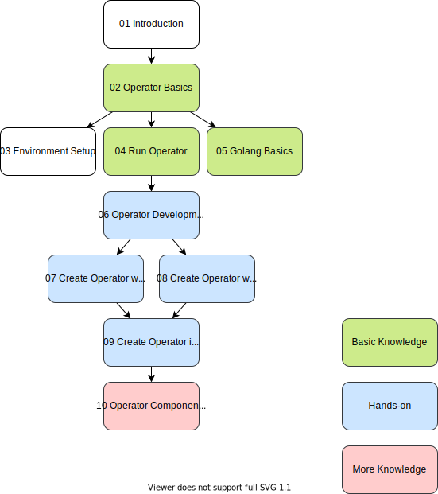

# Kubernetes Operator Basics

## Contents

1. Introduction
1. Operator Basics
1. [Environment Setup](03-environment-setup)
1. [Run Operator](04-run-operator)
1. Golang Basics
1. [Operator Development Method](06-operator-development-method)
1. [Create Operator with kubebuilder](07-create-operator-with-kubebuilder)
1. [Create Operator with operator-sdk](08-create-operator-with-operator-sdk)
1. [Create Operator in Kubernetes way](09-create-operator-in-kubernetes-way)
1. [Operator Components](10-operator-components)

## CheatSheet

1. [kind](99-cheatsheet/kind)
1. [kubebuilder](99-cheatsheet/kubebuilder)
